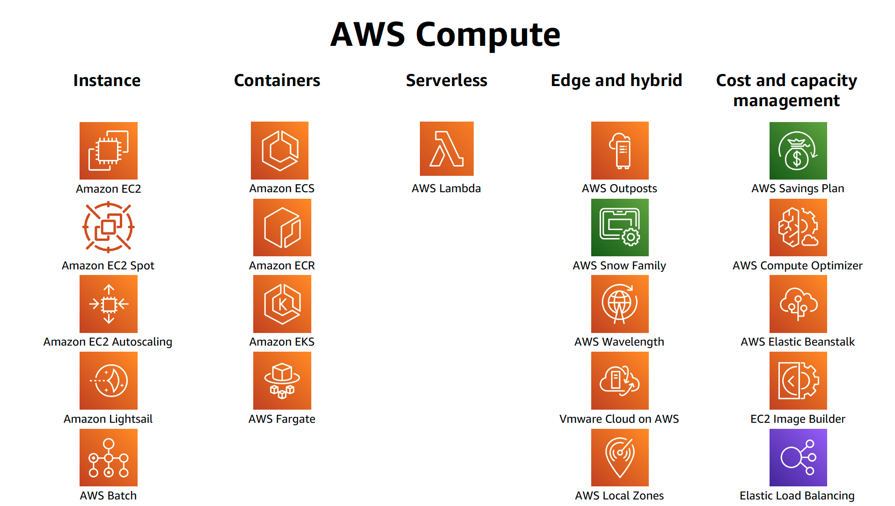

# 컴퓨트 - Amazon EC2

엔터프라이즈, 클라우드 네이티브 또는 모바일 애플리케이션을 구축하거나 대규모 클러스터를 실행하여 분석 워크로드를 구동하던 상관없이 조직의 구축 및 실행은 컴퓨팅에서 시작됩니다. AWS는 세계에서 가장 강력하고 안전하며 혁신적인 컴퓨팅 클라우드에서 애플리케이션과 워크로드를 개발, 배포, 실행 및 확장할 수 있는 포괄적인 [컴퓨팅 서비스](https://aws.amazon.com/products/compute/?nc1=h_ls)  포트폴리오를 제공합니다.

AWS 컴퓨팅 서비스들은 아래와 같은 특징을 가지고 있습니다:

- 고객의 워크로드에 적합한 컴퓨팅

- 아이디어에서 프로덕션 출시까지 걸리는 시간 가속화

- 빌트인 보안 제공

- 비용 최적화를 위한 유연성

- 필요한 위치에 컴퓨팅 서비스 제공

[Previous](./basic-modules.md) | [Next](./10-ec2.md)