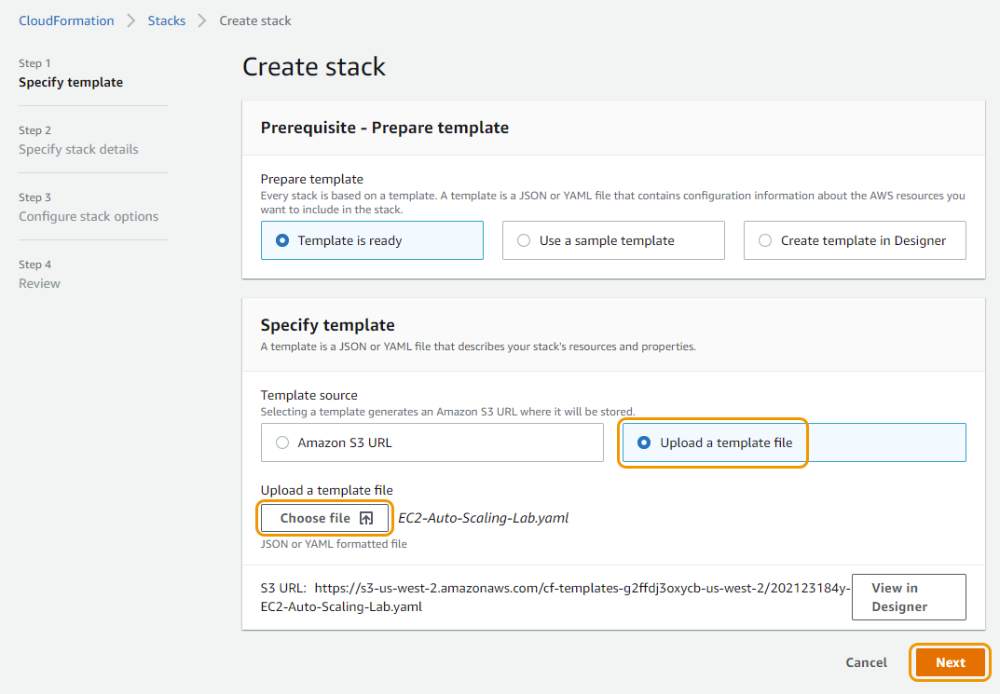
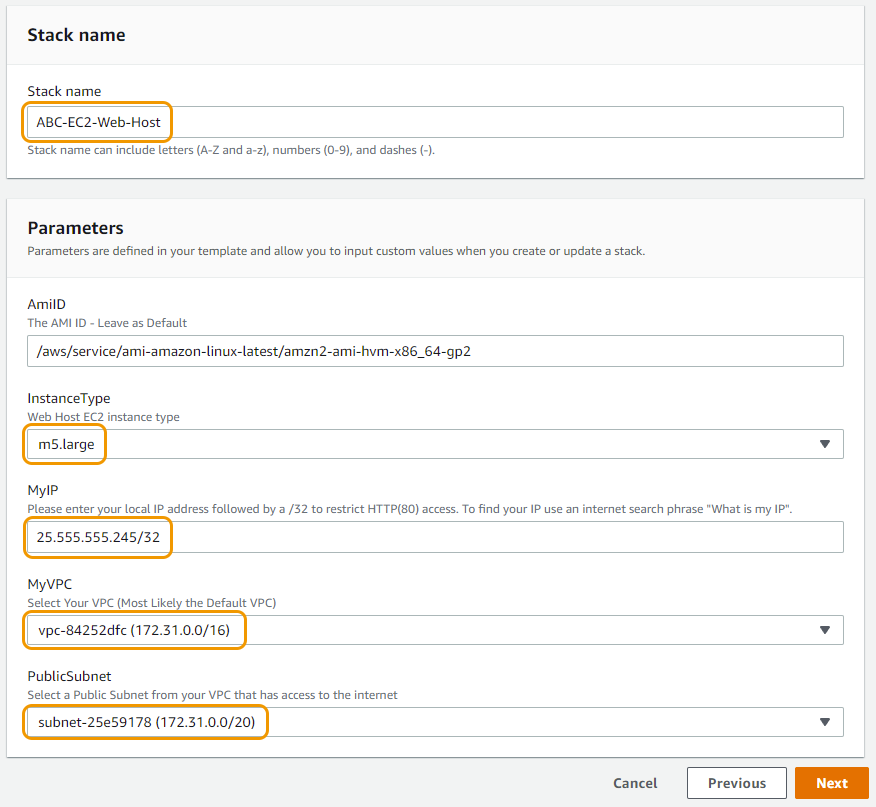
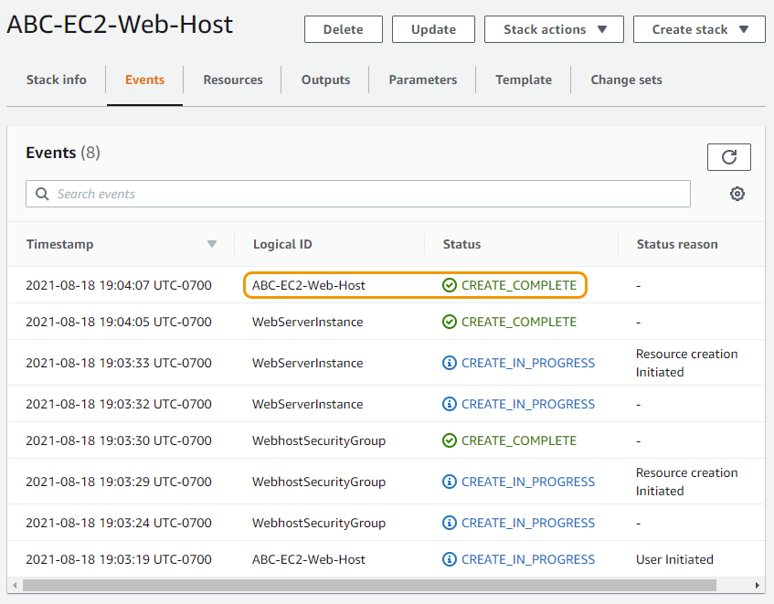
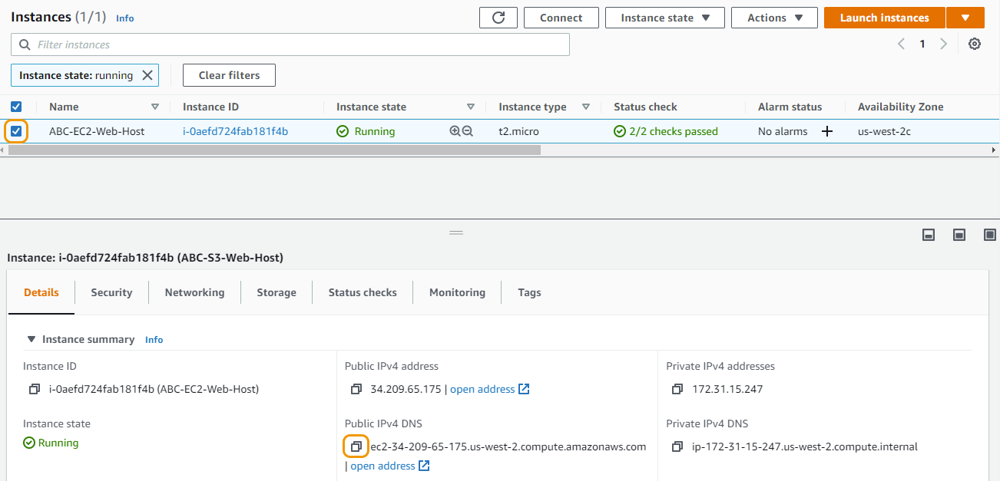
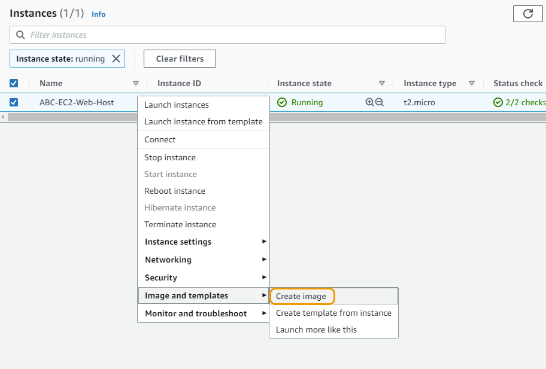
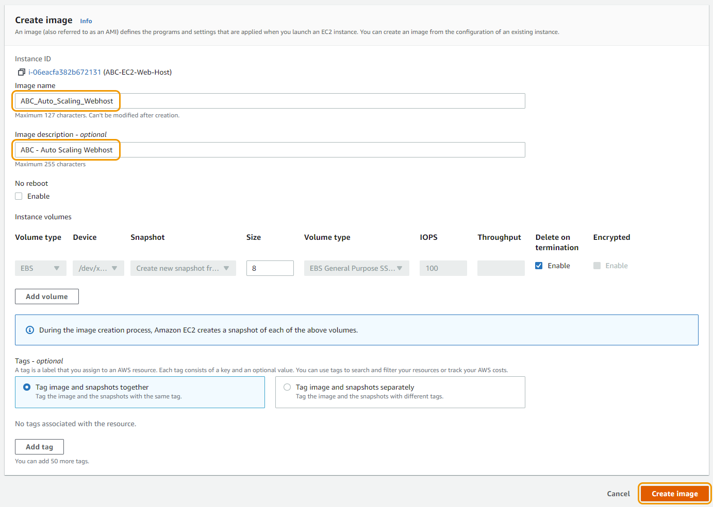
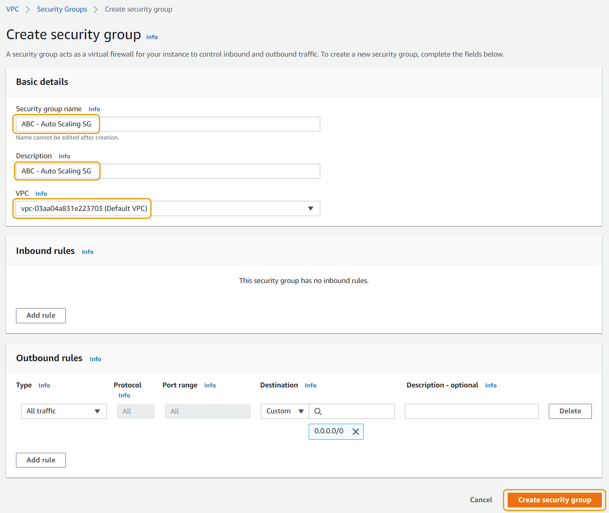

# 실습 준비
Auto-Scaling 그룹에 대한 AMI(Amazon Machine Image)를 생성하려면 먼저 웹 호스트를 설정해야 합니다. 인스턴스에서 AMI를 생성한 다음 로드 밸런서 뒤에서 인스턴스의 개수를 자동으로 조정합니다. [CloudFormation](https://aws.amazon.com/cloudformation/) 을 사용하여 EC2에서 웹 호스트를 구축하려면 아래 템플릿 링크 버튼을 클릭하세요.

## CloudFormation 템플릿 다운로드 및 실행하기

1. [해당 링크}(https://static.us-east-1.prod.workshops.aws/public/a24595bd-ccdc-448e-8a16-71e415d3e56b/static/common/ec2_auto_scaling/EC2-Auto-Scaling-Lab.yaml) 를 오른쪽 클릭 하여 CloudFormation 템플릿인 "EC2-Auto-Scaling-Lab.yaml" 파일을 다운로드하고 로컬 드라이드에 파일을 저장합니다.

2. AWS 콘솔에서 CloudFormation 을 검색하거나 Services 메뉴를 선택하고 "Management & Governance" 밑에 위치한 CloudFormation 을 클릭합니다.

3. CloudFormation 콘솔 창에서 Create Stack 버튼을 클릭하고 With new resources (standard) 를 선택합니다.

4. Create Stack 창 중간에 "Template source" Upload a template file 을 선택하고 Choose file 버튼을 클릭합니다. 첫 번째 스텝에서 다운로드한 "EC2-Auto-Scaling-Lab.yaml" 템플릿 파일을 선택합니다. 템플릿 파일 선택이 완료되면 Next 버튼을 클릭합니다.

5. Specify stack details 페이지에서 아래와 같이 빈칸을 채워놓습니다:

    a. "Stack name" 필드에는 [이니셜]-EC2-Web-Host 와 같은 포맷으로 스택 이름을 기입합니다.

    b. "InstanceType" 필드에는 m5.large 또는 t2.micro 인스턴스 타입을 선택합니다. 실제 운영 환경에서의 성능을 검증하기 위해서 m5.large 인스턴스 타입 사용을 권장 드립니다. t2 타입의 인스턴스 경우 운영 환경에서 권장 드리지 않고 있습니다. m5 타입의 인스턴스 선택의 어려움이 있으실 경우, Cloudformation 템플릿을 다시 불러오고 t2.micro 선택하여 실습을 진행하는 데 무리는 없습니다.

    c. "MyVPC" 필드에는 인스턴스가 올라갈 VPC를 선택 합니다. 대부분 계정의 경우, default VPC를 사용하셔도 무방하고 새로 생성된 계정의 경우 따로 VPC를 생성하지 않은 경우 default VPC만 옵션으로 제공됩니다.

    d. "PublicSubnet" 필드에는 위에서 선택한 VPC내에서 인터넷 엑세스가 가능한 서브넷을 선택 합니다. 퍼블릭 서브넷은 라우팅 테이블에 인터넷 게이트웨이로 라우팅되어 있게 설정되어 있음을 확인할 수 있습니다. 기본 VPC내에 서브넷은 기본적으로 전부 퍼블릭 서브넷입니다.

6. 위와 같이 정보를 기입 완료 시, Next 버튼을 클릭합니다. 다음 페이지인 "Configure stack options" 에서 "Tags" 와 "Permissions" 과 "Advanced options" 을 기본값으로 두고 Next 버튼을 클릭합니다.

7. Review [이니셜]-EC2-Web-Host 페이지에서 설정된 값을 확인하고 Create stack을 클릭하여 웹 서버 생성을 시작합니다.

8. "Logical ID", "[이니셜]-EC2-Web-Host"의 status가 "CREATE_COMPLETE"가 될 때 까지 기다립니다.

CloudFormation stack 생성이 완료되기까지는 대략 3분 정도가 소요 됩니다.

## 인스턴스가 제대로 생성되었는 지 확인하기

1. Services 탭에서 EC2 를 선택하거나 콘솔 검색창에서 EC2 를 검색하여 EC2 서비스 페이지로 이동합니다.

2. 왼쪽 탭에서 Instances를 선택합니다. "Instances" 페이지에서 "[이니셜]-S3-Web-Host" 인스턴스를 선택하고 "Public IPv4 DNS" 주소를 아래와 같이 Public IPv4 DNS 왼쪽에 위치한 네모가 겹쳐져 있는 이미지를 클릭하여 클립보드에 복사합니다. 웹 브라우저의 새로운 탭을 열고 복사한 주소를 붙혀넣습니다.

"Public IPv4 DNS" 밑에 위치한 open address 링크 클릭 시 제대로된 경로의 웹사이트를 열 수 없습니다. "open address" 링크는 http:// 대신 https://를  사용하기 때문에 현재 인스턴스 설정에서는 SSL 인증을 설정하지 않았기 때문에 에러 페이지가 나타나는 것을 확인할 수 있습니다.

3. "EC2 Instance Metadata" 라는 타이틀을 가진 페이지를 확인하실 수 있습니다.

페이지를 불러오는 데 시간이 걸리실 경우, "Status check" 가 "2/2 checks passed" 로 변경될 때까지 기다리고 다시 페이지를 열어보세요. 메타데이터는 비슷해 보일 수 있지만 위 이미지와 정확히 똑같이 보이지는 않을 겁니다.

## 생성된 EC2내에 웹 서버의 Custom AMI 만들기 - Linux Lab
현재 웹 사이트를 호스트할 수 있는 인스턴스가 프로비저닝된 상태입니다. auto scaling group을 위해 custom 머신 이미지를 만들 것입니다. 웹 서버의 이미지를 생성하고 이를 기반으로 들어오는 트래픽에 따라 여러 인스턴스로 확장할 수 있게 auto scaling group을 설정할 것 입니다.

1. EC2 콘솔 페이지내에 Instance 탭에서 인스턴스가 실행 중이거나 중지중인 상태에서 Amazon Machine Images (AMIs)를 생성하실 수 있습니다. EC2 콘솔로 다시 돌아가거나 새로 콘솔 창을 엽니다.

2. "[이니셜]-S3-Web-Host" 이름으로 설정된 웹 호스트 인스턴스에서 오른쪽 버튼 클릭 을 하시고 "Image and templates" 탭에서 Create image 버튼을 클릭합니다. (다른 방법으로는 해당 인스턴스를 선택하고 오른쪽 위 Action 메뉴 버튼을 클릭하여서 진행하실 수 있습니다.)

3. "Create Image" 페이지에서 Image name 와 description에 [이니셜]-S3-Web-Host 을 기입합니다. Instance volumes 은 기본 값으로 두시고 Create Image 버튼을 클릭합니다.

4. AMI를 생성하는 데 몇 분의 시간이 소요됩니다. EC2 콘솔내에서 왼쪽 "Images" 탭에서 AMIs 버튼을 클릭합니다. 방금 생성된 AMI를 확인하실 수 있고 현재 pending 상태일 것입니다. 조금 기다리시면 상태가 available로 변경되는 것을 확인하실 수 있습니다.

지금까지 Amazon Machine Image 생성을 완료 했습니다. 이제 오토 스케일링에 필요한 Security Group (보안 그룹) 설정으로 넘어가겠습니다.

## 오토 스케일링 그룹에 필요한 새로운 Security Group(보안 그룹) 만들기
Launch Template (시작 템플릿)을 설정하기 전에 오토 스케일링 그룹에 필요한 보안 그룹을 설정할 것입니다. 보안 그룹은 인스턴스 (가상 머신) 레벨에서 적용되는 방화벽입니다. 보안 그룹에 대한 자세한 내용이 필요하시면 이 페이지  를 참고해주세요.

1. 콘솔 내에서 "Services" 탭 아래 EC2 를 선택하거나 콘솔 검색 창에서 EC2 를 검색합니다. EC2 페이지내 왼쪽 메뉴에서 "Network & Security" 아래 위치한 Security Groups 버튼을 클릭합니다. [Your Initials]-EC2-WEb-Host - Website Security Group 와 같은 다른 Security Group을 확인하실 수 있습니다. 새로운 security group 생성하기 위해 Create security group 버튼을 클릭합니다.

2. Security group 이름을 [이니셜] - Auto Scaling SG 로 기입하고 description 또한 같은 이름으로 설정합니다. 꼭 올바른 VPC를 선택해주시기 바랍니다. (대부분의 경우 기본 VPC ,Default VPC, 가 기본값으로 설정되어 있습니다.)

3. "Inbound rules" 탭 아래에 현재 어떤 규칙도 설정이 되어져 있지 않는 것을 확인하고 그대로 아무값이 없는 형태로 둡니다. 규칙에 대한 설정이 이후에 진행할 예정이며 해당 설정을 하기 전 로드 밸런서를 먼저 생성하셔야 합니다.

4. "Outbound rules" 탭 아래에 모든 트래픽이 허용되어져 있음을 확인하고 따로 추가적인 규칙을 설정하지 않으셔도 됩니다.

끝으로 Create security group 버튼을 클릭합니다.

지금까지 실습 준비를 완료하셨습니다. 다른 단계인 시작 템플릿 생성하기 로 넘어가기면 됩니다.

[Previous](../ec2-auto-scaling/ec2-auto-scaling.md) | [Next](./2-ec2-as)