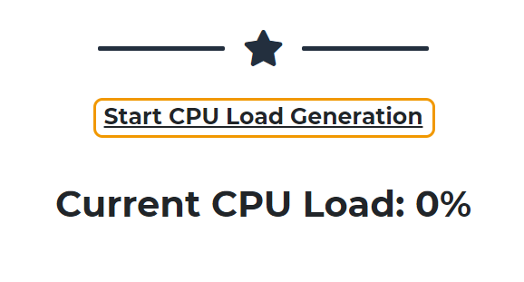
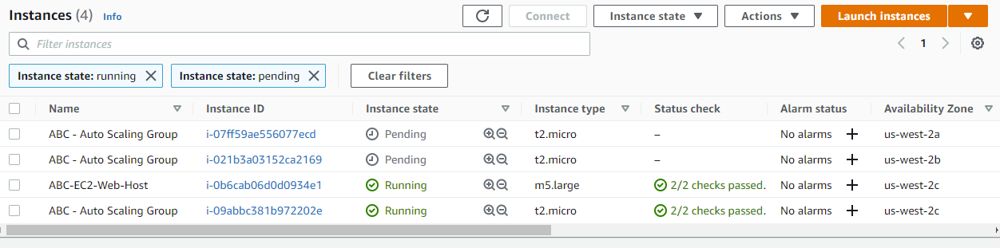
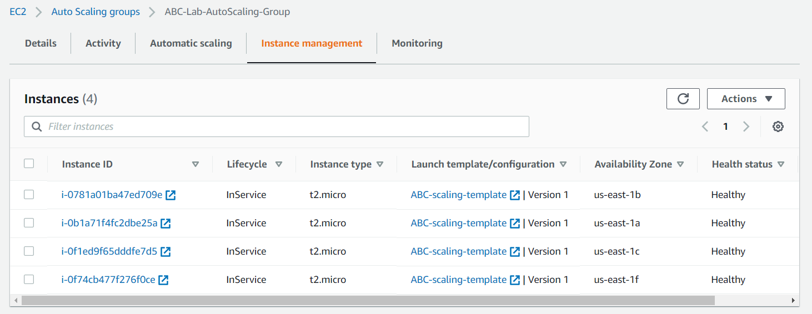
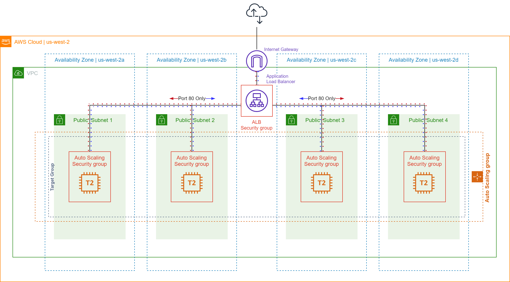
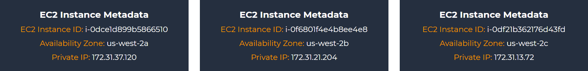

# 오토스케일링 그룹 테스트하기

## 오토스케일링 그룹 테스트하기
Auto Scaling 그룹과 로드 밸런서를 생성했으므로 이제 모든 것이 올바르게 작동하는지 테스트해 보겠습니다.

1. 이전 단계에서 로드 밸런서 DNS 주소를 통해 액세스한 웹 사이트에 있는지 확인하세요

2. 첫 페이지 하단에서 Start CPU Load Generation 링크를 클릭합니다. CPU 로드가 일정 기간 동안 25% 이상으로 올라가면 Auto Scaling 정책은 수요를 충족하기 위해 시작 템플릿에 지정된 인스턴스를 확장하기 시작합니다 (처음에 충분한 로드가 생성되지 않으면 이 작업을 두 번 수행해야 할 수도 있습니다.)

3. EC2 콘솔의 "인스턴스" 섹션에서 Auto Scaling에 의해 생성된 새 인스턴스를 볼 수 있으며 몇 분 정도 걸릴 수 있습니다. EC2 인스턴스 페이지를 새로 고치면 곧 새 인스턴스가 자동으로 생성되는 것을 볼 수 있을 것입니다. [이니셜] - Auto Scaling Group이라는 인스턴스를 선택하고 아래의 Monitoring 탭을 클릭하여 "CPU Utilization"을 확인할 수 있습니다.

4. Auto Scaling Groups 페이지로 이동하여 이를 확인할 수도 있습니다. https://console.aws.amazon.com/ec2autoscaling  그런 다음 자동 스케일링 그룹 [이니셜]-Lab-AutoScaling-Group 을 선택합니다. 인스턴스 관리 탭에서 세부 정보를 보면 새 인스턴스가 실행되고 있는지 확인할 수 있습니다. 인스턴스 관리 탭에서 현재 그룹에 몇 개의 인스턴스가 있는지 확인할 수 있습니다. 모니터링 탭에는 그룹 크기, 보류 중인 인스턴스, 총 인스턴스 등과 같은 다양한 메트릭이 표시됩니다.

## 현재 아키텍처는 다음과 같습니다.:

5. 여러 개의 새 인스턴스가 성공적으로 시작되면(3개 또는 4개) 웹 호스트에서 웹 브라우저를 반복적으로 새로고침 합니다. 이제 로드 밸런서가 Auto Scaling 그룹 전체에 요청을 분산할 때 인스턴스 ID, 가용 영역 및 사설 IP 변경 사항을 확인해야 합니다.

축하합니다! Application Load Balancer 뒤단에 EC2 Auto Scaling 그룹을 성공적으로 생성했습니다.

Lab Author: Cy Hopkins

실습을 정리해야 하는 경우 다음 섹션으로 이동하세요.: 실습 자원 삭제하기

[Previous](./4-ec2-as.md) | [Next](./6-ec2-as.md)