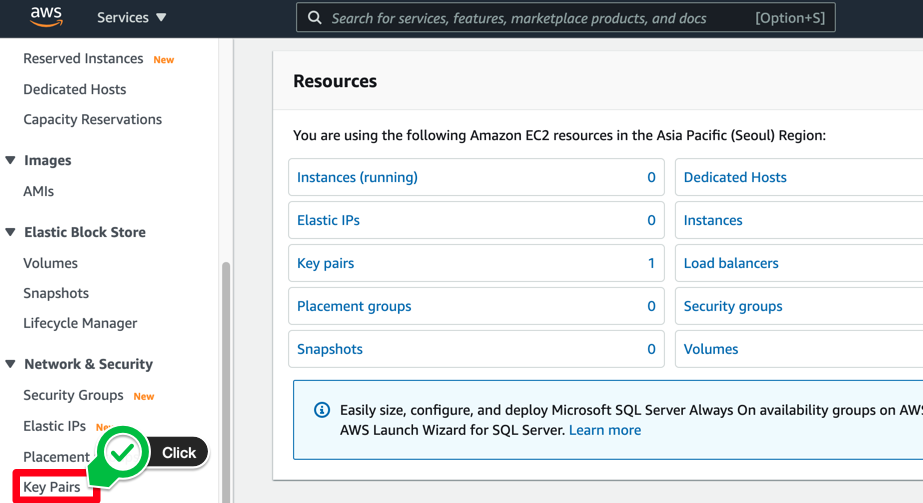
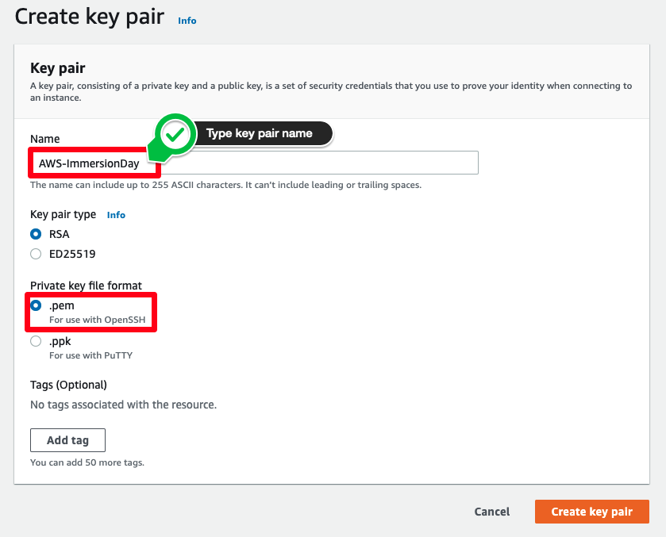

# 키페어 생성하기

## 키페어 생성하기
이 실습에서는 SSH 키 쌍을 사용하여 EC2 인스턴스를 생성해야 합니다. 다음 단계에 따라 이 실습에서 사용할 고유한 SSH 키 쌍을 생성할 수 있습니다.

1. AWS 관리 콘솔에 로그인하고 Amazon EC2 콘솔 을 엽니다. AWS 관리 콘솔의 오른쪽 상단 모서리에서 원하는 AWS 리전에 있는지 확인합니다.

2. 왼쪽 메뉴 하단의 네트워크 및 보안 섹션에서 Key Pairs를 클릭합니다. SSH 키 쌍을 관리하는 페이지가 표시됩니다.

3. 새 SSH 키 페어를 생성하려면 브라우저 창의 맨 위에 있는 키 쌍 만들기 버튼을 클릭합니다.

4. Key Pair Name: 텍스트 상자에 [Your Name]-ImmersionDay를 입력하고 Create key pair 버튼을 클릭합니다. Windows 사용자의 경우 파일 형식에 대해 ppk를 선택하십시오.

5. 웹 브라우저에서 [Your Name]-ImmersionDay.pem 파일을 로컬 드라이브에 다운로드합니다. 브라우저 지침에 따라 파일을 기본 다운로드 위치에 저장합니다. 방금 다운로드한 키페어 파일의 전체 경로를 기억하십시오.

방금 생성한 키페어를 사용하여 나머지 실습에서 진행하는 EC2 인스턴스를 관리합니다.

[Previous](../ec2-linux.md) | [Next](2-ec2.md)