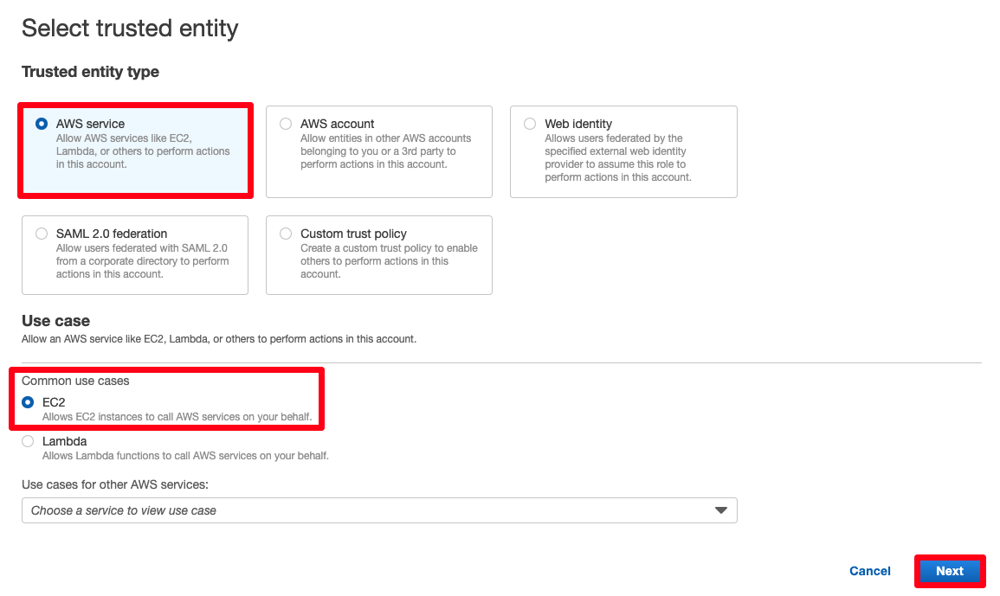

# (옵션) Session Manager를 사용하여 리눅스 인스턴스에 접근하기
Session Manager는 대화형 원클릭 브라우저 기반 셸 또는 AWS CLI를 통해 Amazon EC2 인스턴스를 관리할 수 있는 AWS Systems Manager의 기능입니다. Session Manager를 사용하여 계정의 인스턴스에 세션을 시작할 수 있습니다. 세션이 시작된 후, 다른 연결 유형을 통해 bash 명령을 실행할 수 있습니다.

## Systems Manager를 위한 IAM 인스턴스 프로파일 생성

1. AWS 콘솔창에 접속한 후 IAM 콘솔 을 엽니다. 네비게이션 항목에서 Roles를 선택한 후, Create role을 클릭합니다.

2. Select type of trusted entity에서 AWS service를 선택합니다. 바로 아래에 이 role을 사용할 서비스인 EC2를 선택합니다. 그리고 Next 버튼을 클릭합니다.

3. 해당 IAM Role에 부착할 IAM Policy를 선택하는 페이지에서 아래와 같은 작업을 수행합니다: 검색바를 사용하여 AmazonSSMManagedInstanceCore를 찾은 다음, select box를 클릭한 후, Next를 클릭합니다.

4. Role name에 SSMInstanceProfile를 입력합니다. Create role를 클릭합니다. 그러면 Roles 창으로 돌아오게 됩니다.

방금 생성한 Role 이름을 기록합니다. Systems Manager를 사용하여 관리할 인스턴스에 해당 Role을 부여합니다.

### 기존의 인스턴스에 Systems Manager 인스턴스 프로파일 부착(콘솔)

1. AWS 콘솔창에 접속한 후, [Amazon EC2 콘솔](https://console.aws.amazon.com/ec2) 을 엽니다.

2. 네비게이션 항목에서 Instances 아래에 Instances를 선택합니다. 실습 때 생성한 EC2 인스턴스를 클릭합니다.

3. Actions 메뉴에서 Security 선택 후, Modify IAM role를 클릭합니다.

4. IAM Role에서 방금 생성한 SSMInstanceProfile 인스턴스 프로파일을 선택합니다.

5. Save 버튼을 누릅니다.

### Session Manager를 사용하여 리눅스 인스턴스 연결하기

1. EC2 인스턴스 콘솔에서 방금의 인스턴스를 선택한 후, Connect 버튼을 클릭합니다.

2. Connect to instance 페이지에서 Session Manager를 선택합니다. 아래의 내용을 참고하세요.

3. Session Manager 사용에 대한 이점이 담겨있는 Session Manager usage section 내용을 검토합니다.

4. Connect를 선택합니다. 새로운 세션이 새로운 탭에서 시작될겁니다. 세션이 시작된 후, bash command를 실행할 수 있습니다.

만약 아래와 같은 에러가 발생할 경우, 수초를 기다린 후, 브라우저를 리프레시합니다. EC2 인스턴스가 Session Manager를 사용하기 위한 준비를 하고 있기 때문입니다. 혹은 앞선 페이지에서 인스턴스를 클릭한 후, Instance State 메뉴를 선택한 후, Reboot instance를 클릭합니다.

[Previous](./2-ec2.md) | [Next](./3-ec2.md)