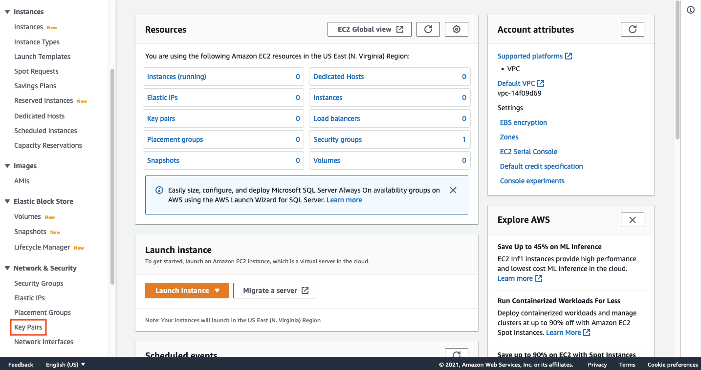
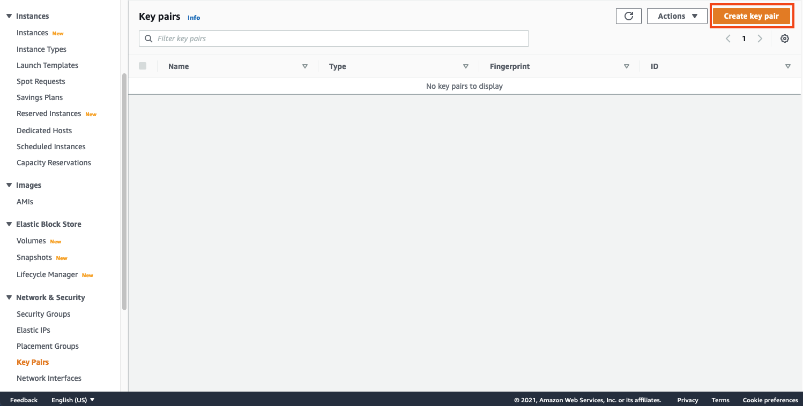
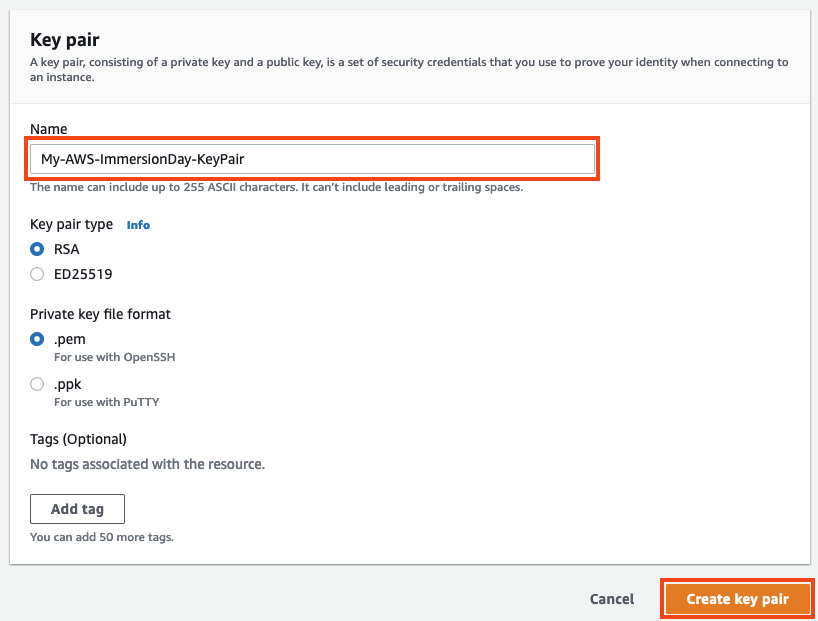

# 키페어 생성하기

## 키페어 생성하기
이 실습에서는 EC2 인스턴스를 연결할 때 사용하는 키페어를 생성합니다. 다음 단계에 따라 이 실습에서 사용할 키페어를 생성할 수 있습니다.

1. AWS 관리 콘솔에 로그인하고 [Amazon EC2 Console](https://console.aws.amazon.com/ec2) 를 엽니다. AWS 콘솔창 우측 상단에 AWS region을 확인합니다.

2. Network & Security 탭에서 Key Pairs를 클릭합니다. 해당 페이지에서는 여러분이 관리하는 키페어 리스트들이 나열됩니다. 우측 상단에 Create key pair 버튼을 클릭합니다.

3. 새로운 키페어를 생성합니다.

4. Key Pair Name: 텍스트 상자에 [Your Name]-AWS-mmersionDay를 입력하고 Create key pair 버튼을 클릭합니다. 본 실습에서는 기본 키페어 타입인 RSA를 선택하고 프라이빗 키 파일 형식은 .pem를 선택합니다. Create key pair 버튼을 클릭하고 로컬 환경에 해당 키를 저장합니다. 해당 키가 어디에 저장되었는지 확인합니다.

방금 생성한 키페어를 상요하여 나머지 실습에서 사용할 EC2 인스턴스의 관리자 패스워드를 해독하는데 사용할 예정입니다.

[Previous](../ec2-windows.md) [Next](./2-ec2.md)