# 웹 서버 인스턴스 생성하기

## 웹 서버 인스턴스 생성하기
본 실습에서 우리는 리부팅되는 동안 IIS web server가 설치되는 Windows Server 2019 인스턴스를 실행합니다.

1. AWS 관리 콘솔에 접속한 후, [Amazon EC2 콘솔](https://console.aws.amazon.com/ec2) 을 엽니다. 우측 상단에 인스턴스를 배포할 AWS region를 확인하세요.

2. Launch Instance를 클릭하고 Launch instance를 드롭다운 메뉴에서 선택합니다.

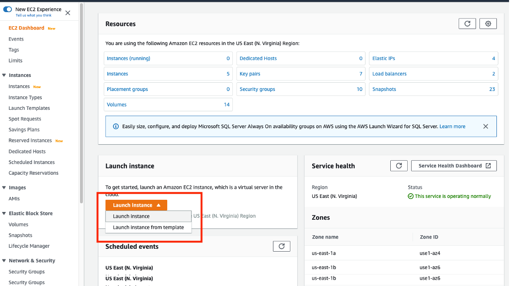

3. 아래로 내려 Microsoft Windows Server 2019 Base AMI를 선택합니다.

검색 창에서 해당 AMI를 찾을 수도 있습니다

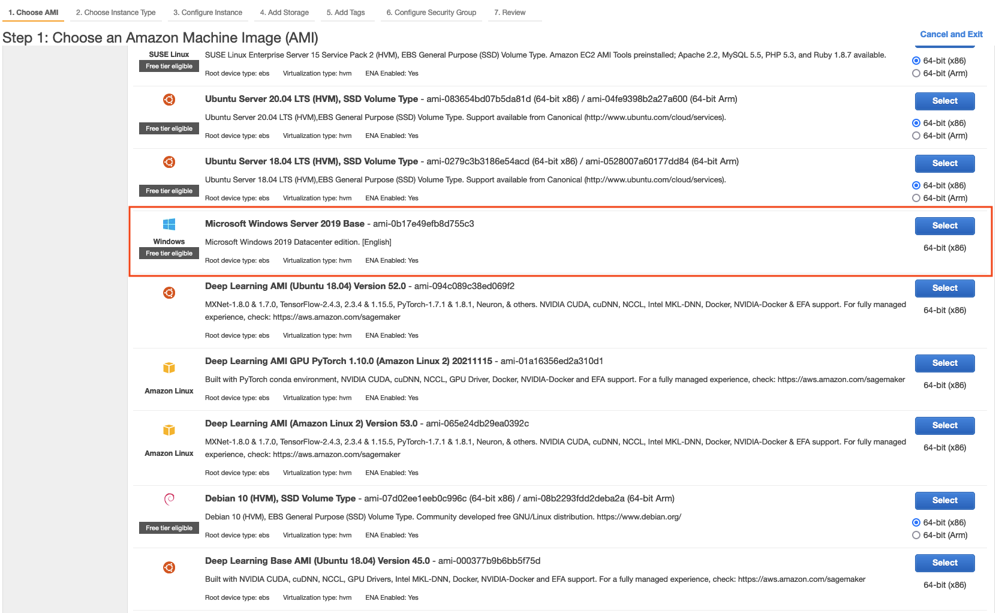

4. Choose Instance Type 탭에서 t2.medium 인스턴스 사이즈를 선택한 후, Next: Configure Instance Details를 클릭합니다.

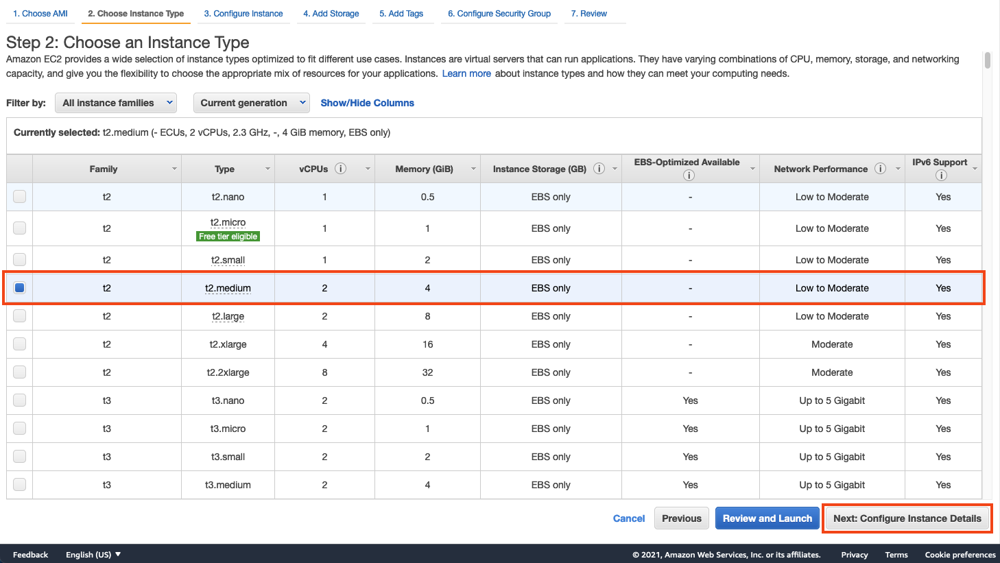

만약 Free Tier Eligible 라벨이 없다면 실습 도중 과금이 발생할 수 있습니다.

5. Configure Instance Details 페이지에서 모든 값들은 기본 설정으로 둡니다. 아래로 내려 가장 아래에 있는 Advanced Details 섹션을 확장합니다.

- 아래의 스크립트를 User Data 필드에 복사/붙여넣기 합니다. 해당 PowerShell 스크립트는 IIS를 설치 및 시작하고 간단한 웹 페이지를 배포할겁니다.

```
<powershell>
Import-Module ServerManager;
Install-WindowsFeature Web-Server -IncludeManagementTools -IncludeAllSubFeature
remove-item -recurse c:\inetpub\wwwroot\*
(New-Object System.Net.WebClient).DownloadFile("https://static.us-east-1.prod.workshops.aws/public/a24595bd-ccdc-448e-8a16-71e415d3e56b//static/common/ec2_web_hosting/ec2-windows.zip", "c:\inetpub\wwwroot\ec2-windows.zip")

$shell = new-object -com shell.application
$zip = $shell.NameSpace("c:\inetpub\wwwroot\ec2-windows.zip")
foreach($item in $zip.items())
{
$shell.Namespace("c:\inetpub\wwwroot\").copyhere($item)
}
</powershell>
```

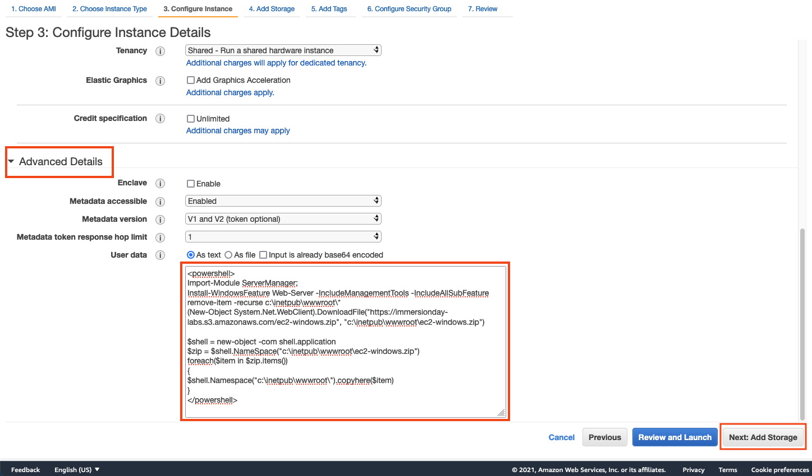

User Data에 대한 추가적인 정보를 얻고 싶다면 아래의 문서 링크를 참조합니다. http://docs.aws.amazon.com/AWSEC2/latest/WindowsGuide/ec2-instance-metadata.html 

Next: Add Storage 버튼을 클릭합니다.

6. Add Storage 페이지에서 해당 인스턴스에 스토리지를 변경 및 추가할 수 있습니다. 본 실습에서는 기본 값으로 둡니다. Next: Add Tags를 클릭하여 다음 단계로 넘어갑니다.

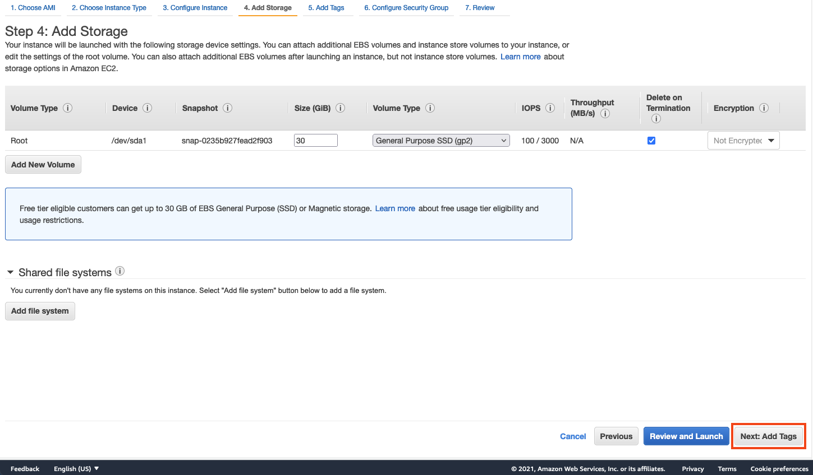

7. Add Tags 페이지에서 해당 인스턴스에 친숙한 이름을 설정할 수 있습니다. 이 이름은 tag라고 불리며 인스턴스가 시작되면 콘솔창에 보일겁니다. 그리고 인스턴스를 식별하기 위해 여러 다양한 정보를 추가할 수 있습니다. 태그 정보는 사용자가 스토리지, 목적, 인스턴스의 비용에 대한 정보를 쉽게 파악하기 위해 설계되었습니다. Add Tag를 클릭하고 "[Your Name] Web Server" 이름을 설정합니다. 키 값은 "Name"으로 입력하는데, 대소문자에 유의합니다. 모든 값을 입력하였다면 Next: Configure Security Group를 클릭하여 다음 단계로 넘어갑니다.

Tags에 대한 추가적인 정보를 얻고 싶다면 아래의 문서 링크를 참조합니다.- https://docs.aws.amazon.com/AWSEC2/latest/WindowsGuide/Using_Tags.html .

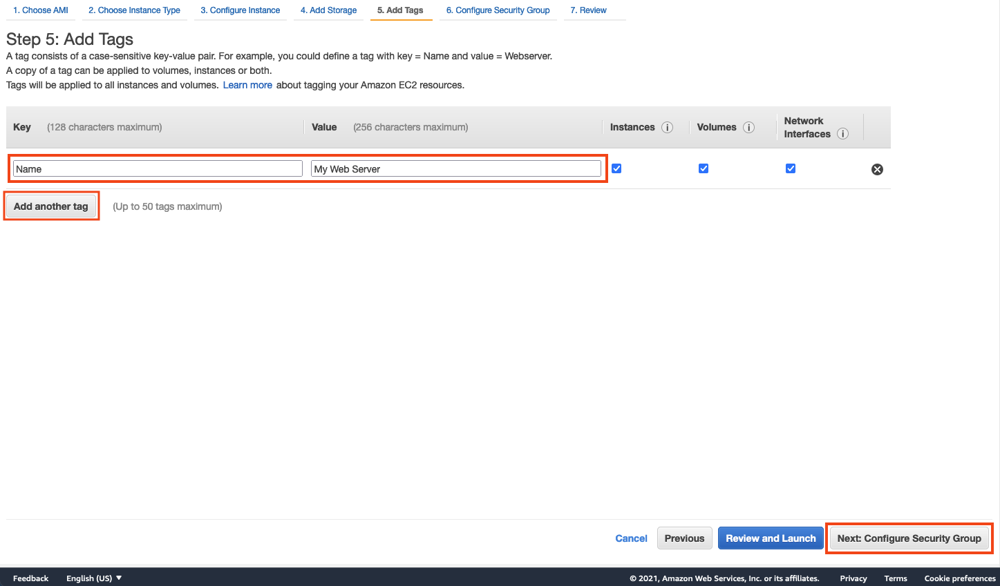

KEY | VALUE
--- | ----
Key | Name
Value | My Web Server

8. 해당 페이지에서 Security Group을 새로 만들거나 기존에 존재하는 Security Group을 선택할 수 있습니다. Security Group은 방화벽 정책으로 허용할 protocol 및 IP 주소를 지정할 수 있습니다. Create a new security group를 클릭하고 이름 및 디스크립션에 "Immersion Day - [Your Name] Web Server"를 입력합니다. RDP 접근을 최소화하기 위해, 기존에 존재하는 RDP 정책에서 Source 단을 My IP로 변경합니다. 웹 서비스를 위한 TCP/80을 허용하기 위해 Add Rule 버튼을 클릭하고 Type 아래에 있는 HTTP을 선택합니다. Source 값은 인터넷을 통한 모든 접근을 허용하기 위해 0.0.0.0/0로 설정합니다. Review and Launch 버튼을 클릭합니다.

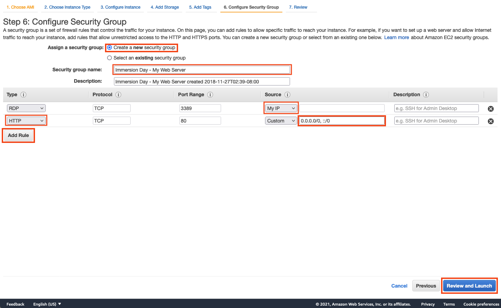

9. 앞선 단계에서 설정한 모든 값들을 확인한 이후 Launch 버튼을 클릭합니다.

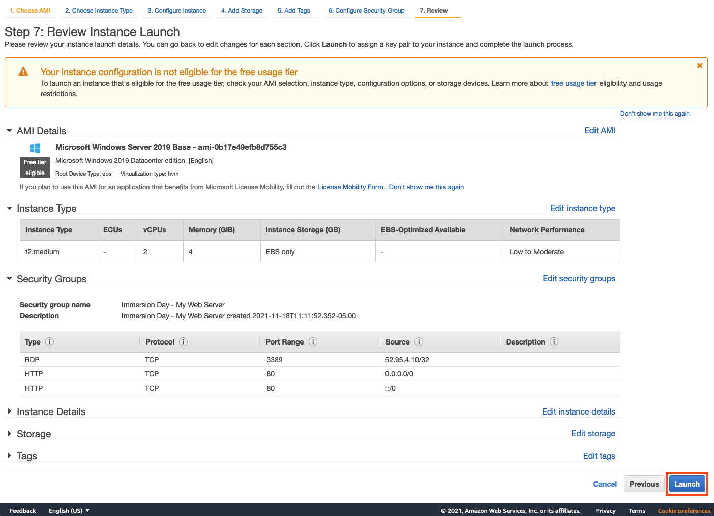

10. 본 실습을 시작할 때 생성한 키페어를 선택한 후, I acknowledge 체크 박스를 클릭합니다. 윈도우 웹 서버를 시작하기 위해 Launch Instances 버튼을 클릭합니다.

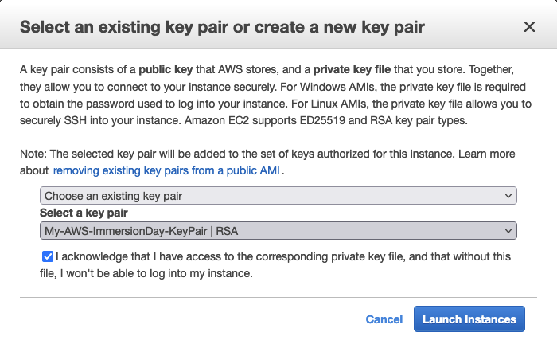

11. 우측 하단에 있는 View Instances 버튼을 클릭하여 EC2 인스턴스 목록이 있는 페이지로 이동합니다.

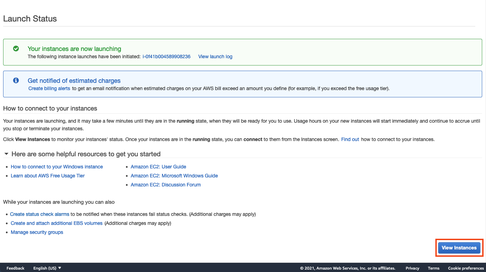

12. 방금 생성한 인스턴스 옆에 체크 박스를 클릭하여 EC2 인스턴스의 세부 정보를 파악합니다. 인스턴스가 생성되면 웹 서버를 볼 수 있을 뿐만 아니라 인스턴스의 가용 영역 정보 및 퍼블릭하게 라우팅 가능한 DNS 이름 또한 확인할 수 있습니다.

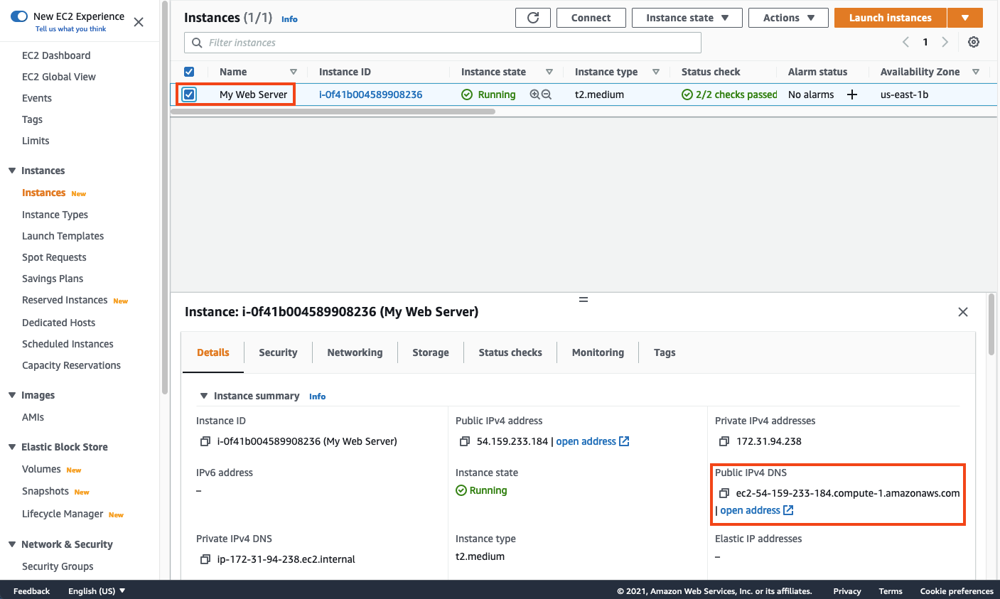

## 웹 서버 탐색하기

1. 인스턴스 Status checks가 pass 상태로 변경되기 전까지 대기합니다.

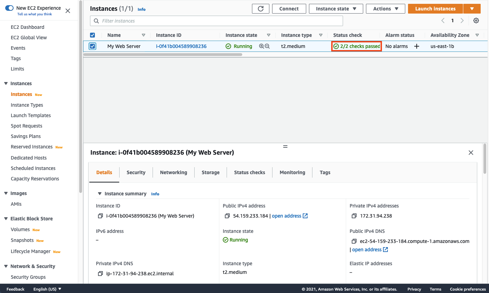

2. 새로운 웹 브라우저 탭을 열고 EC2 인스턴스의 Public IPv4 DNS 값을 새로운 브라우저 탭에 붙여넣기 합니다. EC2 인스턴스의 Public DNS 이름은 아래에 표시된 위치에 있습니다. 여러분들은 아래와 같은 형태의 웹 사이트를 확인할 수 있습니다.

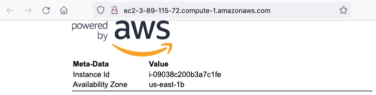

::alert[윈도우 서버를 배포하고 웹 사이트를 런칭하였습니다!{type="success" header="잘하셨습니다"}

모든 설청이 완료되기까지 수분이 걸릴 수 있습니다. 만약 public DNS 이름으로 페이지에 접근했을 때 아래의 스크린이 보인다면 아직 bootstrap script 설정이 완료되지 않은 겁니다.

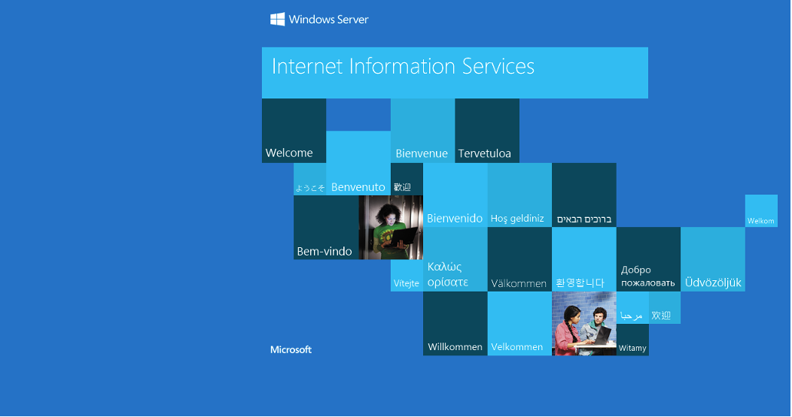

[Previous](./1-ec2.md) | [Next](./3-ec2.md)