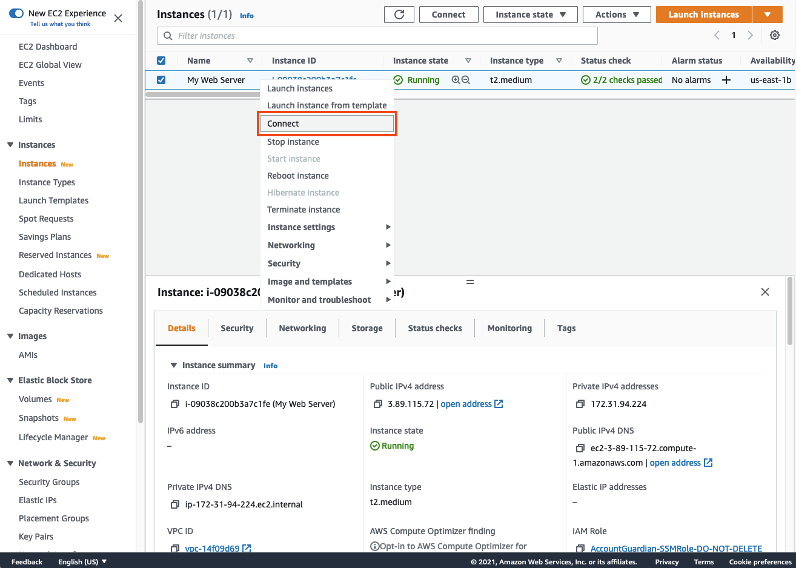
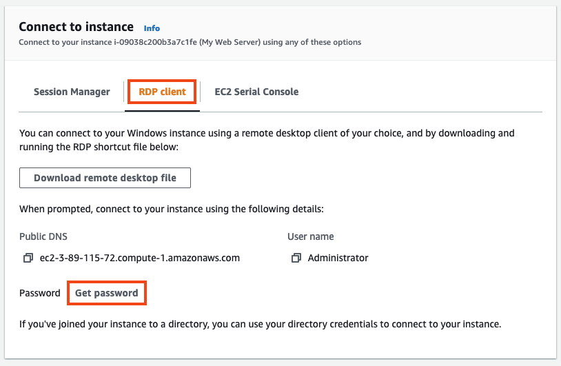
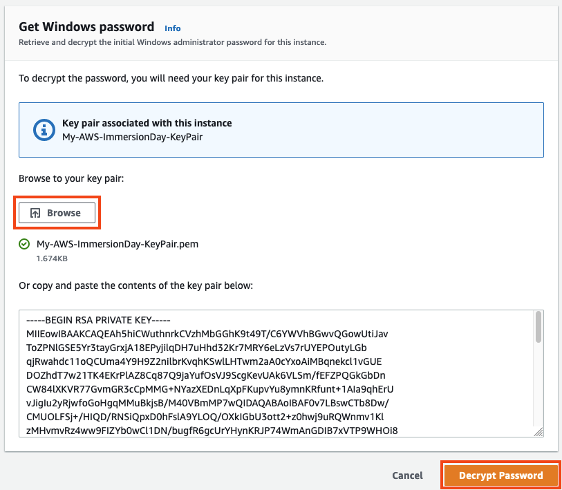
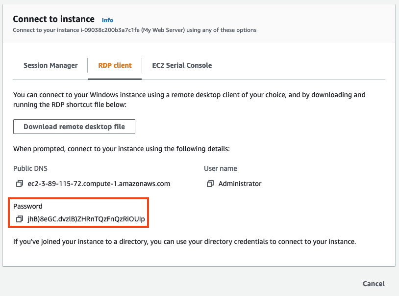
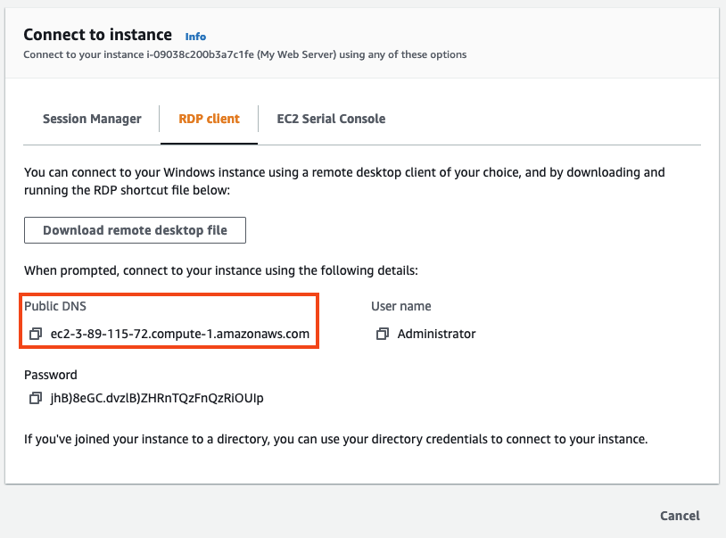
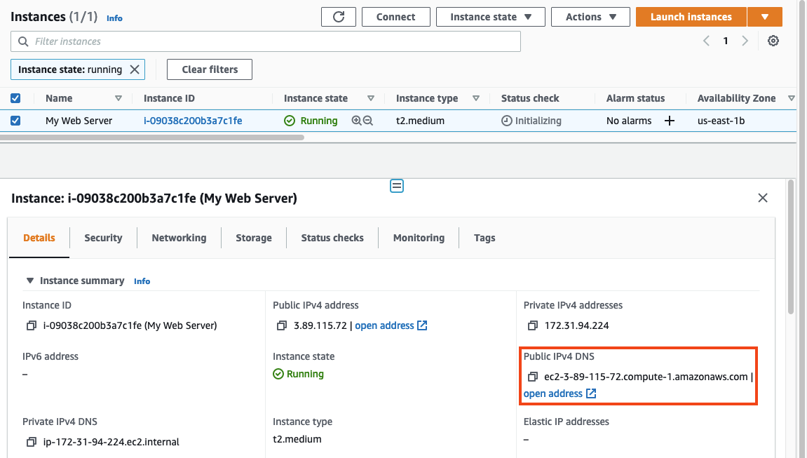
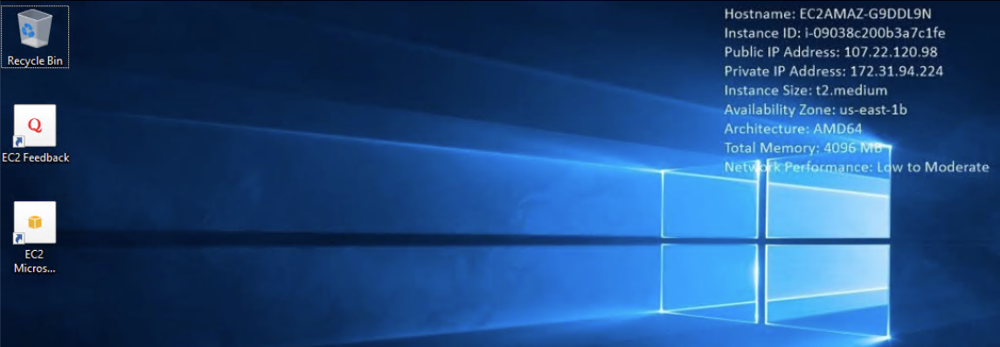

# 윈도우 인스턴스에 접근하기

## 윈도우 인스턴스에 접근하기
본 실습에서는 RDP 클라이언트를 사용하여 윈도우 데스크탑에 연결하는 작업을 수행합니다. 만약 윈도우 PC 사용자라면 bundled Remote Desktop application을 사용합니다. Mac 사용자라면 RDP client가 설치되어 있지 않다면 Microsoft Remote Desktop  링크를 통해 다운로드를 받습니다.

1. 자동으로 생성된 Windows 암호를 복호화하기 위해, 인스턴스를 선택하고 Connect 버튼을 클릭합니다.

2. RDP client을 클릭하고 Get password를 클릭합니다.

3. 그 다음 화면에서 Browse을 클릭하고 가장 처음 실습 때 생성한 키페어의 프라이빗 키를 선택합니다. Administrator 비밀번호를 얻기 위해 Decrypt Password를 클릭합니다.

4. 복호화된 Administrator 비밀번호는 아래의 화면처럼 보입니다. 복사 아이콘을 클릭해서 비밀번호를 복사합니다.

오직 여러분만이 프라이빗 키를 가지고 있기 때문에 자동 생성된 비밀번호는 여러분을 통해서만 복호화될 수 있습니다. 따라서 해당 키를 안전하게 보관하는 것은 중요합니다. 일반적으로 자동 생성된 비밀번호는 처음 로그인 이후, 사용자에 의해 변경될 수 있습니다. 만약 자동 생성된 비밀번호가 변경되지 않고 프라이빗 키를 유실하였다면 해당 비밀번호를 복호화할 방법이 없습니다.

5. RDP 애플리케이션을 실행하고 인스턴스의 호스트 이름으로 연결합니다.

또한 EC2 콘솔 Instances 에서 Instance summary에서 Public IPv4 DNS으로도 호스트 이름을 찾을 수 있습니다.

6. RDP 세션이 연결되면 아래와 같은 Windows 데스크탑 화면을 확인할 수 있습니다.

잘하셨습니다
Windows EC2 인스턴스에 성공적으로 연결했습니다.

[Previous](./2-ec2.md) | [Next](./4-ec2.md)