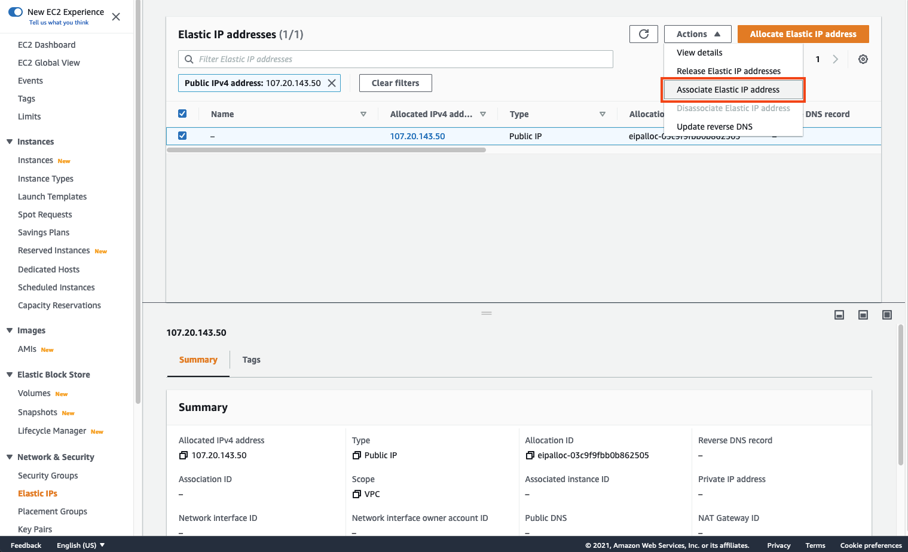

# (옵션) Elastic IPs

## Elastic IPs(고정 IP 할당하기)
웹 서버의 실제 DNS 이름을 어떻게 설정하나요? http://ec2-75-101-197-112.compute-1.amazonaws.com/  와 같은 주소는 번거로울 수 있습니다. 서버를 재부팅하고 DNS 이름과 IP 주소가 둘다 변경되기 전까지는 http://www.anycompany.com  으로 라우팅시키는 DNS 레코드를 셋팅하는 것이 쉬울 수 있습니다.

AWS는 Elastic IP(EIP) 주소를 제공합니다. Elastic IP는 동적 클라우드 컴퓨팅을 위해 고안된 정적 IPv4 주소입니다. Elastic IP 주소는 AWS 계정에 할당되며 릴리즈할 때까지 할당된 상태로 유지됩니다.

아래의 단계는 웹 서버에 EIP를 할당하는 방식입니다:

1. AWS 콘솔창을 실행하고, [Amazon EC2 콘솔](https://console.aws.amazon.com/ec2) 창을 엽니다.

2. 왼쪽 네이게이션 메뉴에서 Elastic IPs를 클릭합니다.

3. Allocate Elastic IP address를 클릭합니다.

4. Elastic IP 주소의 기본 사항을 확인한 후, Allocate를 클릭합니다.

5. 콘솔창에서 EIP를 선택합니다. Actions을 클릭하고 Associate Elastic IP address를 선택합니다.

6. 이전 실습에서 생성한 웹 서버 인스턴스를 선택한 후, Elastic IP를 할당하고 Associate를 클릭합니다.

잘하셨습니다
EC2 인스턴스에 Elastic IP를 할당하였습니다.
여러분들이 만든 EIP IP 주소를 www.yourdomain.com을  가리키도록 DNS 서버에 DNS A 레코드를 생성할 수 있습니다.

[Previous](./4-ec2.md) | [Next](./99-ec2.md)