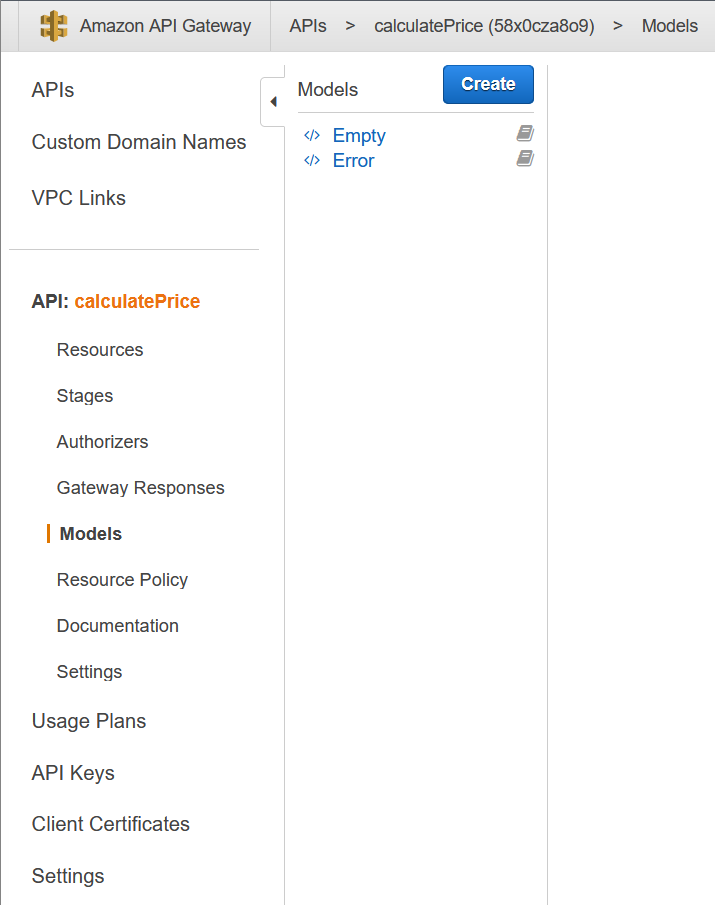
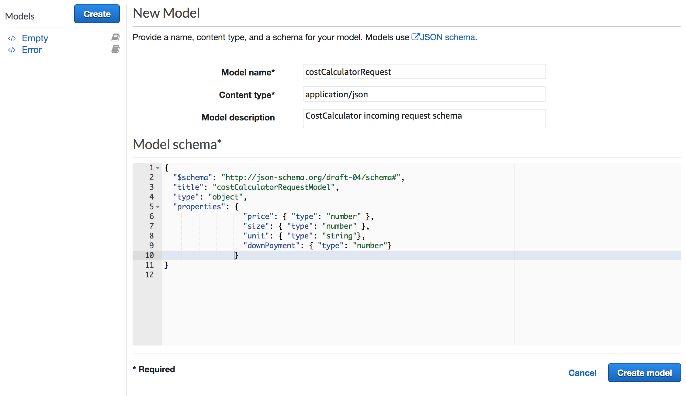
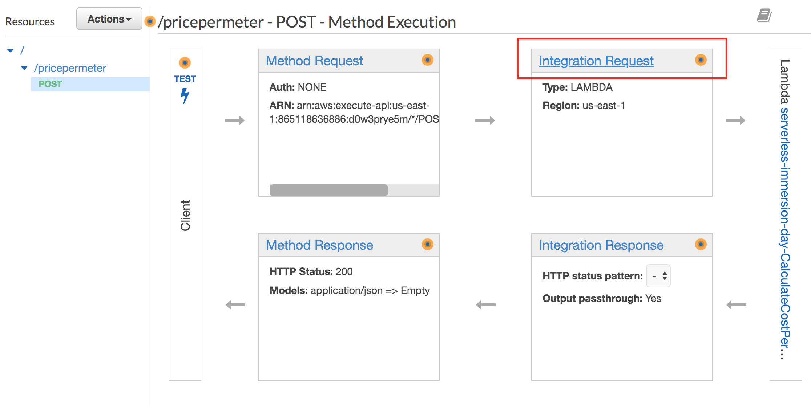
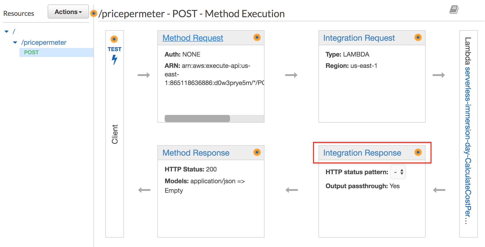
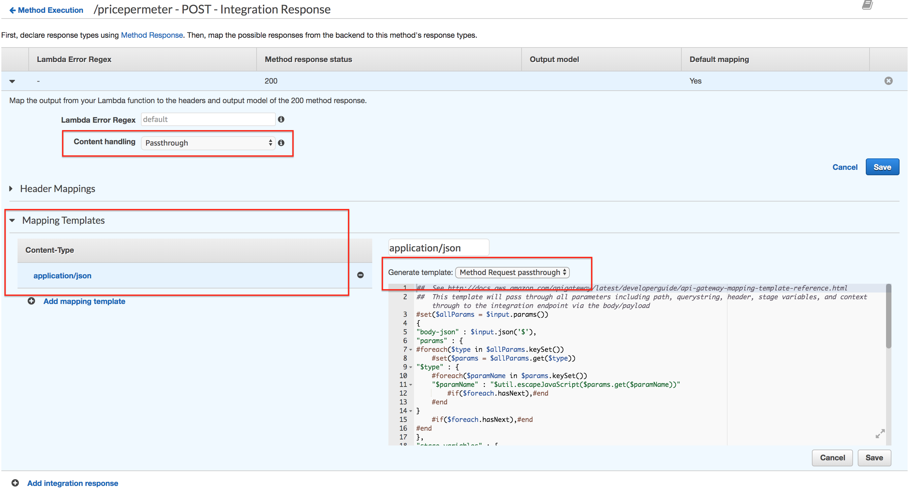
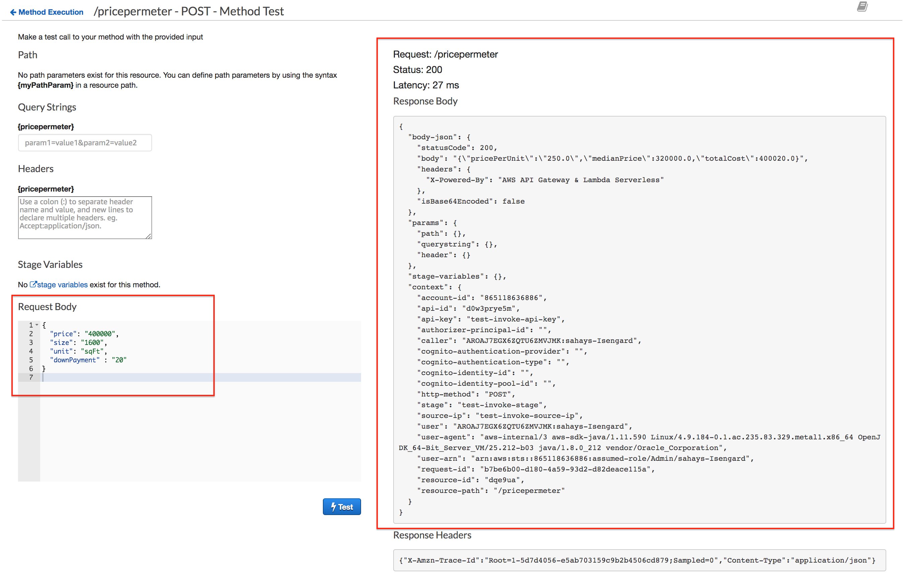

# Message Transformation

In API Gateway, a mapping template is used to transform data from one format to another. A JSON path expressions can be used to map and transform the integration payload to any desired format. In addition, a model (schema) can be created to define the structure of a message payload. Having a model also enables you to generate an SDK that can be used by the client application to send properly formatted messages.

In this section, you will first create a model to represent the schema of the incoming request and response messages. Then you will validate and transform the incoming request message to match the downstream service (lambda) specification. The returned response message will also be formatted to properly capture the unit metrics.

- Building a Model

- Transform Request Payload

- Transform Response Payload

- Test the API

- Building a Model

In the box that contains the name of the API calculatePrice, select Models.



2. Click Create.

3. Enter the following information:

    - Model name: costCalculatorRequest

    - ContentType: application/json

    - Model Description: CostCalculator incoming request schema

    - Model Schema: Copy and Paste the following:

```
{
  "$schema": "http://json-schema.org/draft-04/schema#",
  "title": "costCalculatorRequestModel",
  "type": "object",
  "properties": {
                  "price": { "type": "number" },
                  "size": { "type": "number" },
                  "unit": { "type": "string"}, 
                  "downPayment": { "type": "number"} 
  }
}
```



4. Click Create model.

Now that the models are created, the next step is to transform the incoming request and response messages.

## Transform Request Payload
1. Go back to the CalculatePrice API and click on the POST action.

2. From the Gateway pane, click on Integration Request



3. From the Integration Request pane, expand the Mapping Templates section

4. Select When there are no templates defined (recommended)

5. Click on Add mapping template

6. Type application/json for the Content-Type. Select check mark.

7. Under the Generate Template, select CostCalculatorRequest model

8. Update the template as follows:

```
#set($inputRoot = $input.path("$"))
{
  "price": "$inputRoot.price",
  "size": "$inputRoot.size",
  "unit": "$inputRoot.unit",
  "downPaymentAmount": $inputRoot.downPayment
}
```

9. Click Save
The first statement #set($inputRoot = $input.path("$")) uses a JSONPath expression and returns an object representation of the result. This allows you to access and manipulate elements of the payload natively in Apache Velocity Template Language (VTL).

After the inputRoot variable is assigned to the root of the request, we can map the value of price, size and unit into the appropriate fields. Notice that the last statement is mapping the value of downPayment to a new attribute called downPaymentAmount. The downstream lambda function uses the downPaymentAmount to calculate the total price. (i.e. totalPrice = price + downPaymentAmount).

The next step is to map the integration response. An API Gateway response is identified by a response type defined by API Gateway. The response consists of an HTTP status code, a set of additional headers that are specified by parameter mappings, and a payload that is generated by a non-VTL mapping template

## Transform Response Payload
Similar to the request mapping, create the mapping template for the response payload. Perform the following:

1. Go back to the CalculatePrice API and click on the POST action.

2. From the API Gateway pane, select Integration Response.

3. Click on Integration Response



4. Expand the 200 Method response row

5. Expand the Mapping Templates

6. Click on application/json Content-Type

7. Choose Method Request Passthrough

8. Click Save



## Test the API
In the response mapping, we have chosen to pass through the response content from lambda without making any further modifications. The method request passthrough is a pre-defined template that maps the request header, body, parameters and context. The $context variable holds all the contextual information of your API call.

1. Go back to your calculatePrice API and click on the POST method to test your API.

2. Click on the Test icon to provide a sample request message.
3. Copy and Paste the following JSON Sample in the Request Body section

```
{
  "price": "400000",
  "size": "1600",
  "unit": "sqFt",
  "downPayment": "20"
} 
```

4. Click on Test



Notice that the downPayment amount was added to the price to calculate the totalCost output. The response also contains the header and context attributes.

[Previous](./2-apigateway.md) | [Next](./4-apigateway.md)