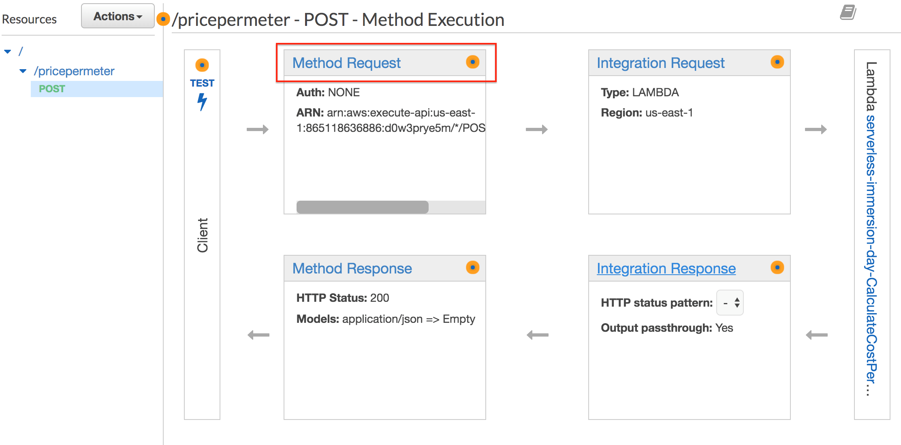
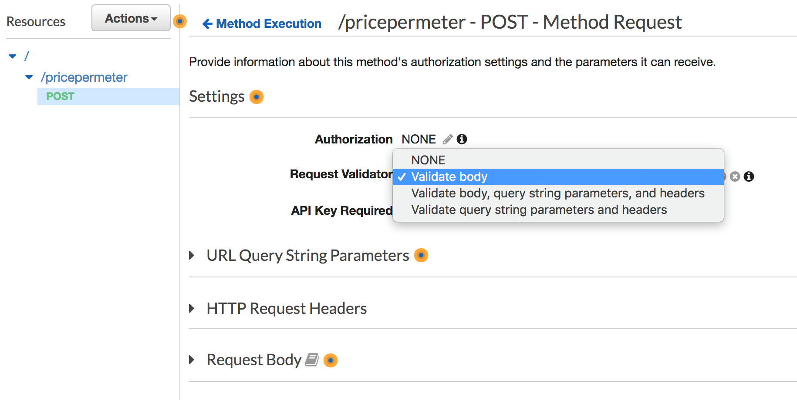
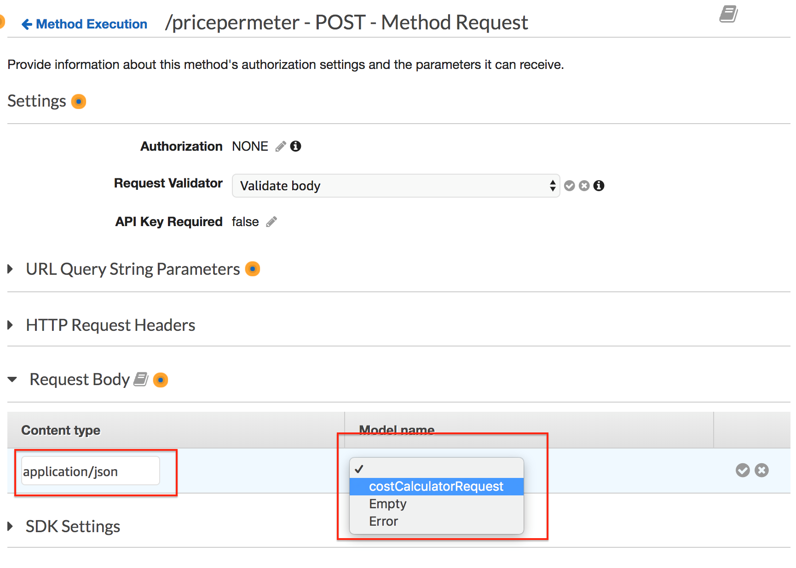
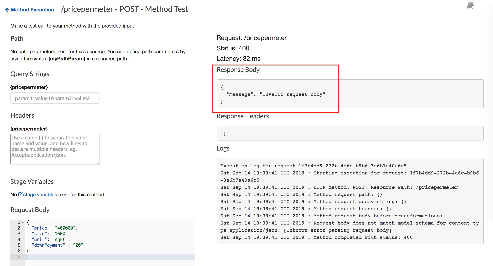

# Request Validation
Request validation is used to ensure that the incoming request message is properly formatted and contains the proper attributes. You can set up request validators in an API’s Swagger definition file and then import the Swagger definitions into API Gateway. You can also set them up in the API Gateway console or by calling the API Gateway REST API, AWS CLI, or one of the AWS SDKs.

The API Gateway console lets you set up the basic request validation on a method using one of the three validators:

- Validate body: This is the body-only validator.

- Validate query string parameters and headers: This is the parameters-only validator.

- Validate body, query string parameters, and headers: This validator is for both body and parameters validation.

In this section, we will use the console to setup request validation and validate only the body.

1. Select CalculatePrice API and choose the POST method.

2. Choose Method Request



3. Choose the pencil icon of Request Validator under Settings.

4. Choose Validate body from the Request Validator drop-down list and then click the check mark icon to save your choice.



5. Expand Request Body

6. Click Add model

7. Enter application/json for Content Type

8. Choose costCalculatorRequest for the model name

9. Click the check mark icon to confirm.



Go back to the API Gateway console and select the POST integration method to test out the API.

1. Click on the Test icon to provide a sample request message.

2. Copy and Paste the following JSON Sample in the Request Body section

```
{
  "price": "400000",
  "size": "1600",
  "unit": "sqFt",
  "downPayment": "20"
} 
```

3. Click on Test

Notice that this time, the message failed with a message of Invalid request body.



The request failed validation because price, size and downPayment are defined as number in our model/schema. Remove the string quotes (" ") from price, size, and downPayment and try your request again.

4. Click on the Test icon to provide a sample request message.

5. Copy and Paste the following JSON Sample in the Request Body section

```
{
  "price": 400000,
  "size": 1600,
  "unit": "sqFt",
  "downPayment": 20
}
```

6. Click on Test

You should see that the normal response is returned by the service.

[Previous](./3-apigateway.md) | [Next](./5-apigateway.md)