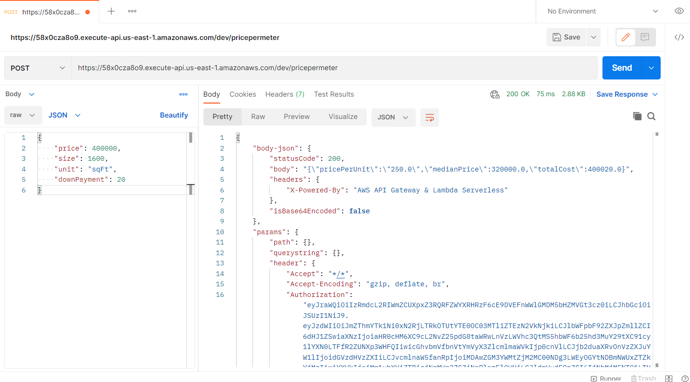

# API Deployment

At this point, we have been testing our API using the API Gateway console. Now that we have made the necessary configuration for authorization, we are ready to deploy our API.

1. Select POST method from the API Gateway console for the pricepermeter method of the calculatePrice API

2. Select Actions then choose Deploy API


3. Select [New Stage] from the Deployment Stage drop down

4. Enter the following values:

    - Stage Name: dev

    - Stage description: Development stage for calculate price API Deployment

    - Deployment description: Initial Deployment


4. Click Deploy

5. Expand the dev stage, and click on the POST method of the pricepermeter method.

Note the API/Invoke URL. Copy this value as it will be used in the subsequent steps.

Up to this point, we have used the local API Gateway console to test our API. Now that we have deployed the API, we can test it using external tools. For this lab, we will leverage PostMan to test our API.

1. Skip signing up for an account

2. Click Create a Request

3. Insert the API/Invoke URL into the request URL textbox

4. Change the method type to POST from GET

5. Click Headers. Insert the following attributes

    - Key: Authorization

    - Value: [Your IdToken]

Content-Type is automatically set when you choose the Body type below.


4. Click Body tab for Request

5. Choose raw type in the radio buttons / drop down

6. Change Body type to JSON

7. Insert the following request

```
{
  "price": 400000,
  "size": 1600,
  "unit": "sqFt",
  "downPayment" : 20
}
```

8. Click Send

Click View then Toggle Two-Pane View to have Request and Response side by side.



Congratulations, you have just deployed your first API

You created your first API using Amazon API Gateway. In this lab, you configured API Gateway to call a lambda service, transformed and validated the request message, and secured the API. In the next two modules you will learn additional features of API Gateway.

[Previous](./5-apigateway.md) | [Next](./7-apigateway.md)