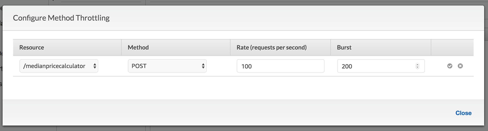

# Usage Plans and Message Throttling (Optional)
To prevent your API from being overwhelmed by too many requests, Amazon API Gateway throttles requests to your API. There are pre-defined steady-state and burst throttling limits set at the account level. As an API owner, you can set the default method throttling to override the account-level request throttling limits for a specific stage or for individual methods in an API. In addition, you can setup usage plans to restrict client request submissions to within specified request rates and quotes.

A usage plan provides access to one or more deployed API stages with configurable throttling and quota limits enforced on individual client API keys. API callers are identified by API keys that can be generated by API Gateway. The throttling prescribes the request rate limits applied to each API key.

In the subsequent sections of the lab, we are going to setup API Keys to track our API Callers. The API keys will then be used to setup usage plans and restrict each client based on their tier level (platinum, gold, silver, etc.).

- Setting up API Keys

- Setting Up Usage Plans

- Testing API with Usage Plan

## Setting up API Keys

1. If not already done, Sign in to the AWS Management Console and open the API Gateway console at https://console.aws.amazon.com/apigateway/ .

2. In the API Gateway main navigation pane, select the calculatePrice API by clicking on the name

3. Then click the POST action of medianpricecalculator method

4. Select Method Request

5. Under the Settings section, select true for API Key Required.

6. Select the check mark icon to save the settings.

7. Choose Actions then Deploy API. Enter the following values:

    - Stage Name: dev

    - Deployment description: Adding API Key

8. Click Deploy

Now that our API requires an API key, we have to create one.

1. In the API Gateway main navigation pane, select API Keys.

2. From the Actions drop-down menu, select Create API key.

3. Enter following values:
    - Name: calculatePriceKey

    - API Key: Auto Generate
    
    - Description: Main key for calculatePrice API

4. Click Save

You may need to click on APIs and select the calculatePrice API to get back the full navigation menu.

## Setting Up Usage Plans
Once the API keys are created, the next step is to create a Usage Plan.

1. In the Amazon API Gateway main navigation pane, Select Usage Plans,

2. Click Create to create a new usage plan.

3. Under Create Usage Plan, enter the following:

    - Name: Platinum

    - Description: Exclusive plan for our best customers.

    - Select Enable throttling

    - Throttling > Rate: 100

    - Throttling > Burst: 200

    - Select Enable quota

    - Quota: 5000 requests per Month.

4. Select Next.

5. Select Add API Stage

6. Select calculatePrice API

7. Select dev stage

8. Select the check mark icon to confirm

9. Click Next

10. Click Add API Key to Usage Plan

11. Type: calculatePriceKey and select item when it comes up

12. Click check mark icon to confirm

13. Click Done

14. While on the Details tab click Configure Method Throttling under Associated API Stages

15. Click Add Resource/Method

16. Use the following values:

    - Resource: /mediapricecalculator

    - Method: POST

    - Rate: 100

    - Burst: 200

16. Click check mark icon to confirm

17. Click Close
At this point, we have created a Platinum usage plan that enables the calculate price API to accept 100 requests and burst up to 200 requests. If desired, we can also create Silver and Bronze plans that enable fewer requests.

## Testing API with Usage Plan
Once the Keys are created and associated with an API, they are typically distributed to developers or customers. In this lab, we will use Postman to test our deployed service with the API Keys.

1. In the Amazon API Gateway main navigation pane, choose API Keys

2. Select calculatePriceKey

3. Click Show to reveal the API Key

4. Copy the API Key

Using Postman, configure the following

1. Select the medianpricecalculator in POSTMAN

2. Set the Header attribute x-api-key

3. Set the value with your API Key

4. Click Send

Invoke the method several (10+) times and then go to usage plan to see the number of invocations remaining.

1. In the Amazon API Gateway main navigation pane, choose Usage Plans

2. Click on Platinum Plan

3. Click on API Keys

4. Click Usage

5. Notice the usage statistics.

Usage data is delayed by up to an hour, so would suggest taking a break for an hour and coming back to check it.

6. Click on Extension

7. Observe the number of requests that are still available.

[Previous](./7-apigateway.md) | [Next](./9-apigateway.md)