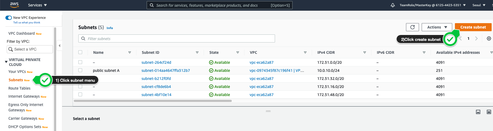
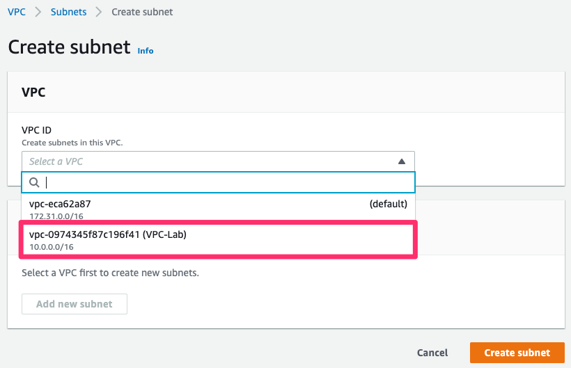
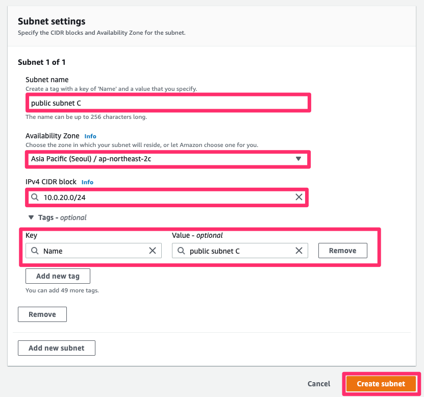
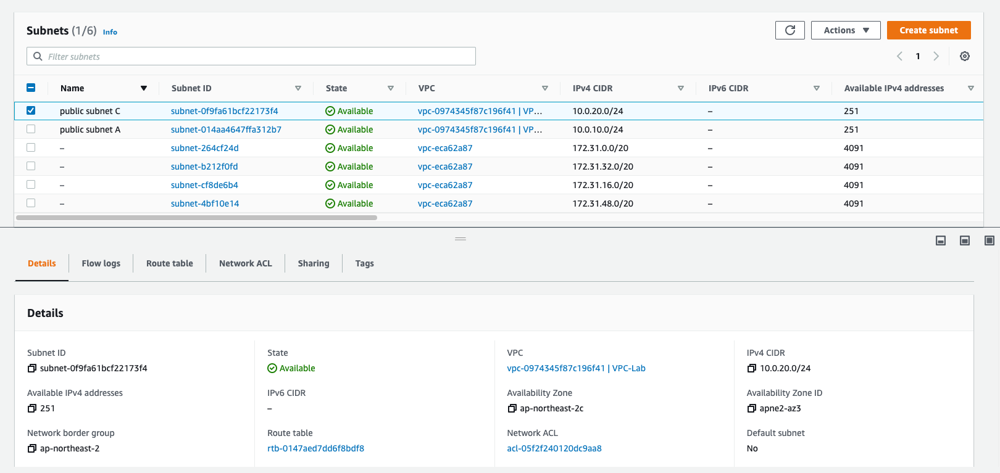
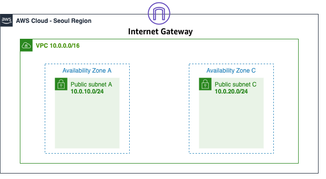

# 추가 서브넷 생성하기

## 추가 서브넷 생성하기
고가용성을 확보하기 위해, 다중 가용 영역에 서비스를 배포하는 것이 중요합니다. 따라서 본 실습에서는 앞에서 생성한 서브넷이 위치한 가용 영역 A 외에 다른 가용 영역인 C에 서브넷을 생성합니다.

1. 왼쪽 사이드 바에서 서브넷 메뉴를 클릭한 후, 서브넷 생성 버튼을 클릭합니다.

2. VPC ID에는 방금 생성한 VPC를 선택합니다.

3. 아래의 서브넷 설정에서는 화면과 같이 값을 입력한 후, 서브넷 생성 버튼을 클릭합니다.

키 | 값
--- | ---
서브넷 이름 | public subnet C
가용 영역 | ap-northeast-2c
IPv4 CIDR 블록 | 10.0.20.0/24
Name | public subnet C

4. public subnet A와 public subnet C가 모두 생성된 것을 확인할 수 있습니다.

5. 현재까지의 아키텍처 구성은 아래와 같습니다.

[Previous](./1-vpc.md) | [Next](./3-vpc.md)