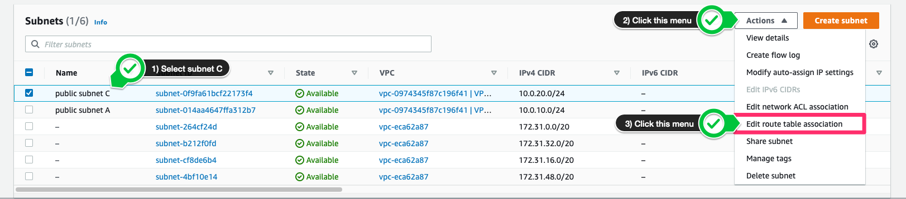
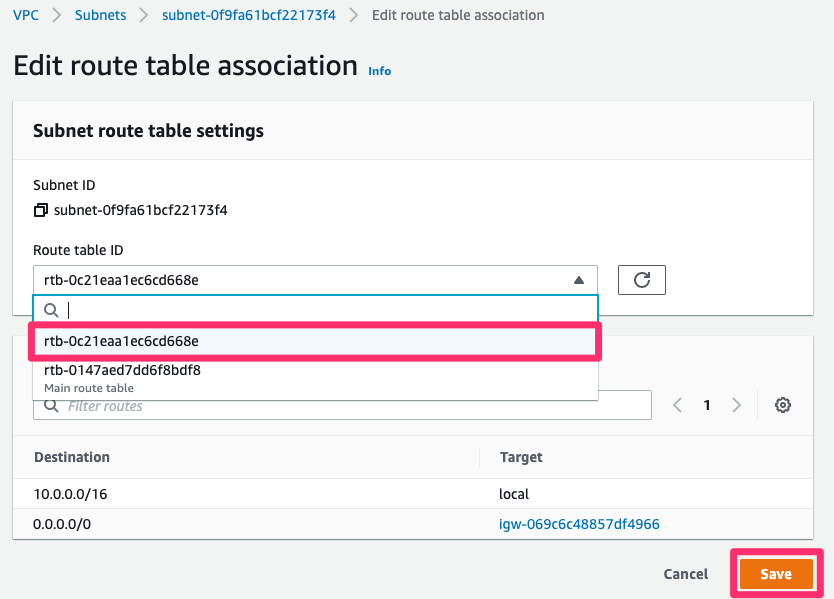
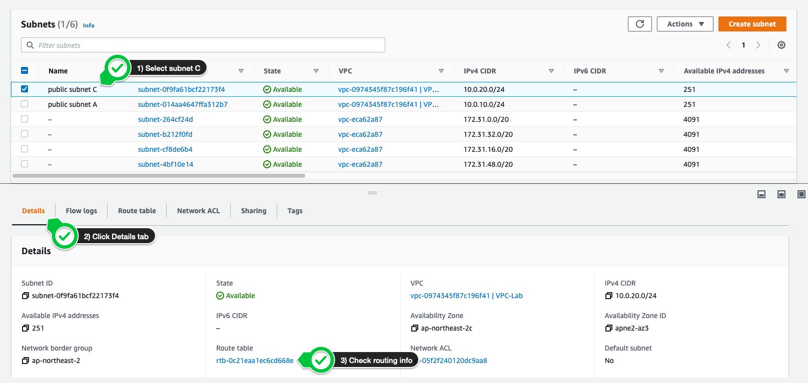
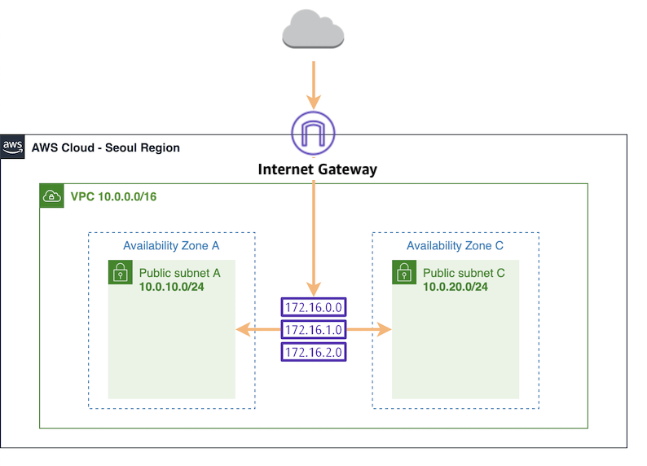

# 라우팅 테이블 편집하기

## VPC 라우팅 테이블 개념
라우팅 테이블에는 서브넷 또는 게이트 웨이의 네트워크 트래픽이 전송되는 위치를 결정하는데 사용되는 라우팅이라는 규칙 집합이 포함되어 있습니다.

- 기본 라우팅 테이블은 VPC와 함께 자동으로 생성되는 라우팅 테이블입니다. 다른 라우팅 테이블과 명시적으로 연결되지 않은 모든 서브넷의 라우팅을 제어하는 역할을 합니다.

- 사용자 지정 라우팅 테이블은 기본 라우팅 테이블 외에 사용자가 생성한 라우팅 테이블입니다.

## 라우팅 테이블 편집하기

1. 서브넷 메뉴에서 작업 버튼을 클릭한 후, 라우팅 테이블 연결 편집을 선택합니다.

2. 라우팅 테이블 ID에서 기본 라우팅 테이블이 아닌 다른 라우팅 테이블을 선택한 후, 저장합니다. 이때, 선택한 라우팅 테이블에 인터넷으로 향하는 경로가 있는지 확인합니다.

3. public subnet C를 선택한 후, 세부 정보 탭에서 변경된 라우팅 테이블 하이퍼 링크를 클릭하면 라우팅 정보를 확인할 수 있습니다.

라우팅 테이블을 클릭 후, 라우트 탭에서 확인할 수 있는 결과는 아래와 같습니다. 이를 통해, public subnet C도 인터넷으로 향하는 경로가 생성되었음을 확인할 수 있습니다.

Destination | Target
----------- | -----
10.0.0.0/16 | local
0.0.0.0/0 | igw-OOO

4. 현재까지의 아키텍처 구성은 아래와 같습니다.

[Previous](./2-vpc.md) | [Next](./4-vpc.md)