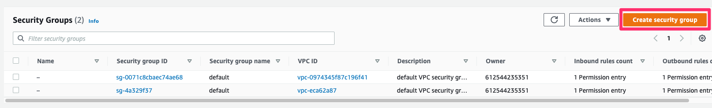
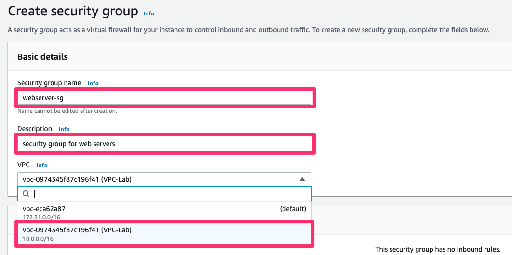
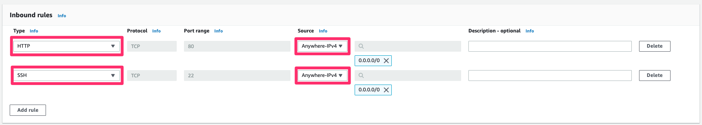
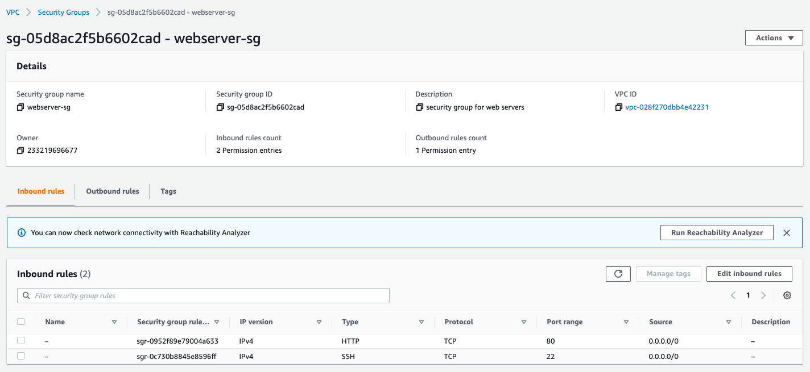

# 보안 그룹 생성하기

## 보안 그룹 생성하기
보안 그룹은 인스턴스에 대한 인바운드 및 아웃바운드 트래픽을 제어하는 가상 방화벽 역할을 합니다.

1. 왼쪽 사이드 바에서 보안 그룹 메뉴를 클릭한 뒤, 보안 그룹 생성 버튼을 클릭합니다.

2. 화면과 같이 보안 그룹 및 설명을 입력한 후, 본 실습에서 생성한 VPC를 선택합니다.

키 | 값
--- | ---
보안 그룹 이름 | webserver-sg
설명 | security group for web servers
VPC | VPC-Lab

3. 인바운드 규칙에서 아래와 같이 규칙을 부여한 후, 오른쪽 하단의 보안 그룹 생성 버튼을 클릭합니다.

유형 | 소스
--- | ---
HTTP | Anywhere-IPv4
SSH | Anywhere-IPv4

4. 아래와 같이 인바운드 규칙이 생성된 것을 확인합니다.

[Previous](./3-vpc.md) | [Next](./6-vpc.md)