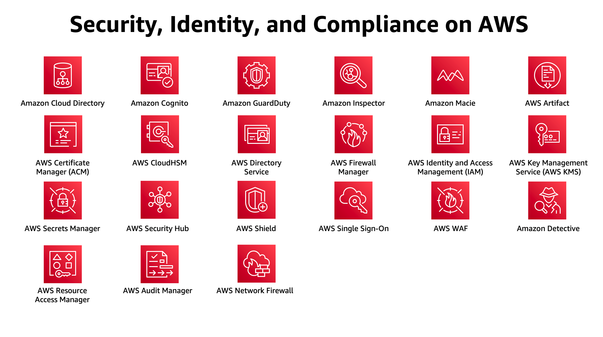

# 보안 - AWS IAM

AWS를 사용하면 오늘날 사용 가능한 가장 유연하고 안전한 클라우드 컴퓨팅 환경에서 비즈니스를 안전하게 운영하는 데 필요한 제어 능력과 자신감을 얻을 수 있습니다. AWS 고객은 정보, 자격 증명, 애플리케이션 및 디바이스를 보호하도록 설계된 AWS 데이터 센터와 네트워크를 활용할 수 있습니다. AWS를 사용하면 AWS의 포괄적인 서비스 및 기능을 통해 데이터 리전성, 보호 및 기밀성과 같은 핵심 보안 및 규정 준수 요구 사항을 충족할 수 있습니다.

AWS에서는 수동 보안 태스크를 자동화하여 비즈니스 확장 및 혁신에 집중할 수 있습니다. 또한 사용하는 서비스에 대해서만 요금을 지불하면 됩니다. AWS의 모든 고객은 보안에 매우 민감한 워크로드를 처리할 수 있을 정도로 안전하고 검증된 서비스 오퍼링 및 관련 공급망을 지원하는 유일한 상용 클라우드인 AWS의 이점을 누릴 수 있습니다.

## 참고 자료

- [IAM Introduction](https://docs.aws.amazon.com/IAM/latest/UserGuide/introduction.html)

- [IAM Best Practices](https://docs.aws.amazon.com/IAM/latest/UserGuide/best-practices.html)

- [IAM Policies](https://docs.aws.amazon.com/IAM/latest/UserGuide/access_policies.html)

- [IAM Tutorials](https://docs.aws.amazon.com/IAM/latest/UserGuide/tutorials.html)

[Previous](./20-vpc/api-gateway/9-apigateway.md) | [Next](./30-iam/iam.md)