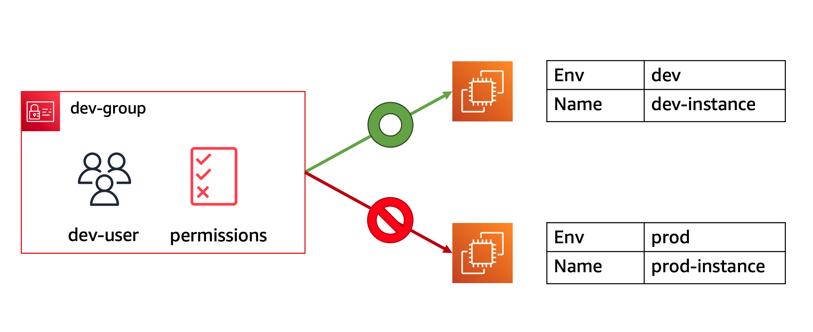

# IAM 실습

## Identity & Access Management (IAM) 에 대하여
[AWS Identity and Access Management (IAM)](https://docs.aws.amazon.com/IAM/latest/UserGuide/introduction.html) 는 AWS 리소스에 대한 액세스를 안전하게 제어할 수 있는 웹 서비스입니다. IAM을 사용하여 리소스를 사용하도록 인증(로그인) 및 권한 부여(권한 있음)된 사용자를 제어할 수 있습니다.

AWS 계정을 처음 생성하는 경우에는 전체 AWS 서비스 및 계정 리소스에 대해 완전한 액세스 권한을 지닌 단일 로그인 자격 증명으로 시작합니다. 이 자격 증명은 AWS 계정 루트 사용자라고 하며, 계정을 생성할 때 사용한 이메일 주소와 암호로 로그인하여 액세스합니다.

일상적인 작업은 물론 관리 작업에도 루트 사용자를 사용하지 않는 것이 좋습니다. 대신 IAM 사용자를 처음 생성할 때만 루트 사용자를 사용하는 모범 사례 를 준수하십시오.

AWS IAM 주요 컴포넌트:

- IAM Identities
    - [IAM Users](https://docs.aws.amazon.com/IAM/latest/UserGuide/id_users.html)

    - [IAM User groups](https://docs.aws.amazon.com/IAM/latest/UserGuide/id_groups.html)

    - [IAM Roles](https://docs.aws.amazon.com/IAM/latest/UserGuide/id_roles.html)

- [IAM Policy](https://docs.aws.amazon.com/IAM/latest/UserGuide/access_policies.html)

또한, AWS 리소스를 안전하게 보호하려면 [IAM에서의 보안 모범 사례](https://docs.aws.amazon.com/IAM/latest/UserGuide/best-practices.html) 를 참고합니다.

본 실습은 아래의 순서로 구성되어 있습니다:

1. [태그를 명시한 EC2 인스턴스 생성](https://catalog.workshops.aws/general-immersionday/ko-KR/basic-modules/30-iam/iam/1-iam)

2. [AWS IAM Identities 생성](https://catalog.workshops.aws/general-immersionday/ko-KR/basic-modules/30-iam/iam/2-iam)

3. [리소스 접근 테스트](../images/https://catalog.workshops.aws/general-immersionday/ko-KR/basic-modules/30-iam/iam/3-iam)

4. [EC2 Instance에 IAM Role 부여 및 접근 테스트](https://catalog.workshops.aws/general-immersionday/ko-KR/basic-modules/30-iam/iam/4-iam)

[Previous](../30-iam.md) | [Next](./iam.md)
