# AWS IAM Identities 생성하기

## AWS IAM Identities 생성하기
이번 실습에서는 AWS IAM Identities 생성 작업을 수행할 것입니다. AWS IAM Identity는 IAM 사용자, IAM 사용자 그룹, 그리고 IAM 역할을 포함합니다. 또한, identity나 리소스에 권한을 부여하기 위한 객체인 IAM Policy를 생성할 것입니다.


이번 실습은 아래의 단계로 구성되어 있습니다.

- IAM User group에 붙이기 위한 IAM Policy 생성

- dev-group라는 IAM User group 생성

- dev-group에 속해 있는 dev-user라는 이름을 가진 IAM User 생성

1. IAM 콘솔 에 로그인 합니다. 콘솔에 로그인할 때 접속할 Sign-in URL의 **어카운트 별칭(Account Alias)** 을 생성하기 위해 IAM 메인 페이지의 우측에서 Create 버튼을 클릭합니다.


2. 계정 별칭을 입력합니다. 본 실습에서는 aws-login-사용자 이름 을 입력하고 create alias 버튼을 클릭합니다.

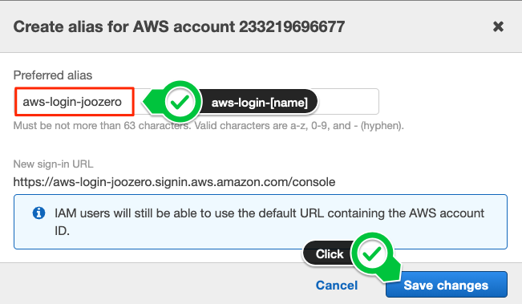

3. IAM 콘솔 왼쪽 사이드바에서 Policies를 클릭하고, 오른쪽 상단에 있는 Create Policy 버튼을 클릭합니다.

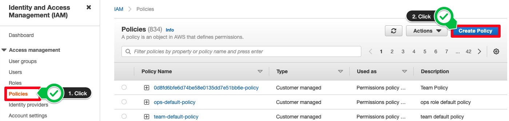

4. AWS 권한을 부여하기 위한 policy를 정의할 때, visual editor 혹은 JSON으로 생성 및 편집을 할 수 있습니다. 본 실습에서는 JSON 방법을 사용합니다. 아래에 명시된 권한을 간단하게 설명하면 해당 policy는 Env-dev로 태깅된 EC2에 대한 모든 액션을 허용합니다. 또한, 모든 EC2 인스턴스의 describe와 관련된 액션에 대해 허용합니다. 그러나 사용자가 임의로 Tags를 생성 및 삭제하는 액션은 거부합니다. Deny가 allow보다 우선권을 가짐에 유의하세요.

```
{
    "Version": "2012-10-17",
    "Statement": [
        {
            "Effect": "Allow",
            "Action": "ec2:*",
            "Resource": "*",
            "Condition": {
                "StringEquals": {
                    "ec2:ResourceTag/Env": "dev"
                }
            }
        },
        {
            "Effect": "Allow",
            "Action": "ec2:Describe*",
            "Resource": "*"
        },
        {
            "Effect": "Deny",
            "Action": [
                "ec2:DeleteTags",
                "ec2:CreateTags"
            ],
            "Resource": "*"
        }
    ]
}
```

JSON 탭을 클릭하고 위의 policy를 붙인 후 Next: Tags 버튼을 클릭합니다.

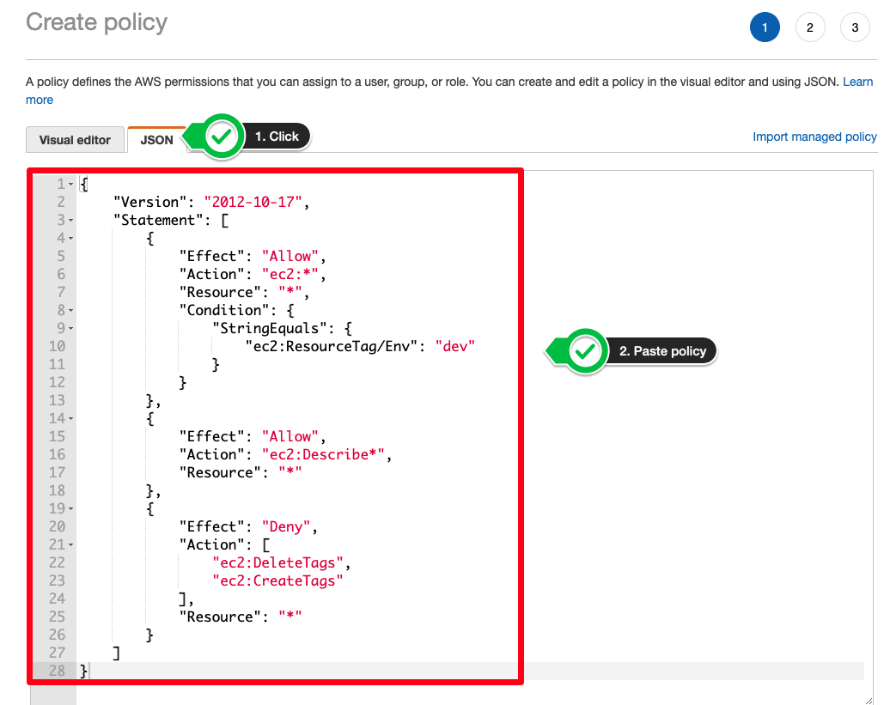

JSON policy 구조 

- Version : 최신 2012-10-17 버전 사용 권고합니다.

- Statement : 이 주요 정책 요소를 다음 요소의 컨테이너로 사용합니다. 정책에 설명문 둘 이상을 포함할 수 있습니다.

- Sid(선택 사항) : 선택 설명문 ID를 포함하여 설명문들을 구분합니다.

- Effect : Allow 또는 Deny를 사용하여 정책에서 액세스를 허용하는지 또는 거부하는지 여부를 설명합니다.

- Principal (일부 상황에서만 필요) : 리소스 기반 정책을 생성하는 경우 액세스를 허용하거나 거부할 계정, 사용자, 역할 또는 연동 사용자를 표시해야 합니다. 사용자 또는 역할에 연결할 IAM 권한 정책을 생성하면 이 요소를 포함할 수 없습니다. 보안 주체는 사용자 또는 역할을 의미합니다.

- Action : 정책이 허용하거나 거부하는 작업 목록을 포함합니다.

- Resource (일부 상황에서만 필요) : IAM 권한 정책을 생성하는 경우 작업이 적용되는 리소스 목록을 지정해야 합니다. 리소스 기반 정책을 생성하는 경우 이 요소는 선택 사항입니다. 이 요소를 포함하지 않으면 작업이 적용되는 리소스는 정책이 연결된 리소스입니다.

- Condition (선택 사항) : 정책에서 권한을 부여하는 상황을 지정합니다.
다음 단계에서는 기본 사항으로 유지하고 Next: Review 버튼을 클릭합니다. name 칸에 DevPolicy를 입력하고 해당 policy에 대한 설명을 작성합니다.

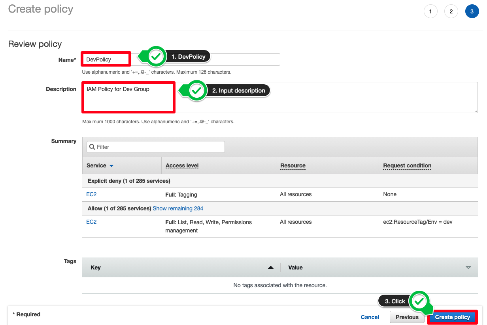

KEY | VALUE
--- | -----
Name | DevPolicy
Description | IAM Policy for Dev Group

6. IAM 콘솔 왼쪽 사이드 바에서 User groups를 클릭하고 오른쪽 상단에 Create group를 클릭합니다.

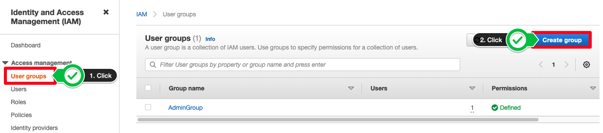

7. User group name에 dev-group을 입력하고 Attach permissions policies - Optional 섹션에서 DevPolicy를 선택합니다.

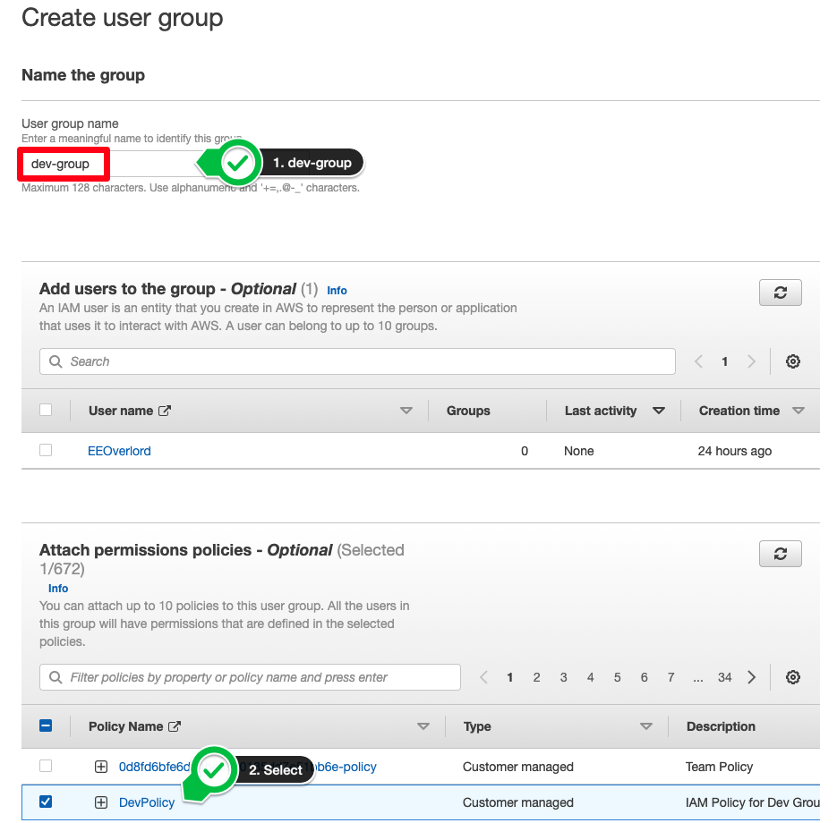

KEY | VALUE
--- | ----
User group | name	dev-group

8. 왼쪽 사이드바에서 Users를 클릭하고 Add users 버튼을 클릭합니다.

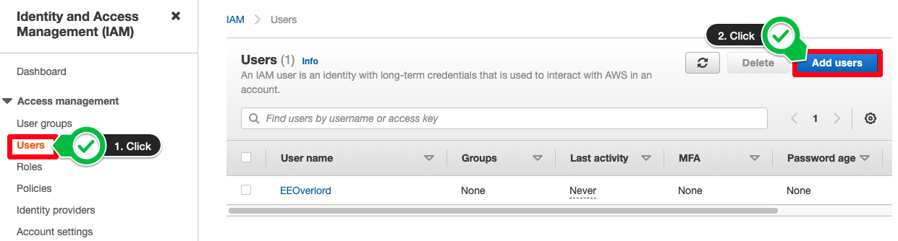

9. User name에 dev-user를 입력하고 Programmatic access와 AWS Management console access를 허용합니다. 그 후, Custom password를 선택하고 원하시는 패스워드를 입력합니다. 마지막으로 다음 단계에서 빠른 실습을 진행하기 위해 Require password reset 체크를 해제합니다. 실제 사용할 때에는 패스워드 초기화를 권장드립니다. Next: Permissions 버튼을 클릭합니다.

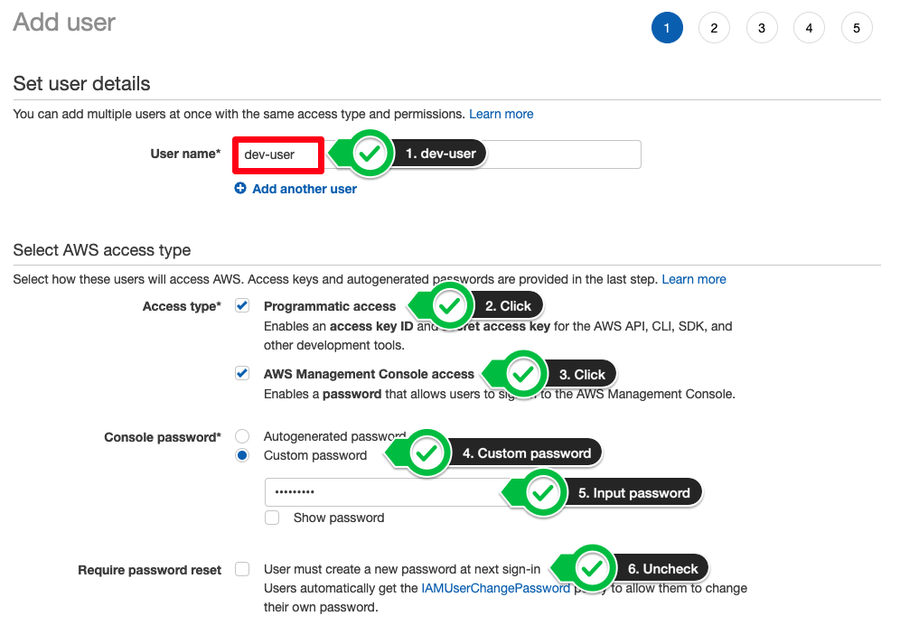

10. 방금 생성한 dev-group를 선택하고 Next: Tags 버튼을 클릭합니다. Add user 단계는 생략하고 다음 단계로 넘어갑니다.

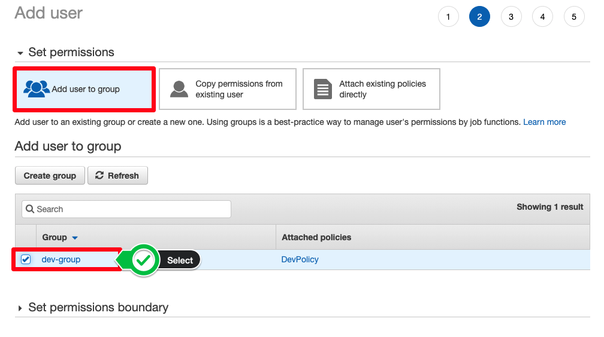

dev-user를 추가하기 위해 Create user 버튼을 클릭합니다.

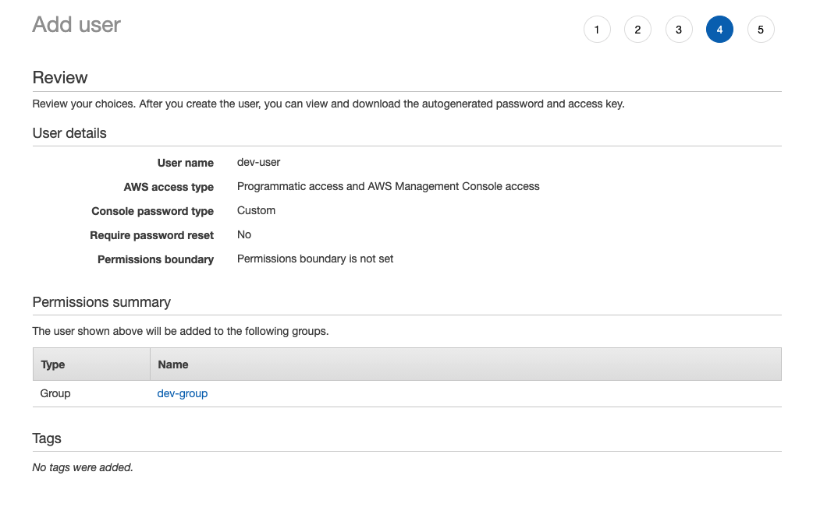

Access key ID와 Secret access key를 얻기 위해 csv 파일을 다운로드 합니다. 또한, 로그인을 위한 가이드를 이메일로 보낼 수 있습니다.

11. dev-user로 로그인하기 위해, Sign-in URL을 클릭합니다.

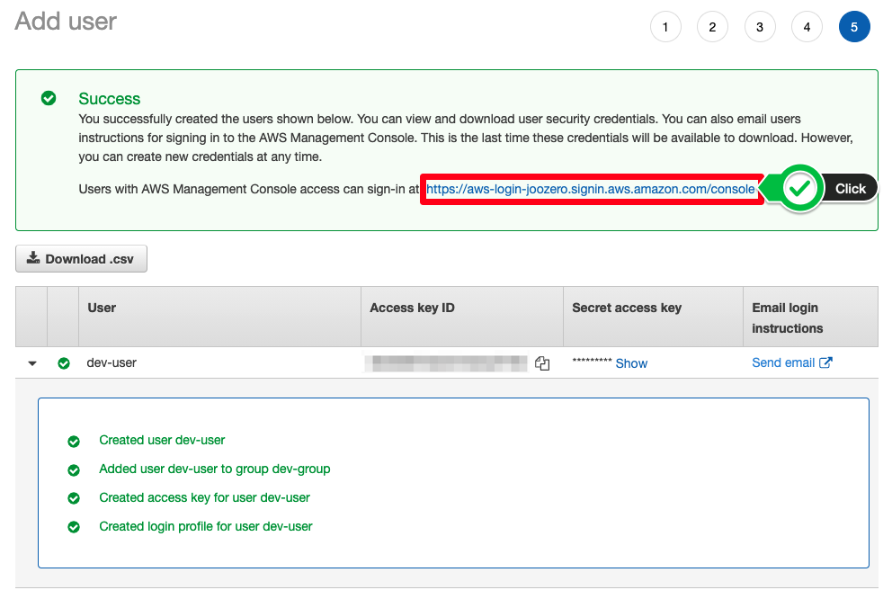

12. AWS 관리 콘솔에 접속하기 위해 IAM user name과 Password를 입력합니다.

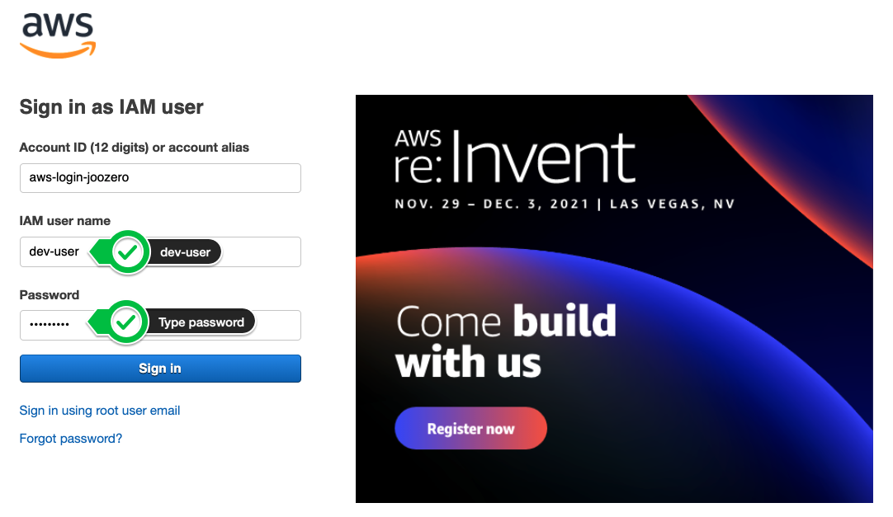

잘하셨습니다! AWS Identities를 생성했습니다. 다음 챕터에서는 설정한 권한이 제대로 작동하는지 확인합니다.

[Previous](./1-iam.md) | [Next](./3-iam.md)