# 리소스 접근 테스트

## 리소스 접근 테스트

1. AWS 관리 콘솔로 로그인한 후, IAM User과 계정 별칭을 확인합니다. 또한, EC2 인스턴스를 실행한 AWS region이 맞는지 확인합니다.

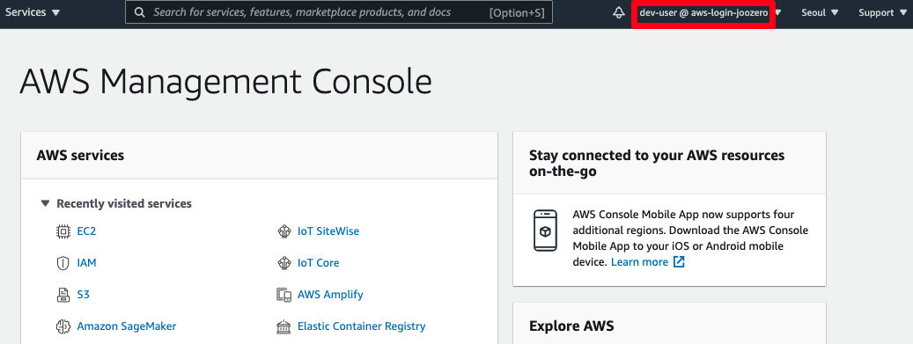

2. [EC2 console](https://console.aws.amazon.com/ec2) 로 이동하고 Instances 메뉴를 클릭합니다. prod-instance라는 이름을 가진 인스턴스를 선택하고, Instance state > Stop instance 버튼을 클릭합니다. 그리고 팝업창에서 Stop 버튼을 클릭합니다.

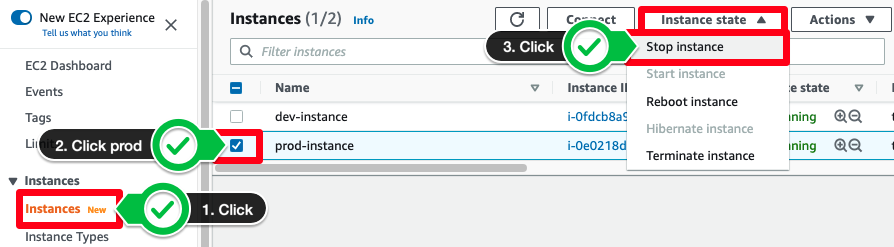

3. dev-user는 EC2 인스턴스 중지 작업을 수행할 권한이 없다는 경고창이 나타납니다. 이는 이전 챕터에서 dev-user의 경우 리소스 태그가 Env(키)-dev(값)인 인스턴스에 한해 작업을 취할 수 있다라고 허용했기 때문입니다.

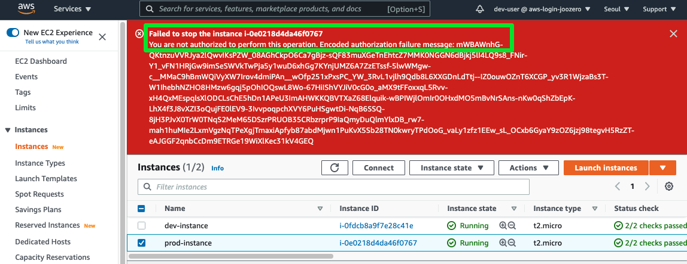

4. dev-instance라는 이름을 가진 인스턴스를 선택하고, Instance state > Stop instance 버튼을 클릭합니다. 그리고 팝업창에서 Stop 버튼을 클릭합니다.

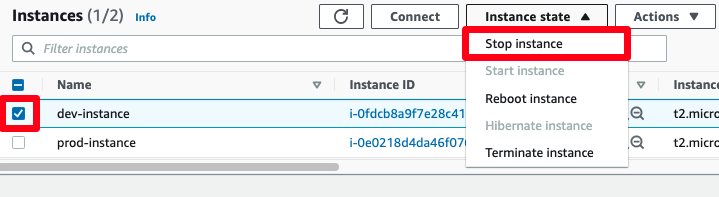

5, 몇초 후, dev 인스턴스가 중지된 것을 확인할 수 있습니다.

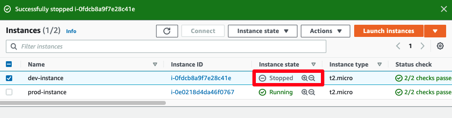

### 잘하셨습니다! 각각의 EC2 인스턴스 권한에 대해 테스트하였습니다. 다음 챕터에서는 AWS 리소스에 부여하는 AWS IAM Role에 대해 학습합니다.

## 팁 - IAM Policy Simulator(옵션)
실제 환경에서는 사용자 지정 IAM 정책을 테스트하기 위해 EC2 인스턴스를 실제로 종료하는 것을 원치 않을 수 있습니다. 정책 시뮬레이터는 정책 설정 권한을 검사하고 검증할 수 있는 도구입니다. 이번 실습에서는 IAM policy simulator를 사용하여 DeleteTags와 StopInstances 작업을 시뮬레이션하여 dev-group's 권한을 테스트합니다. 해당 실습을 건너뛰어도 다음 실습 진행에는 무방합니다.

여러분이 방금까지 사용하고 계셨던 dev-user는 IAM Policy Simulator 권한이 없으므로, AWS 콘솔에서 로그아웃 후 Administrator 로 다시 로그인하시기 바랍니다.

1. [IAM Policy simulator](https://policysim.aws.amazon.com/) 로 이동합니다.

2. dev-group을 선택합니다.

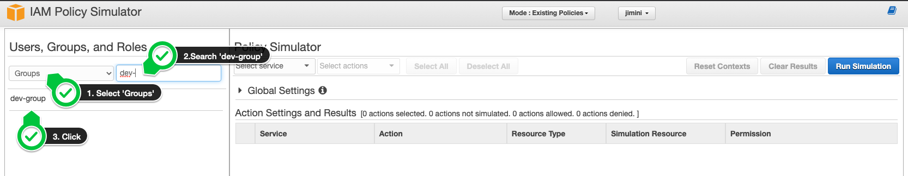

3. 테스트를 위해, DeleteTags과 StopInstances 액션을 선택합니다.

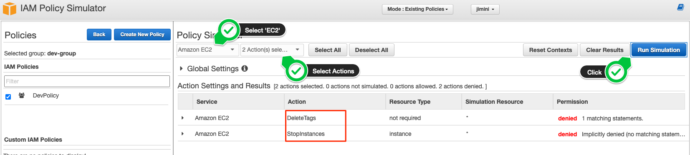

4. 두 개의 액션이 거부되었지만 각각에 대한 이유는 다릅니다. DeleteTags의 경우, 1 matching statements 로 거부되었고, StopInstances의 경우, Implicitly denied (no matching statements) 로 거부된 것을 확인할 수 있습니다.

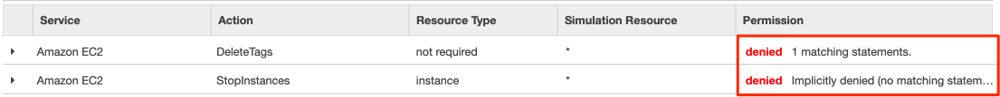

5. DeleteTags를 확장하고 Show statement를 확인합니다. 시뮬레이션된 동작과 정확히 일치하는 문을 자동으로 강조 표시합니다.

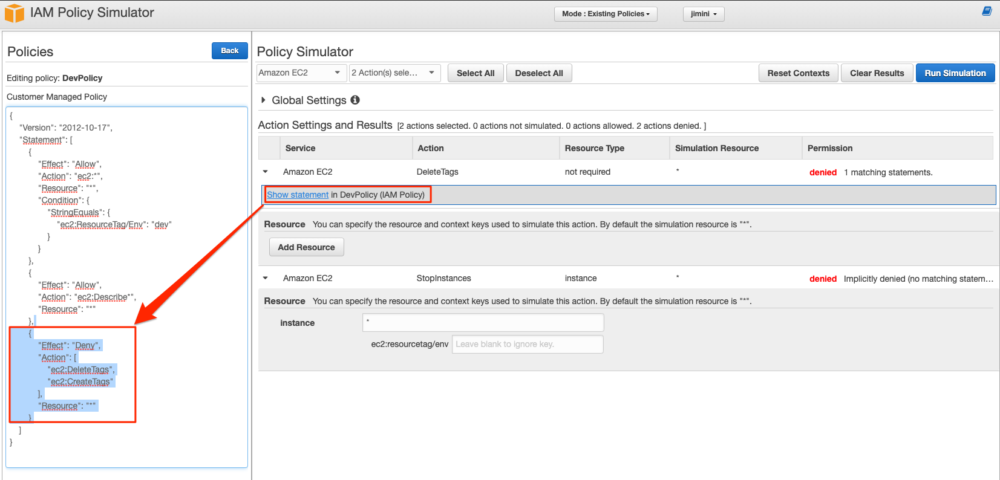

6. StopInstances를 확장합니다. 해당 액션이 거부된 이유는 시뮬레이션한 리소스가 "*" 이기 때문입니다. dev-group은 dev 태그를 가지고 있는 EC2 인스턴스만 중지할 수 있음을 기억하세요.

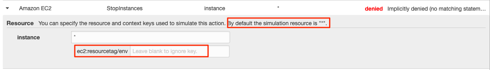

7. 이제 dev 태그를 추가하여 정책을 올바르게 검증한 후 정책을 테스트하겠습니다.

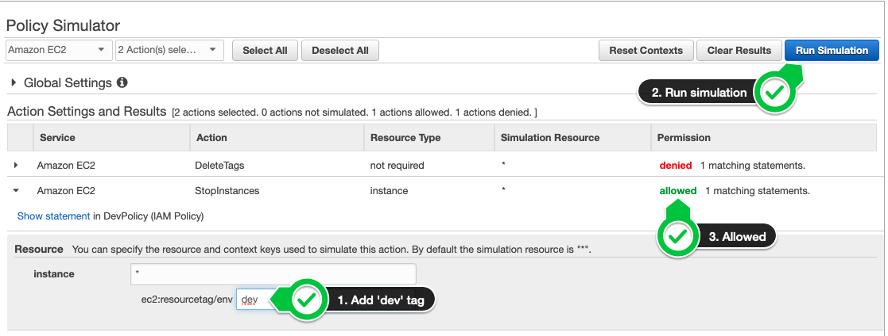

잘하셨습니다! 실제 환경에 영향을 미치지 않고 사용자 지정 IAM 정책을 테스트했습니다.

IAM 정책 시뮬레이터를 사용하면 identity 기반 정책, IAM permissions boundaries, 조직 SCPs(service control policies) 및 리소스 기반 정책을 테스트하고 문제를 해결할 수 있습니다. 자세한 내용은 여기를 참조하십시오. 

[Previous](./2-iam.md) | [Next](./4-iam.md)