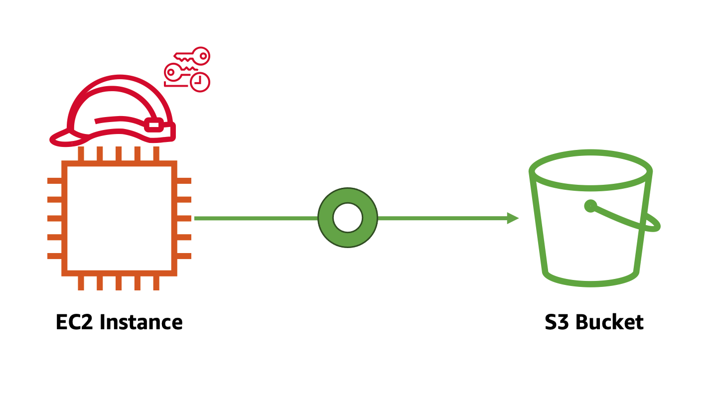

# EC2 Instance에 IAM Role 부여 및 접근 테스트

dev-user가 아닌 처음 IAM 실습을 시작할 때 로그인 했던 Administrator(관리자) 권한을 가진 사용자 로 다시 로그인을 한 후, 실습을 진행합니다.



1. S3 버킷을 생성하기 위해, S3 콘솔  창으로 접속합니다. 그 후, Create bucket 버튼을 클릭합니다. Amazon S3에 대한 자세한 내용은 AWS의 스토리지 챕터를 참조하십시오.


2. Bucket name 필드에 유일한 버킷 이름을 입력합니다. 본 실습에서는 iam-test-사용자 이름을 입력합니다. Amazon S3의 모든 버킷 이름은 고유해야하며 중복될 수 없습니다. 나머지 설정은 그대로 두고 버킷 만들기 버튼을 클릭합니다.


3. S3 버킷에 임의의 파일을 업로드합니다(샘플: [aws-logo-picture](https://static.us-east-1.prod.workshops.aws/public/a24595bd-ccdc-448e-8a16-71e415d3e56b/static/images/iam/aws-logo-sample.jpg) ).


4. iam-test-other-사용자 이름으로 새로운 버킷 하나를 더 만듭니다. 그리고 S3 버킷에 임의의 파일을 업로드합니다.

5. EC2 인스턴스를 위한 IAM role을 생성하기 위해 [IAM 콘솔](https://console.aws.amazon.com/iam/home?region=us-west-2#/home) 페이지로 이동합니다. 왼쪽 사이드 바에서 Roles를 클릭한 후, Create role 버튼을 클릭합니다. 첫 단계에서 신뢰할 수 있는 유형의 개체에서 EC2를 선택하고 Next: Permissions 버튼을 누릅니다. IAM Role은 EC2, Lambda와 같은 AWS 서비스뿐만 아니라 AWS 계정, Web identity, 그리고 SAML 2.0 federation에도 부여할 수 있습니다.


6. Step 2에서 EC2 인스턴스 role에 부여할 policy를 생성하기 위해 Create policy를 클릭합니다. JSON 탭에서 아래의 policy를 붙여넣고 Next: Tags를 클릭합니다.

```
{
    "Version": "2012-10-17",
    "Statement": [
        {
        "Action": ["s3:ListAllMyBuckets", "s3:GetBucketLocation"],
        "Effect": "Allow",
        "Resource": ["arn:aws:s3:::*"]
        },
        {
            "Effect": "Allow",
            "Action": [
                "s3:Get*",
                "s3:List*"
            ],
            "Resource": [
                "arn:aws:s3:::iam-test-user_name/*",
                "arn:aws:s3:::iam-test-user_name"
            ]
        }
    ]
}
```


위의 json 파일에서 Resource에 생성한 S3 버킷 이름으로 변경하는 것에 유념하세요.

7. 태그를 추가하는 작업을 스킵하기 위해, Next:Review를 클릭하고 Name에 IAMBucketTestPolicy를 입력합니다. IAM role에 붙이기 위해 Create policy를 클릭합니다.


8. IAM Role을 생성하던 페이지로 돌아와 오른쪽 코너에 있는 리프레시 버튼을 클릭한 후, IAMBucketTestPolicy를 입력합니다. 방금 생성한 policy가 리스트에 보이면 선택한 후, 다음 단계로 갑니다.


9. Step4에서 IAMBucketTestRole를 입력한 후, role을 생성합니다.


10. EC2 인스턴스에 IAM Role을 부여하기 위해 EC2 콘솔  창으로 이동합니다. 이때, 이전 실습에서 생성한 EC2 인스턴스가 보이지 않는다면 오른쪽 상단에 AWS Region이 알맞게 설정되어 있는지 확인합니다. prod-instance를 선택한 후, Connect 버튼을 클릭합니다.


11. EC2 Instance Connect 옵션을 사용해서 인스턴스에 연결하기 위해 Connect 버튼을 클릭합니다. 아래의 화면과 같이 터미널 창이 나옵니다. aws s3 ls 명령어를 입력하면 S3 버킷 리스트를 확인할 수 없습니다.


12. Instances 페이지로 돌아와서 prod-instance를 선택합니다. Actions 버튼을 클릭하고 Security > Modify IAM role 버튼을 클릭합니다.


13. IAM role에서 IAMBucketTestRole을 선택하고, Save 버튼을 눌러 EC2 인스턴스에 IAM role을 부여합니다.


14. 다시, EC2 인스턴스에 연결하고 aws s3 ls를 입력합니다. 이제 S3 버킷 리스트들을 확인할 수 있습니다. 또한, iam-test-사용자 이름에 있는 객체 리스트는 확인할 수 있지만 iam-test-other-사용자 이름 버킷에 대한 IAM policy는 없기에 객체 리스트는 확인할 수 없습니다.


COMMAND
--------
aws s3 ls  
aws s3 ls iam-test-사용자 이름  
aws s3 ls iam-test-other-사용자 이름  

잘하셨습니다! IAM 실습을 완료했습니다.

[Previous](./3-iam.md) | [Next](./5-iam.md)