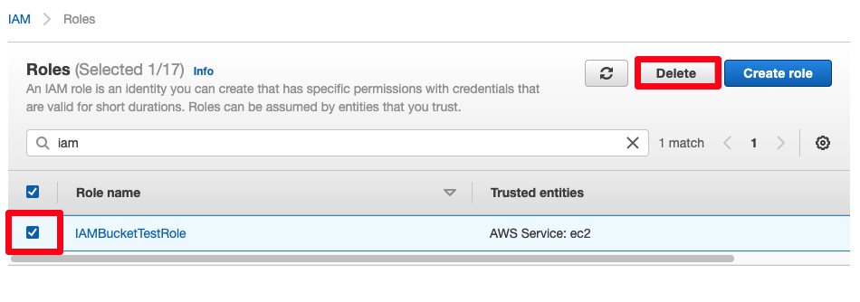

# 실습 자원 삭제하기

## 실습 자원 삭제하기
[EC2 콘솔](https://console.aws.amazon.com/ec2/v2/home?#Instances:) 에서 dev-instance와 prod-instance를 삭제합니다.

[IAM 콘솔](https://console.aws.amazon.com/iam/home?region=us-west-2#/home) 에서 생성한 모든 IAM Identities를 삭제합니다.

- User groups: dev-group

- Users: dev-user

- Roles: IAMBucketTestRole

Policies: DevPolicy, IAMBucketTestPolicy

[S3 콘솔](https://s3.console.aws.amazon.com/s3) 에서 iam-test-사용자 이름과 iam-test-other-사용자 이름 버킷을 삭제합니다. iam-test-사용자 이름을 삭제하기 이전 버킷 Empty 작업을 먼저 수행합니다.

[Previous](./4-iam.md) | [Next](../../40-monitoring.md)