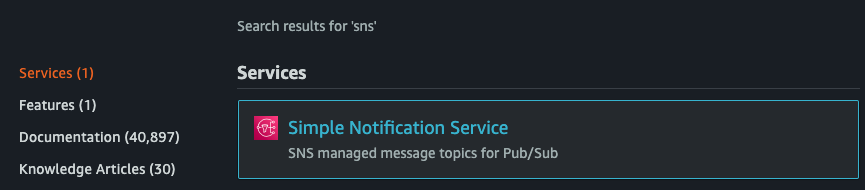
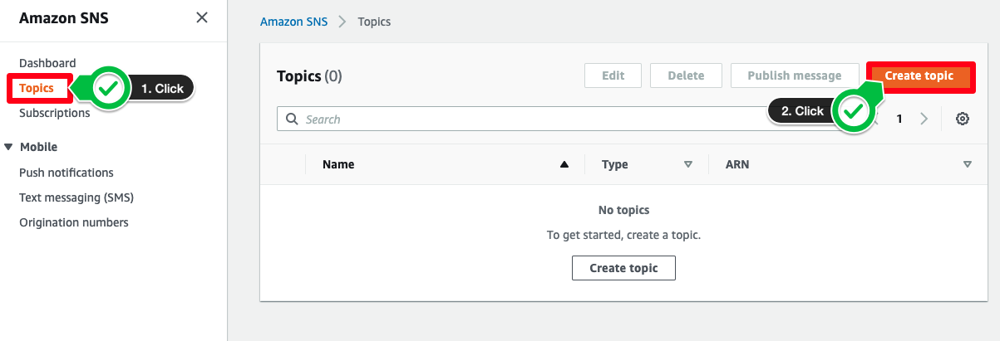
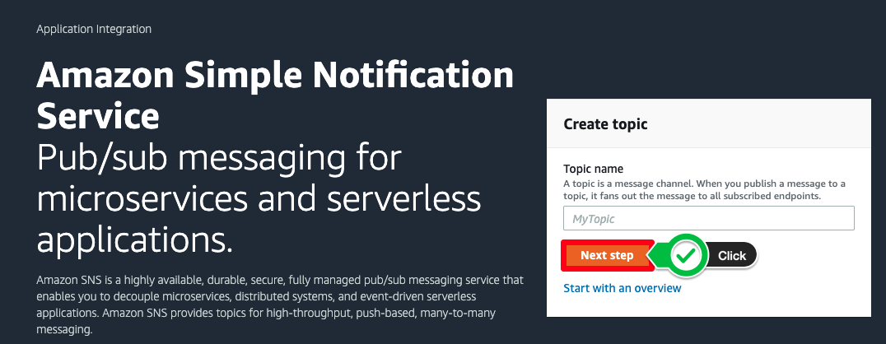
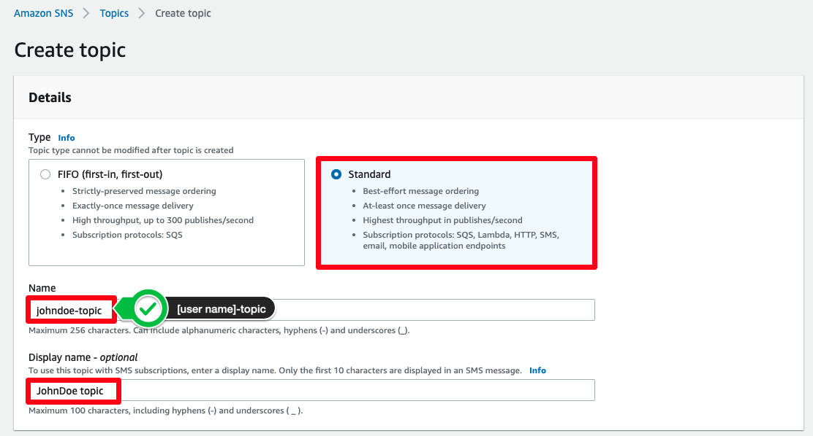
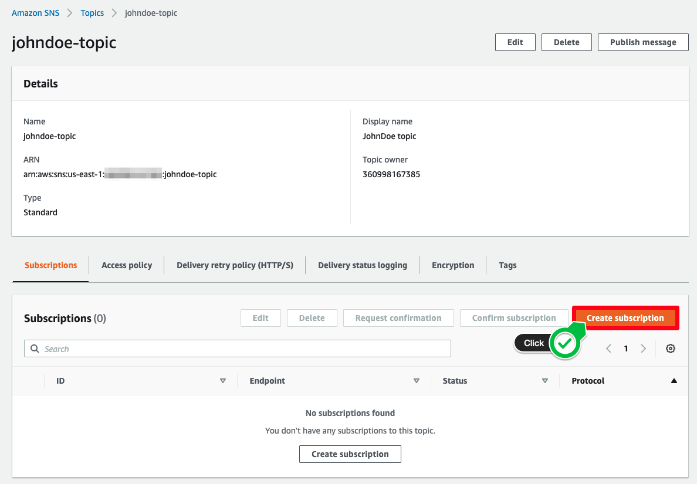
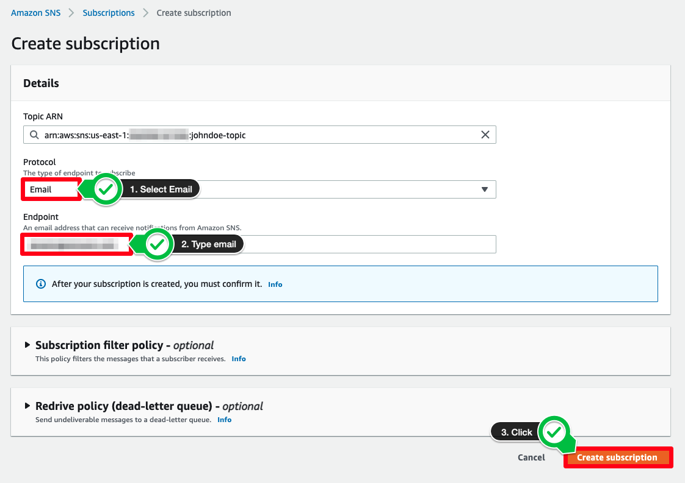
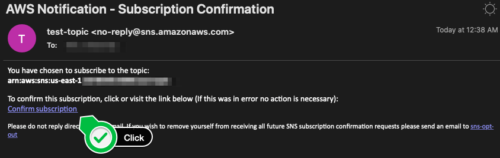
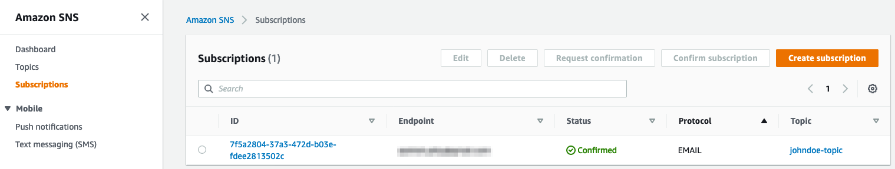

# SNS 토픽 생성하기
## Amazon Simple Notification Service(SNS) 토픽 생성하기
먼저, 알람을 해당 이메일 주소로 발송할 수 있도록 토픽을 설정하겠습니다. Amazon SNS 토픽이란 커뮤니케이션 채널 역할을 하는 논리적 액세스 포인트를 의미합니다.

1. AWS 콘솔에서 [Amazon SNS](https://console.aws.amazon.com/sns/) 서비스를 클릭합니다.

2. 왼쪽 사이드바에서 Topics를 클릭하거나 화면과 같이 Next step 버튼을 누릅니다.

3. Create topic 창이 나옵니다. Type에는 Standard를 선택하고, Name 필드에는 사용자 이름이 포함된 토픽 명을 설정합니다. Display Name은 선택적으로 입력합니다. 화면 아래쪽으로 스크롤하여 Create topic를 클릭합니다.

4. 토픽을 생성하면 해당 토픽의 특정 대시보드로 이동합니다. 화면 오른쪽에 있는 Create subscription를 클릭합니다.

5. Protocol 항목에서 Email을 선택하고, 접속할 수 있는 이메일 계정을 입력합니다. SNS 메시지를 차단할 스팸 필터가 있을 수 있기에 업무 이메일 주소 외에 다른 이메일을 입력합니다. Create Subscription 버튼을 클릭합니다.

6. 입력한 이메일 주소로 “AWS Notification – Subscription Confirmation”라는 제목을 가진 메일이 도착한 것을 확인할 수 있습니다. 이메일을 열고 Confirm subscription 링크를 클릭합니다.

7. Subscription이 활성화되었고 status 탭의 값이 “PendingConfirmation”에서 "Confirmed"로 변경되었음을 확인할 수 있습니다.

[Previous](../monitoring.md) | [Next](../monitoring/2-monitoring.md)