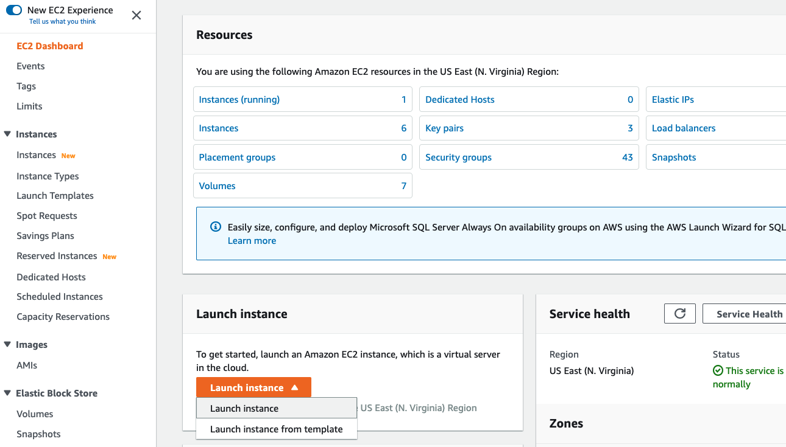
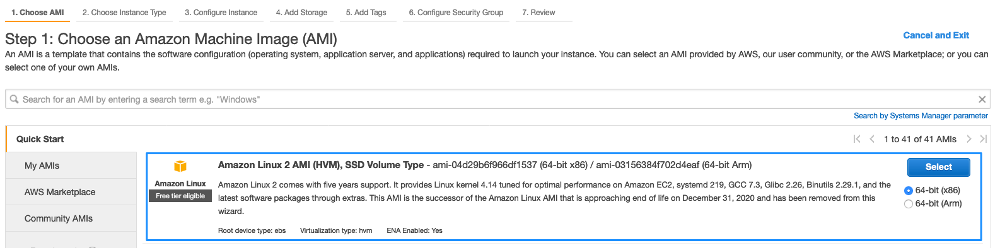
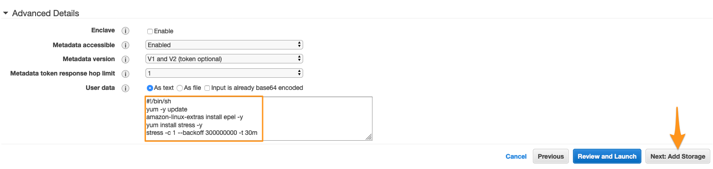
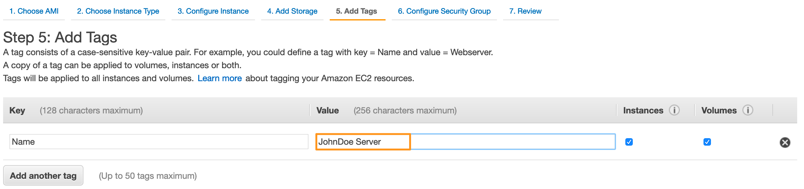
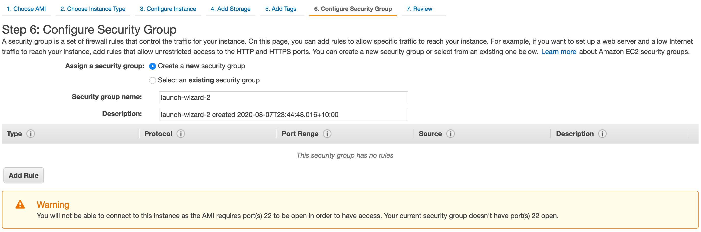

# EC2 인스턴스 생성하기

## EC2 인스턴스 생성하기
이 단계에서는 EC2 인스턴스를 실행하고 스트레스 도구를 설치하고 시작하도록 User Data  를 구성합니다. 스트레스 도구는 사용자가 CloudWatch 경보를 구성할 시간을 확보하기 위해 인스턴스 실행 후 5분 후에 CPU 로드 시뮬레이션을 시작합니다.

1. Amazon EC2 페이지에 접속한 후, 왼쪽 상단에 있는 [EC2 대시보드](https://console.aws.amazon.com/ec2) 를 클릭합니다.

2. Launch instane 버튼을 클릭하고 Launch instance 옵션을 선택합니다.



3. Quick Start 섹션에서 Amazon Linux AMI를 선택하고 Select 버튼을 누릅니다.



4. Instance Type에서 범용 인스턴스인 t2.micro를 선택하고 Next: Configure Instance Details 버튼을 클릭합니다.

5. 이제 인스턴스 히트를 시뮬레이션하는 스트레스 테스트 스크립트를 추가하겠습니다. Configure Instance Details 페이지에서 화면 아래에 있는 Advanced Details 섹션을 확장하고 User Data 필드에 다음 스크립트 정보를 입력합니다(스트레스 도구가 자동으로 설치 및 시작됩니다):

```
#!/bin/sh 
yum -y update
amazon-linux-extras install epel -y
yum install stress -y
stress -c 1 --backoff 300000000 -t 30m
```

6. Next: Add Storage 버튼을 클릭합니다.



7. 스토리지 디바이스 구성을 기본 값으로 유지한 채, Next: Add Tags 버튼을 클릭합니다.

8. 그 다음 페이지에서 Add Tag 버튼을 클릭합니다. 키 값에 "“Name”을 입력합니다. 그런 다음 적절한 인스턴스 이름 값을 선택합니다. 태그로 더 정확히 알려진 이 이름은 인스턴스가 시작되면 콘솔에 나타납니다. 복잡한 환경에서 실행 중인 머신을 쉽게 추적할 수 있습니다.

본 실습의 경우, 다음 형식으로 이름을 지정할 수 있습니다: “사용자 이름 Server”. 그 다음, "Next: Configure Security Group" 버튼을 클릭합니다.



9. 아무런 규칙이 없기 위해 오른쪽에 있는 "x"를 클릭하여 Security Group을 제거합니다(본 실습에서는 해당 인스턴스에 접속할 필요가 없습니다). 그 다음, Review and Launch 버튼을 클릭합니다.



10. Instance Launch Configuration을 검토하고 Launch 버튼을 클릭합니다. Proceed without a keypair을 선택하고 Launch Instances 버튼을 클릭합니다.

11. EC2 인스턴스 목록을 보려면 화면의 오른쪽 아래에 있는 View Instances 버튼을 클릭합니다. 인스턴스가 시작되면 서버와 인스턴스가 있는 가용 영역이 표시됩니다.

[Previous](./1-monitoring.md) | [Next](./3-monitoring.md)
