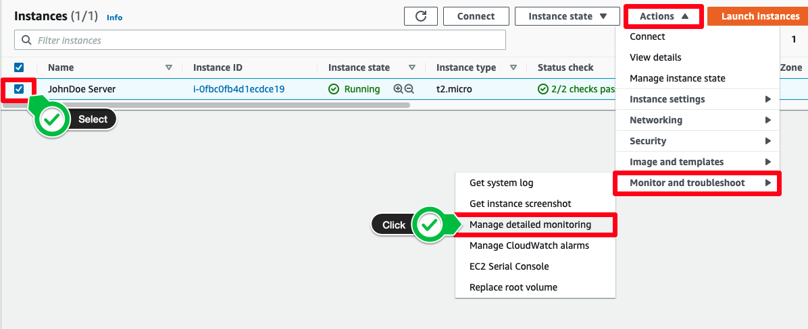

# CloudWatch Alarm 구성하기

## CloudWatch Alarm 구성하기

1. EC2 콘솔에서 EC2 인스턴스의 세부 정보를 보려면 서버 옆의 체크 박스를 클릭합니다. Actions >> Monitor and troubleshoot >> Manage detailed monitoring 을 클릭합니다.

그리고 데이터를 모니터링하는 간격을 기본 값인 5 분에서 1 분으로 바꾸기 위해, Detailed monitoring 아래에 있는 Enable 버튼을 누릅니다. Save 버튼을 누릅니다.

2. Details 탭을 누르고 인스턴스 ID를 클립보드나 메모장 같은 곳에 복사합니다.

3. Actions >> Monitor and troubleshoot >> Manage CloudWatch alarms 를 클릭합니다.

4. "Create an alarm"을 선택합니다. Alarm notification 아래에서 실습 파트 1에서 생성한 SNS topic을 선택합니다.

5. "Alarm thresholds" 섹션에서, 아래 화면과 같이 임계 값을 설정한 후, "Create"를 클릭합니다.

6. AWS 콘솔의 왼쪽 상단 영역에서 Services > CloudWatch 를 선택합니다.

7. 콘솔 왼쪽 창에서 Alarms를 클릭하고 All alarms를 선택합니다. 알람의 State를 체크합니다. 아마도 INSUFFICIENT_DATA(방금 생성했기 때문에)로 표시될 것이고 시간이 경과하면 OK로 변경될 것입니다. 또한, 실습에 생성한 EC2 인스턴스의 알람을 보기 위해 instance-id 값을 사용하여 필터링할 수 있습니다.

8. CloudWatch 콘솔 창에서 Metrics를 왼쪽 창에서 선택합니다. All Metrics 탭을 선택하고 filter 창에 Instance ID를 붙여넣기 합니다.

9. Per-Instance Metrics를 클릭하고 CPU를 추가적인 필터 항목으로 넣습니다. CPUUtilization 메트릭 값을 선택합니다.

10. Graphed metrics 버튼을 클릭하고 Period를 1 분으로 변경합니다. 그래프 간격을 사용자 지정 값 30m로 변경하고 자동 새로 고침을 1분으로 선택합니다.

11. 5분 후, 스트레스 도구가 CPU 로드 시뮬레이션을 위해 작동하고 임계 값에 도달하면 알람을 트리거합니다. CloudWatch 콘솔의 Alarms에서 경보 상태를 볼 수 있습니다. All alarms를 선택하면 구성된 알람을 볼 수 있습니다. 이메일 알림을 설정하면 경보가 트리거될 때 이메일 알람이 수신됩니다.

축하합니다! CloudWatch Alarm을 구성했습니다!

[Previous](./2-monitoring.md) | [Next](./4-monitoring.md)