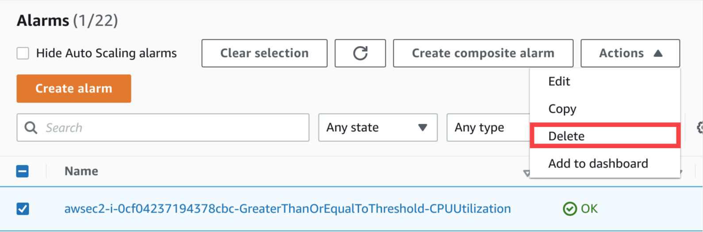
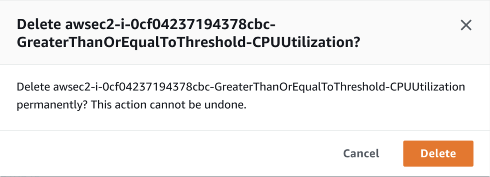
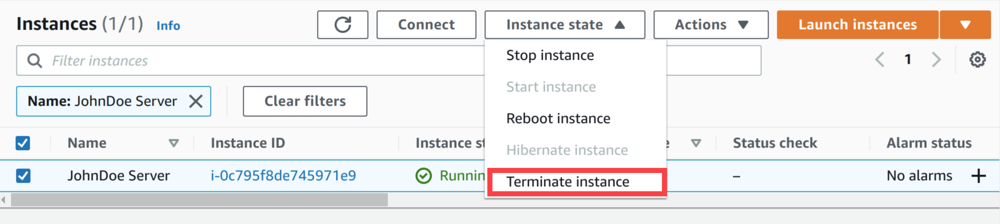
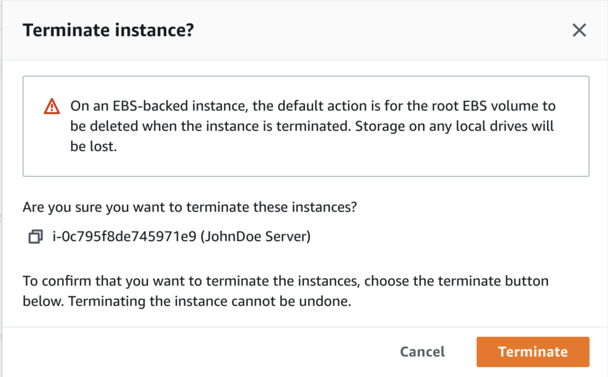
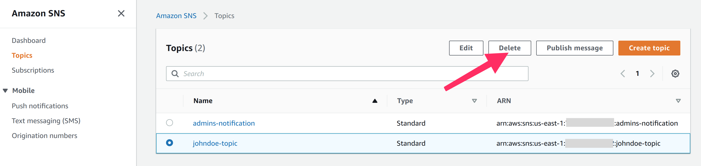
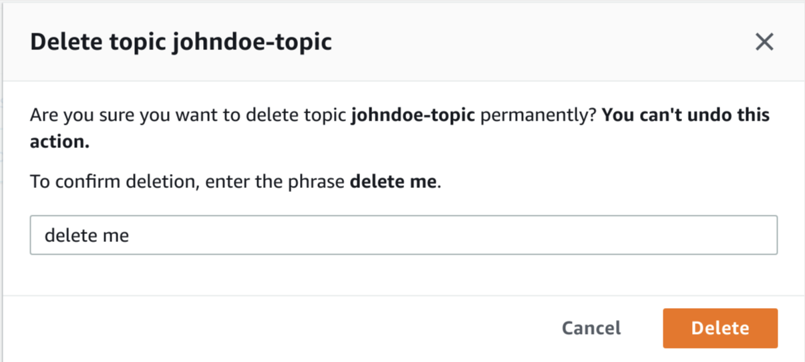

# 실습 자원 삭제하기

## 실습 자원 삭제하기
작업을 완료한 후 다음 리소스를 삭제하십시오:

- CloudWatch Alarm

- EC2 인스턴스

- SNS 토픽

1. CloudWatch Alarm을 삭제하기 위해, CloudWatch 콘솔  에서 실습 때 생성한 alarm을 선택합니다. Actions 메뉴에서, Delete를 선택합니다.

팝업 창에서 해당 알람을 삭제하길 원하는지 묻습니다. Delete 버튼을 클릭합니다.

2. EC2 인스턴스를 삭제하기 위해, EC2 콘솔  에서 실습 때 생성한 EC2 인스턴스를 선택합니다. Instance state 메뉴에서 Terminate instance를 선택합니다.

팝업 창에서 해당 인스턴스를 종료하길 원하는지 묻습니다. Terminate 버튼을 클릭합니다.

3. SNS 토픽을 삭제하기 위해, SNS console  에서 실습 때 생성한 토픽을 선택합니다. Delete 를 클릭합니다.

팝업 창에서 해당 토픽을 종료하길 원하는지 묻습니다. delete me를 입력하고 Delete 버튼을 클릭합니다.

[Previous](./3-monitoring.md) | [Next](../../50-rds.md)