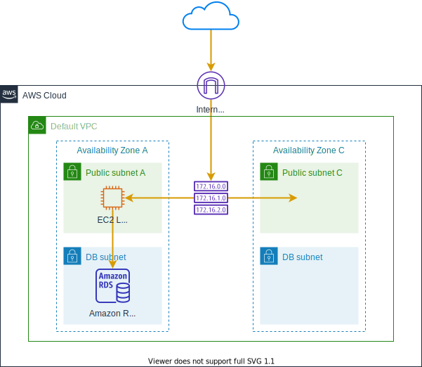

# Amazon RDS MySQL 실습

## Amazon RDS에 대해서
Amazon Relational Database Service(RDS)를 사용하면 클라우드에서 관계형 데이터베이스를 간편하게 설정, 운영 및 확장할 수 있습니다. 하드웨어 프로비저닝, 데이터베이스 설정, 패치 및 백업과 같은 시간 소모적인 관리 작업을 자동화하면서 비용 효율적이고 크기 조정 가능한 용량을 제공합니다. 사용자가 애플리케이션에 집중하여 애플리케이션에 필요한 빠른 성능, 고가용성, 보안 및 호환성을 제공할 수 있도록 지원합니다.

본 실습을 완료하려면 EC2 Linux 실습 이 선행되어야 합니다. 이 실습에서는 이전에 EC2 실습에서 생성한 웹 서버를 사용하여 RDS MySQL에 연결합니다.

본 실습는 다음과 같이 진행됩니다.

- VPC 보안 그룹 생성하기

- RDS 인스턴스 시작하기

- EC2 인스턴스에서 RDS 연결하기

- RDS 스냅샷 생성하기(추가 실습)

- RDS 인스턴스 크기 수정하기(추가 실습)

- 실습 자원 삭제하기

[Previous](../50-rds.md) | [Next](./1-rds.md)