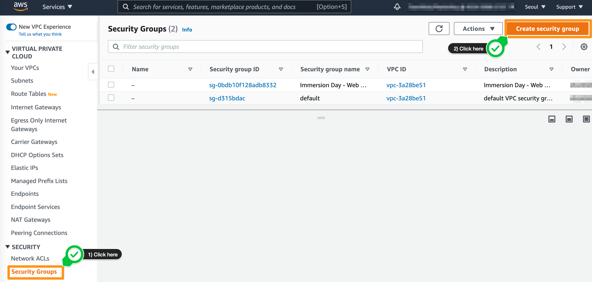
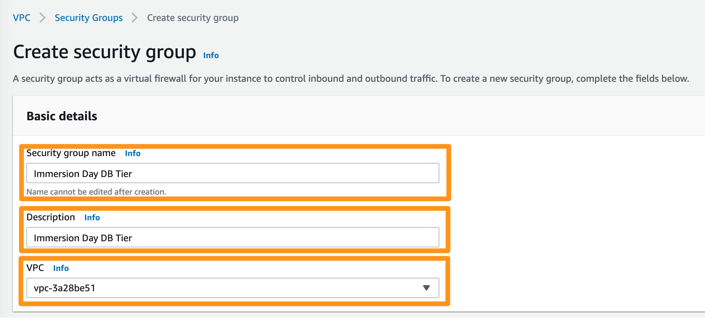
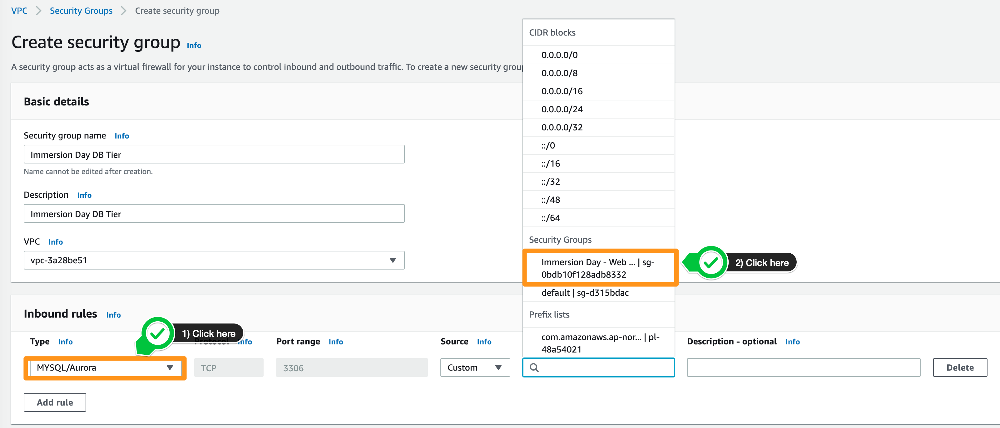
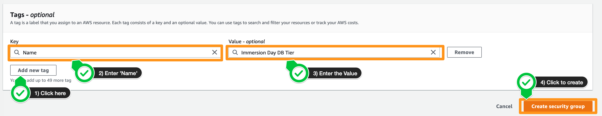

# VPC 보안 그룹 생성하기

## VPC 보안 그룹 생성하기

## 사전 실습: [EC2 Linux 실습](../../10-ec2/ec2-linux.md)

EC2 Linux 실습에서, 웹 서버용으로 TCP 80을 허용하는 Immersion Day - Web Server라는 보안 그룹을 생성하고 웹 서버 EC2 인스턴스를 생성했습니다.

먼저 웹 계층의 트래픽만 허용하는 데이터베이스 계층에 대해 새로운 VPC 보안 그룹 Immersion Day - DB Tier 를 생성합니다.

1. [VPC 콘솔](https://console.aws.amazon.com/vpc) 에서 Security Groups를 클릭한 다음 Create Security Group 버튼을 클릭합니다

2. 아래와 같이 보안 그룹 이름과 설명을 입력하고 VPC 설정을 EC2 인스턴스가 생성된 동일한 VPC로 유지합니다.

키 | 값
--- | ---
보안 그룹 이름 | Immersion Day DB Tier
설명 | Immersion Day DB Tier
VPC | VPC-xxxxxx (default)

1. Inbound Rule에서 Add Rule 버튼을 클릭합니다.

2. 웹 계층의 EC2 서버에 대한 새 인바운드 규칙을 추가합니다. 유형은 MySQL/Aurora(3306), 프로토콜 **TCP(6)**이어야 하며 Source에 EC2 인스턴스가 속한 보안 그룹의 이름을 입력합니다. 입력하는 동안 해당 이름과 일치하는 보안 그룹 목록이 표시되어야 합니다. 보안 그룹을 선택하세요.

3. Name 태그와 그룹 이름을 Immersion Day DB Tier로 설정

4. 그런 다음 아래로 스크롤하여 Create security group 버튼을 클릭합니다. RDS 인스턴스에 대한 보안 그룹이 생성됩니다.

[Previous](../rds.md) | [Next](./2-rds.md)