# RDS 인스턴스 시작하기

## RDS 인스턴스 시작하기
이제 데이터베이스용 VPC 보안 그룹이 준비되었으므로 MySQL RDS 인스턴스를 구성하고 시작하겠습니다.

1. AWS Management 콘솔에 로그인하고 Amazon RDS 콘솔 을 엽니다.

2. Create database을 클릭합니다.

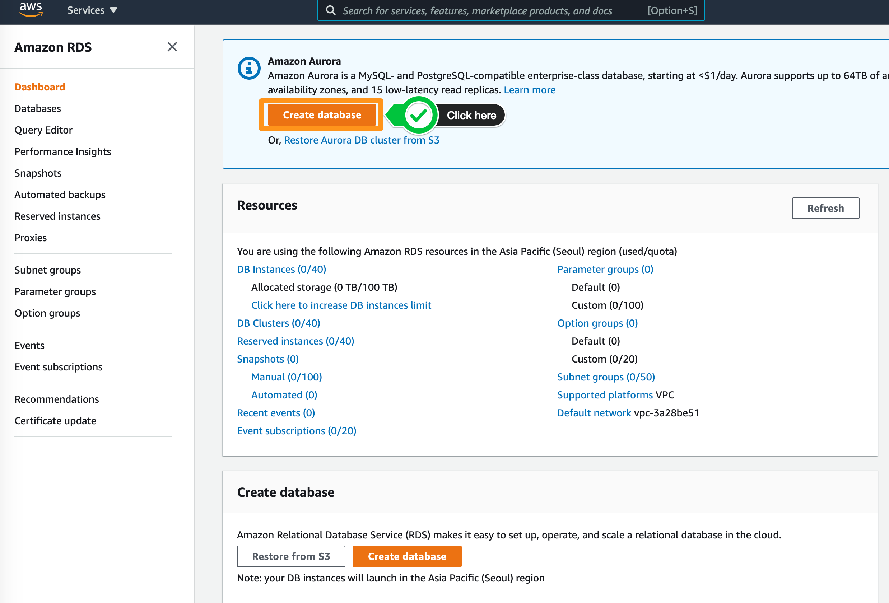

3. Choose a database creation method에서 표준 옵션을 선택합니다. Standard Create를 사용하여 데이터베이스에 대한 구성을 설정합니다.

Easy Create 옵션은 데이터베이스 배포를 시작하는 데 권장되는 모범 사례 구성을 제공합니다.

4. Engine Options에서 MySQL을 선택합니다.

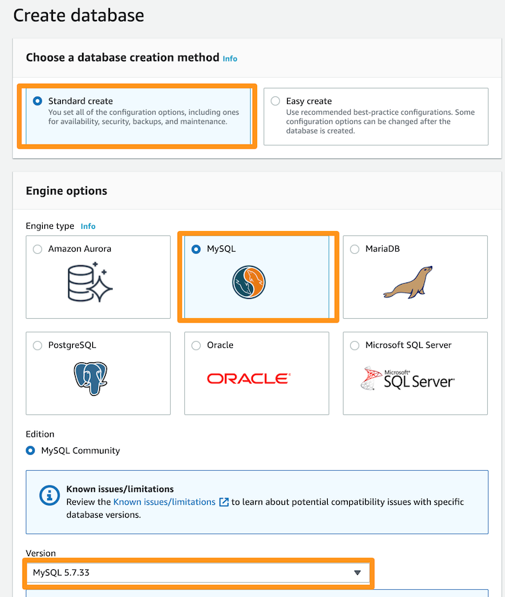

5. MySQL을 데이터베이스 엔진으로 선택하면 최신 버전이 자동으로 선택됩니다. 본 실습에서는 MySQL 버전 5.7.X. 를 선택합니다.

6. 템플릿의 경우 Production, Dev/Test 및 Free tier의 세 가지 옵션을 사용할 수 있습니다. 실습 목적으로 Free tier를 선택합니다.

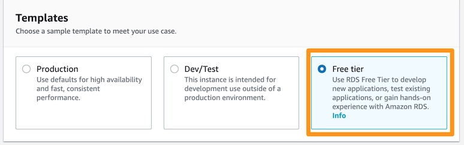

7. Settings 섹션에서 각 필드에 대해 다음을 입력합니다.

Parameter | Value
--------- | ----
DB Instance Identifier | awsdb
Master Username | awsuser
Master Password | awspassword

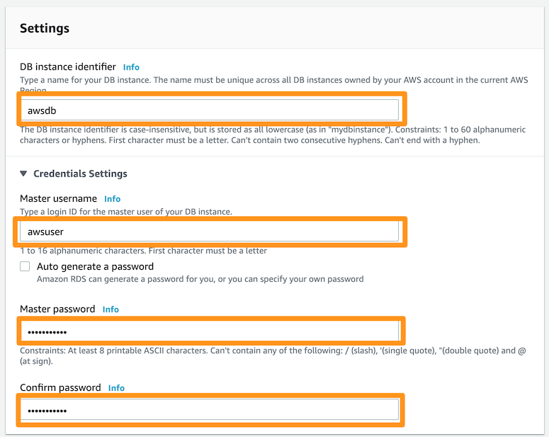

8. DB Instance size 섹션에서 DB instance class에 대해 burstable classes-db.t2.micro를 선택합니다. 이 옵션은 자동으로 선택됩니다.

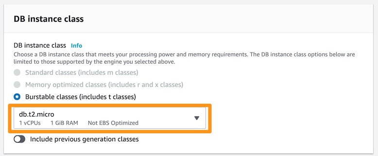

9. Storage 섹션에서 Storage Type을 General Purpose SSD로 선택합니다. 실습을 위해 Auto Scaling 옵션을 선택하거나 선택 취소할 수 있습니다.

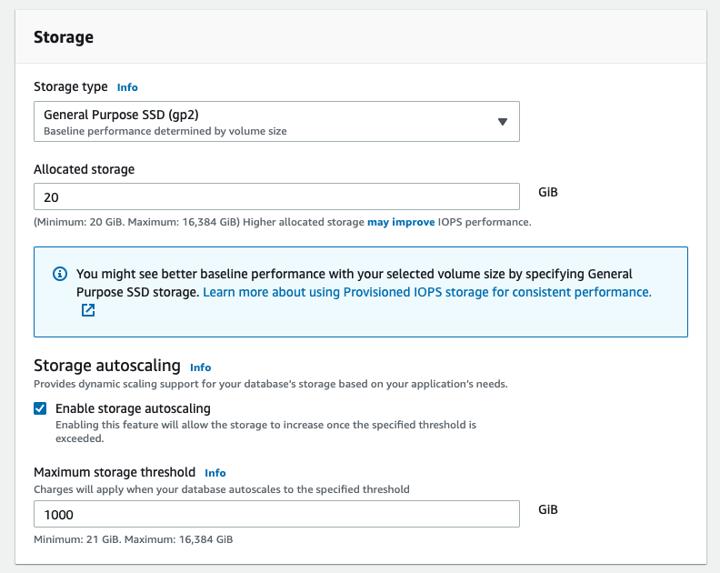

10. 템플릿 옵션을 실습 또는 애플리케이션 테스트에만 사용되는 Free tier로 선택했으므로 Multi-AZ deployment가 필요하지 않으므로 가용성 및 내구성 섹션이 비활성화됩니다.

Production 및 Dev/Test에 사용되는 데이터베이스의 경우 Multi-AZ deployment를 권장 드립니다.

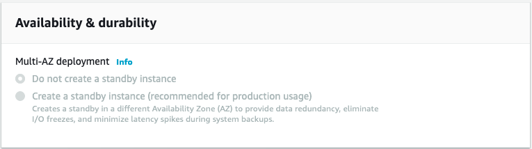

11. Connectivity 섹션은 아래와 같이 구성합니다:

Parameter | Value
--------- | -----
VPC | Default VPC
Additional connectivity configuration | |
Subnet Group | default
Publicly accessible | No
VPC Security Group(s) | Select Choose existing VPC security groups, then pick Immersion Day DB Tier
Availability Zone | No preference
Database port | 3306

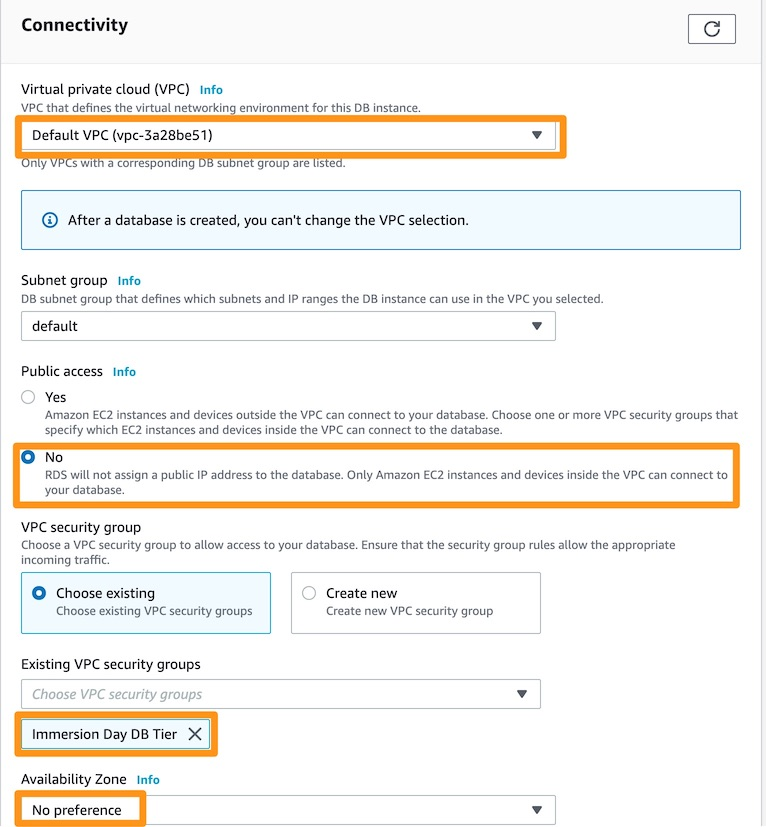

12. Database authentication의 경우 두 가지 옵션 중에서 선택할 수 있습니다. Password Authentication은 데이터베이스 비밀번호로만 사용자를 인증합니다. Password and IAM Database authentication을 사용하면 사용자가 데이터베이스 암호와 IAM 역할 및 정책을 통해 사용자 자격 증명으로 인증됩니다.

이 실습에서는 Password Authentication 을 선택합니다.

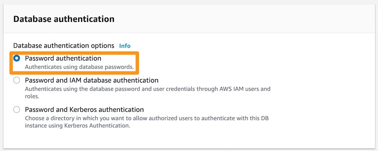

13. Additional Configuration을 펼칩니다.

- 데이터베이스 옵션에 대해 다음과 같이 제공합니다:

    - 초기 데이터베이스 이름: immersionday

    - DB 파라미터 그룹 및 옵션 그룹: default.mysql5.7

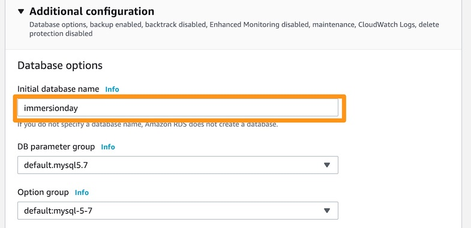

- Backup의 경우:

    - enable automatic backups 체크

    - Backup retention period는 7 days로 설정

    - Backup Window: No preference

    - 나머지는 기본값으로 둡니다.

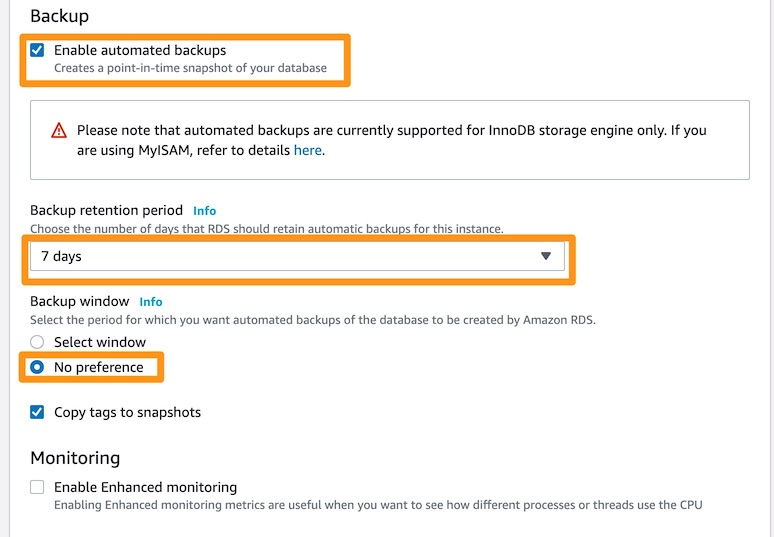

- Log exports의 경우 CloudWatch에서 분석하려는 로그 유형을 다양한 옵션 중에서 선택할 수 있습니다. 기본값으로 둡니다

- Maintenance의 경우 기본값으로 둡니다. 기본 옵션은 자동 마이너 버전 업그레이드 활성화에 대한 자동 확인이며 유지 관리 기간은 기본 설정 없음으로 선택됩니다.

- Deletion protection의 경우 선택하면 데이터베이스가 실수로 삭제되지 않도록 보호하며 이 옵션이 선택되어 있는 동안에는 데이터베이스를 삭제할 수 없습니다. 기본값으로 둡니다.

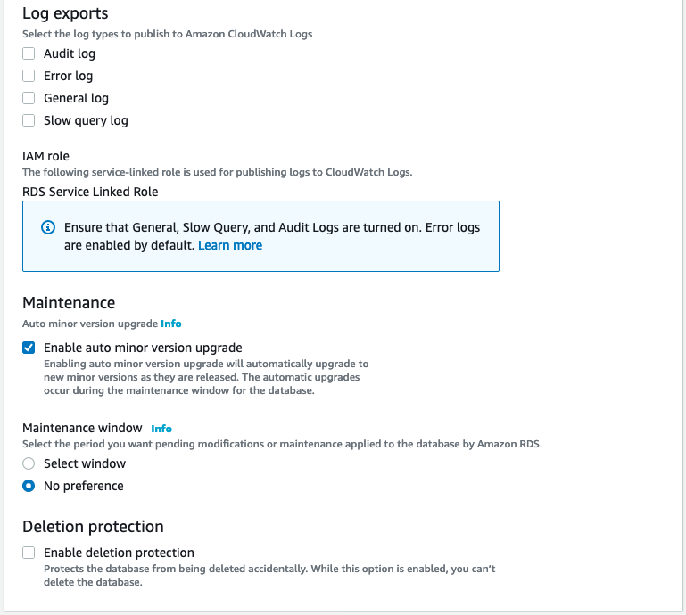

14. 마지막으로 선택한 구성에 대한 예상 비용이 표시됩니다:

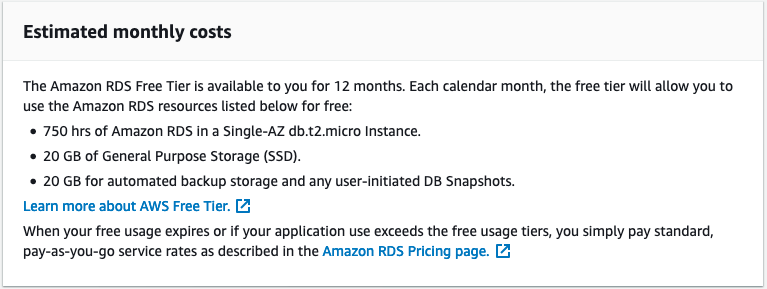

15. 설정을 검토하고 Create database을 클릭합니다.

16. RDS 대시보드에서 상태가 "creating"에서 "backing up", "available"으로 변경될 때까지 새 DB 인스턴스를 모니터링합니다.

데이터베이스가 생성되고 백업되는 동안 최대 5분이 소요될 수 있습니다.

[Previous](./1-rds.md) | [Next](./3-rds.md)
