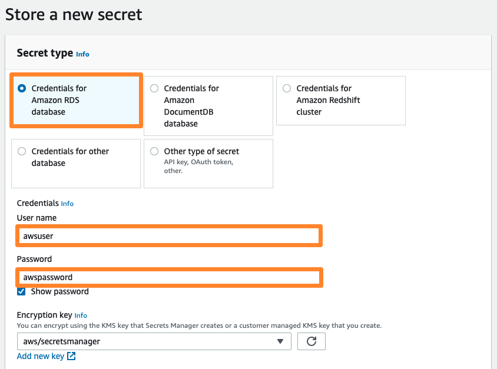
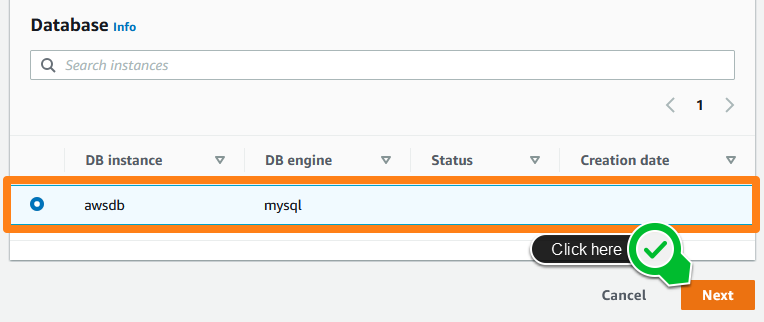
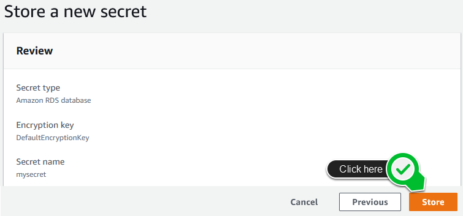

# RDS 크레덴셜 저장하기

## RDS 크레덴셜 AWS Secrets Manager에 저장하기
구축한 웹 서버에는 주소록을 위한 샘플 코드가 포함되어 있습니다. 본 실습에서는 샘플 코드에 어떤 데이터 베이스를 사용할 것인지 그리고 어떻게 연결해야될지 명시하는 작업을 수행합니다. 해당 정보를 AWS Secrets Manager에 저장할 것입니다.

본 챕터에서 우리는 데이터 연결 정보를 포함한 secret을 생성할 것입니다. 추후, 우리는 웹 서버가 해당 secret를 불러올 수 있도록 적절한 권한을 부여할 것입니다.

1. 콘솔 창에서 AWS Secrets Manager 를 열고, Store a new secret 버튼을 클릭합니다.

2. Secret Type 아래, Credentials for Amazon RDS database를 선택합니다. 데이터 베이스를 생성할 때 입력했던 user name과 password를 적습니다.

3. Database 아래에 방금 생성한 데이터베이스를 선택합니다. 그리고 Next 버튼을 클릭합니다.

4. secret 이름을 mysecret으로 입력합니다. 샘플 코드에는 해당 이름의 secret을 묻도록 입력했기 때문에 해당 이름으로 입력해야 합니다. Next을 클릭합니다.

5. Secret rotation는 기본 값으로 두고 Next을 클릭합니다.

6. 작성한 사항을 확인한 후, Store 버튼을 클릭합니다.

[Previous](./2-rds.md) | [Next](./4-rds.md)