# EC2에서 RDS 접근하기

## 웹 서버가 secret에 접근할 수 있도록 허용하기
Secret을 생성했다면 이제는 웹 서버에 해당 secret을 사용할 수 있도록 권한을 부여해야 합니다. 이를 수행하기 위해 웹 서버가 secret을 읽을 수 있는 Policy를 생성해야 합니다. 웹 서버 실습에서 부여한 Role에 해당 policy를 추가합니다.

1. 만약 위의 작업이 수행되지 않았다면 Session Manager를 사용하여 리눅스 인스턴스에 접근하기에서 IAM Instance Profile를 생성하는 작업을 선행해야 합니다.

2. AWS 관리 콘솔에 로그인한 후, IAM 콘솔  창을 엽니다. 왼쪽 사이드 바에서 Policies를 선택하고 Create Policy를 클릭합니다.

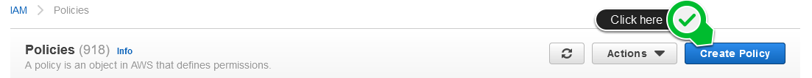

3. Choose a service를 클릭합니다.

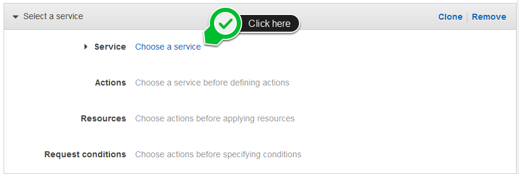

4. Secrets Manager를 검색 바에 입력합니다. Secrets Manager를 클릭합니다.

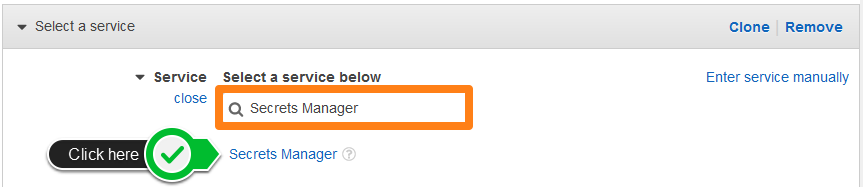

5. Access level 아래에 Read 옆 세모를 누르고 GetSecretValue를 클릭합니다.

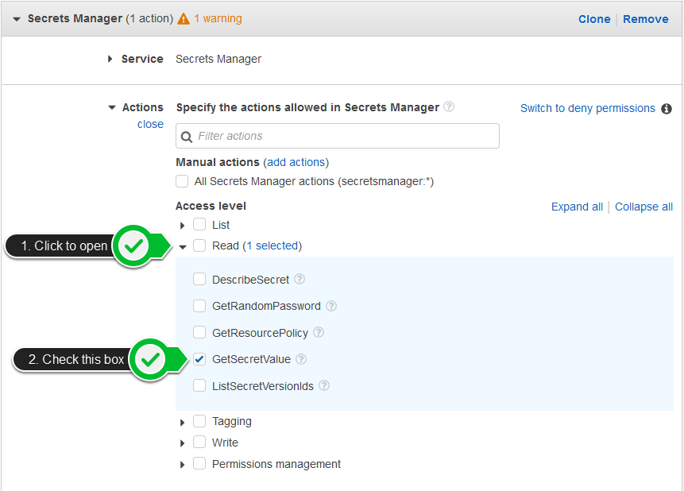

6. Resources 옆 세모를 누릅니다. 본 실습에서는 All resources를 선택하고 Next: Tags를 클릭합니다.

본 실습에서는 EC2가 모든 secret에 접근할 수 있도록 설정했습니다. 하지만 실제 도입시에는 특정 secret만 읽을 수 있도록 설정하는 메카니즘을 고려해야 합니다.

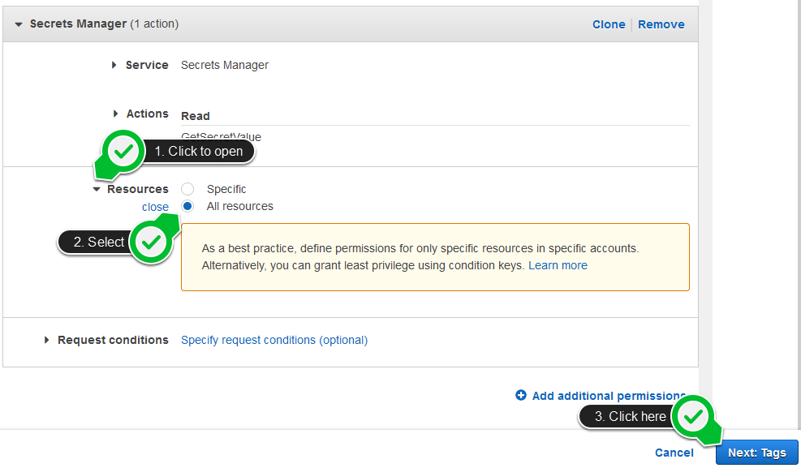

7. Next: Review를 클릭합니다.

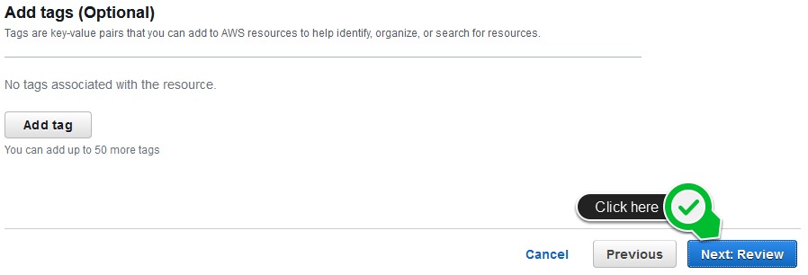

8. Review Policy 화면에서 새로운 policy 이름을 ReadSecrets로 부여하고 Create policy를 클릭합니다.

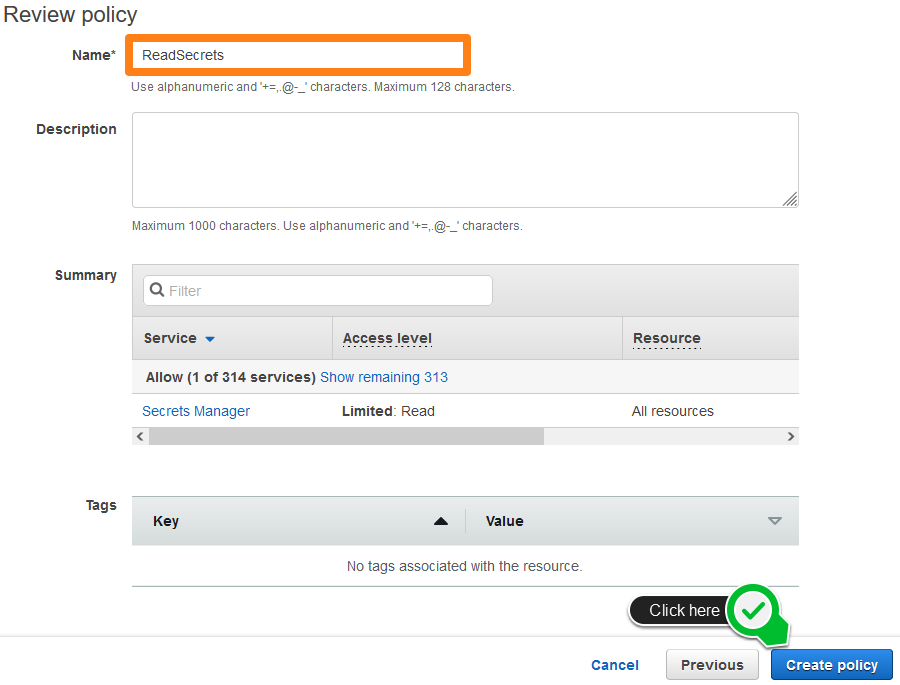

9. 왼쪽 메뉴 탭에서 Roles을 선택하고 검색 창에서 SSMInstanceProfile를 입력합니다. 해당 role의 경우 Session Manager를 사용하여 리눅스 인스턴스에 접근하기에서 생성한 role입니다. SSMInstanceProfile를 클릭합니다.

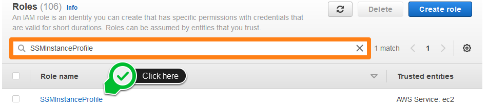

10. Permissions policies 아래에 Attach policies를 클릭합니다.

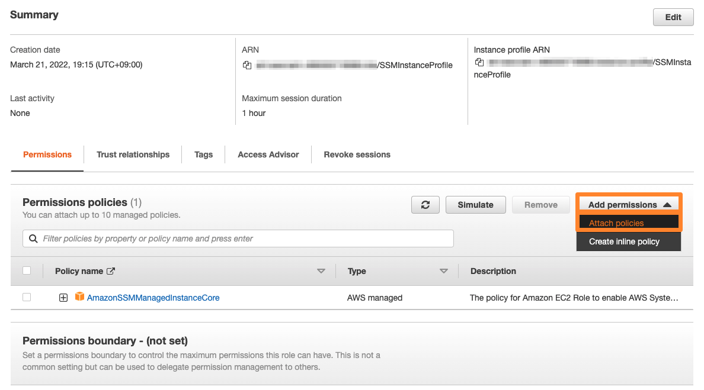

11. ReadSecrets로 생성한 policy를 찾고 Attach policy를 클릭합니다.

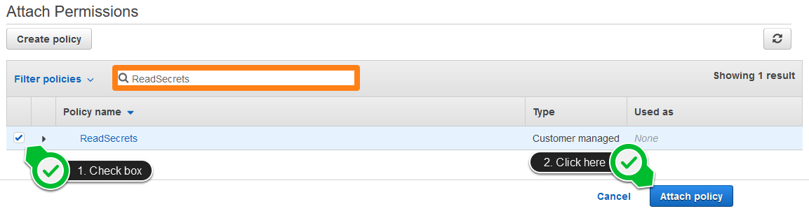

12. Permissions policies 아래에 AmazonSSMManagedInstanceCore와 ReadSecrets가 리스트에 있는지 확인합니다.

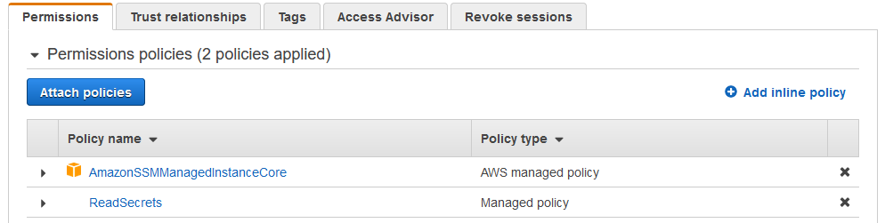

## 주소록에 접근하기

1. [EC2 콘솔](https://console.aws.amazon.com/ec2/v2/home?instanceState=running) 창에 접근하고 EC2 Linux 실습에서 배포한 웹 서버를 찾습니다. 그리고 웹 서버의 public IP를 메모합니다.

.png)

웹 브라우저에서 새로운 탭을 열고 웹 서버의 public IP로 접근한 뒤, RDS 탭으로 들어갑니다.

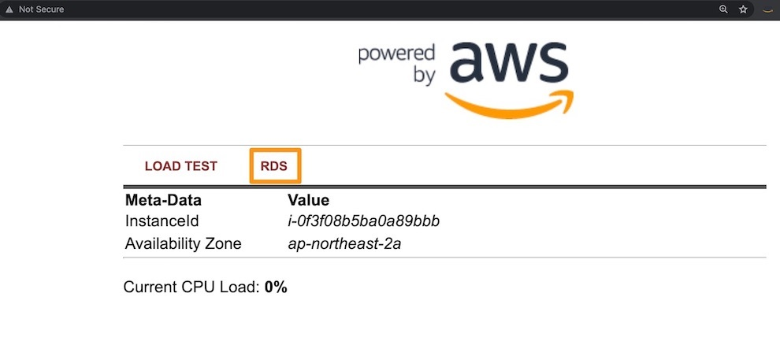

이제 여러분이 생성한 데이터베이스에 있는 데이터들을 확인할 수 있습니다.

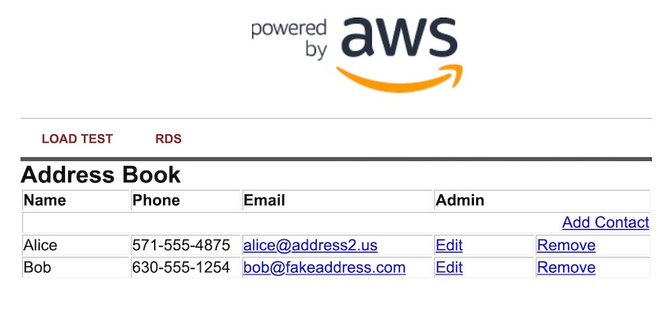

이것은 AWS에 의해 관리되는 MySQL 데이터베이스와 상호 작용하는 매우 기본적인 실습입니다. RDS는 훨씬 더 복잡한 관계형 데이터베이스 시나리오를 지원할 수 있지만 이 간단한 예로 요점을 충분히 이해할 수 있길 바랍니다.

주소록에 있는 Add Contact, Edit 및 Remove 링크를 사용하여 RDS 데이터베이스에서 콘텐츠를 자유롭게 추가/편집/삭제할 수 있습니다.

잘하셨습니다: AWS 관리형 MySQL 데이터베이스를 성공적으로 배포하고 활용했습니다!!
학습을 계속하시겠습니까? 스냅샷 및 인스턴스 크기 변경에 대해 테스트할 수 있는 다음 두 가지 옵션 랩을 참조하십시오.

## RDS 추가 옵션 실습

- RDS 스냅샷 생성

- RDS 인스턴스 크기 수정

[Previous](./3-rds.md) | [Next](./5-rds.md)
