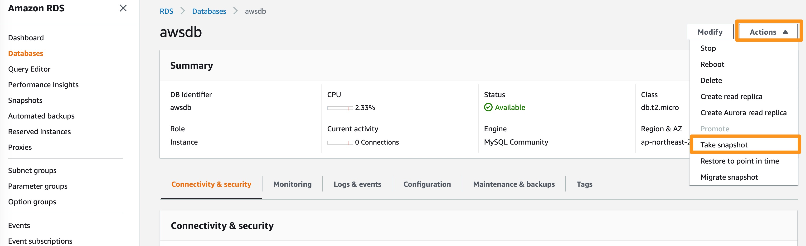
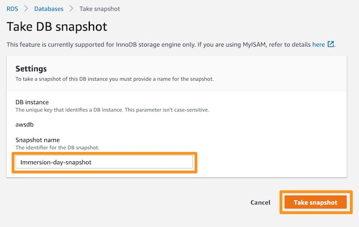
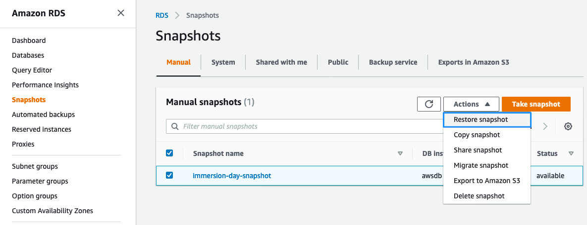

# RDS 스냅샷 생성(추가 실습)

## RDS 스냅샷 생성(추가 실습)
스냅샷을 생성하면 알려진 상태의 DB 인스턴스를 원하는 만큼 자주 백업한 다음 언제든지 특정 상태로 복원할 수 있습니다.

1. [Amazon RDS 콘솔](https://console.aws.amazon.com/rds) 에서 RDS 인스턴스를 선택하고 인스턴스 actions을 클릭한 다음 Take snapshot를 선택합니다.

2. 스냅샷에 Immersion-day-snapshot 이라는 이름을 지정하고 Take Snapshot를 클릭합니다.

단일 인스턴스 RDS를 사용하면 백업을 만드는 데 걸리는 다운타임이 발생합니다. 예제 데이터베이스는 사이즈가 작기 때문에 총 백업 시간도 매우 짧습니다.

3. DB 스냅샷은 화면 왼쪽의 Snapshots 링크에서 찾을 수 있습니다. Actions 메뉴에서 Restore Snapshot을 선택하여 이전 스냅샷에서 새 RDS 인스턴스를 쉽게 시작할 수 있습니다.

[Previous](./4-rds.md) | [Next](./6-rds.md)