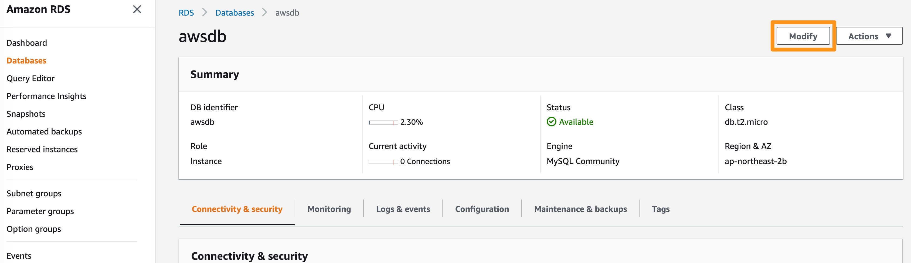
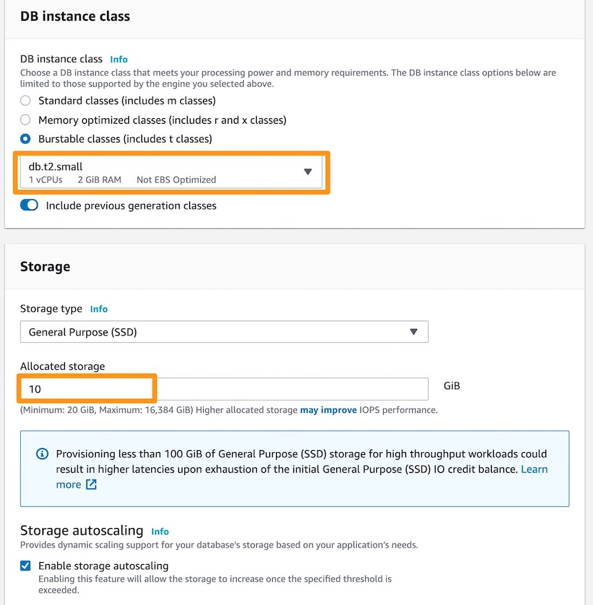
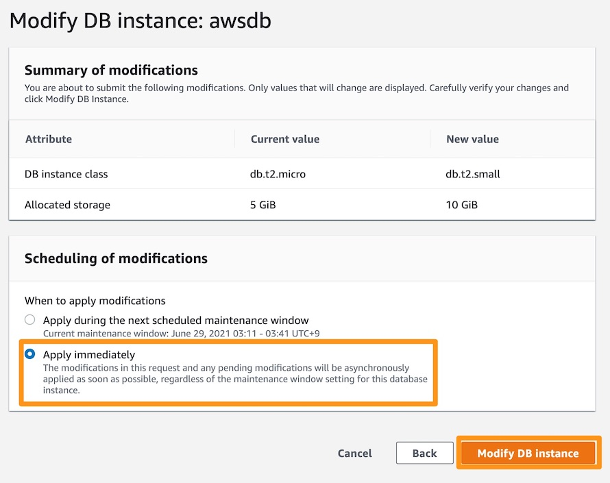

# RDS 인스턴스 크기 수정(추가 실습)

## RDS 인스턴스 크기 수정(추가 실습)

AWS 콘솔에서 클릭 몇 번으로 RDS 인스턴스 크기를 수정할 수 있습니다. 아래 단계를 진행하시면 됩니다:

1. RDS DB 인스턴스를 선택하고 Instance actions을 클릭한 다음 Modify를 클릭합니다.

2. Large instance (t2.small)로 편집하고 원하는 경우 데이터베이스 사이즈를 동시에 확장합니다. Next을 클릭합니다

3. 다음 화면에서 "Apply Immediately"을 클릭합니다. 그렇지 않으면 변경 사항이 다음 유지 관리 기간 동안에 변경 사항이 적용됩니다.. 그런 다음 Modify DB Instance을 클릭합니다.

언제든지 인스턴스 크기를 늘리거나 줄일 수 있습니다. 그러나 데이터베이스를 확장한 후에는 축소할 수 없습니다. 백업과 마찬가지로 이러한 작업을 수행하는 동안 다운타임이 발생합니다. 일반적으로 데이터베이스 크기 또는 시스템 크기 조정과 같은 주요 RDS 재구성에는 4분에서 12분이 소요됩니다.

추가적인 비용 청구를 방지하기 위해 리소스를 정리하는 것을 잊지 마십시오. 다음 페이지로 이동

[Previous](./5-rds.md) | [Next](./7-rds.md)