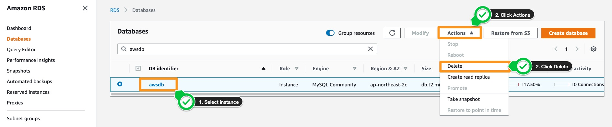
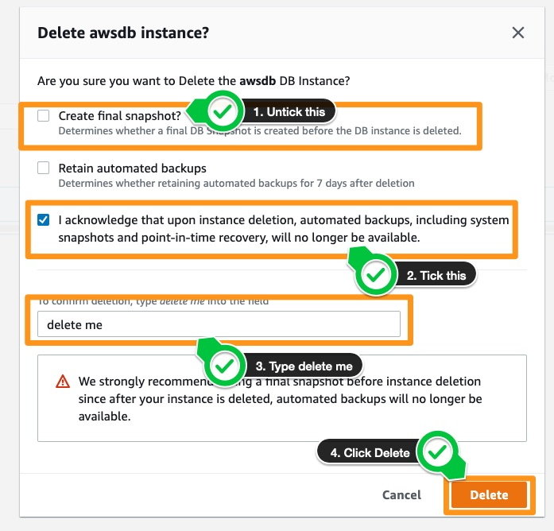

# 실습 자원 삭제하기

## 실습 자원 삭제하기

실습용으로 생성한 RDS 인스턴스를 삭제하려면 생성한 RDS 인스턴스를 선택합니다. 오른쪽 상단의 Actions 버튼에서 Delete를 클릭합니다.

최종 스냅샷 생성 옵션과 함께 DB 인스턴스를 삭제할 것인지 묻는 팝업이 표시됩니다.

1. Create final snapshot 옵션을 선택 해제합니다.

2. 본인은 인스턴스 삭제 시 시스템 스냅샷 및 특정 시점 복구를 포함한 자동 백업을 더 이상 사용할 수 없음을 인정합니다라는 메세지를 체크합니다.

3. delete me 기입합니다.

4. Delete를 클릭하여 DB 인스턴스를 완전히 삭제합니다.

[Previous](./6-rds.md) | [Next](../../60-s3.md)