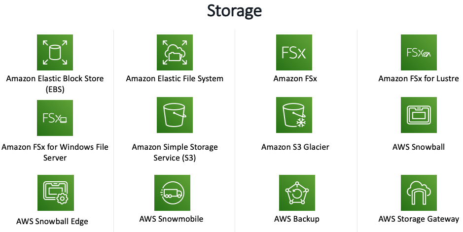

# 스토리지 - Amazon S3

AWS는 데이터를 저장, 액세스, 통제 및 분석하여 비용을 절감하고 민첩성을 높이며 혁신을 가속화할 수 있는 광범위한 서비스를 제공합니다.

객체 스토리지, 파일 스토리지 및 블록 스토리지 서비스, 백업 및 데이터 마이그레이션 옵션 중에서 선택하여 클라우드 IT 환경의 기반을 구축할 수 있습니다.

## S3 실습 을 시작하죠!

[Previous](../1.basic-modules/50-rds/rds/7-rds.md) | [Next](../1.basic-modules/60-s3/s3.md)