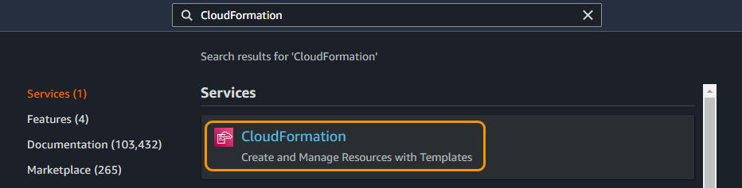
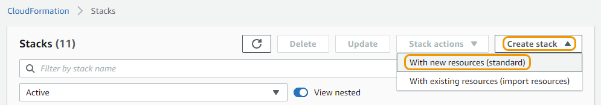
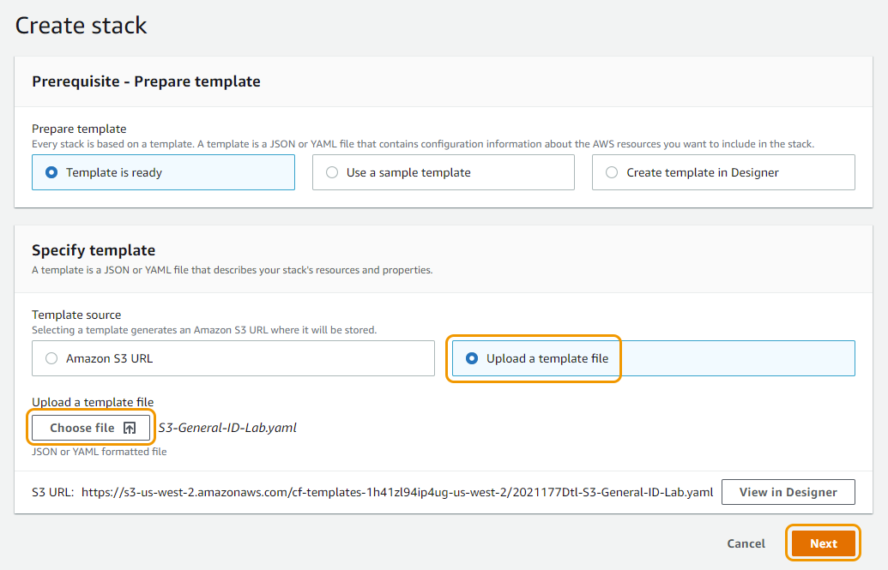
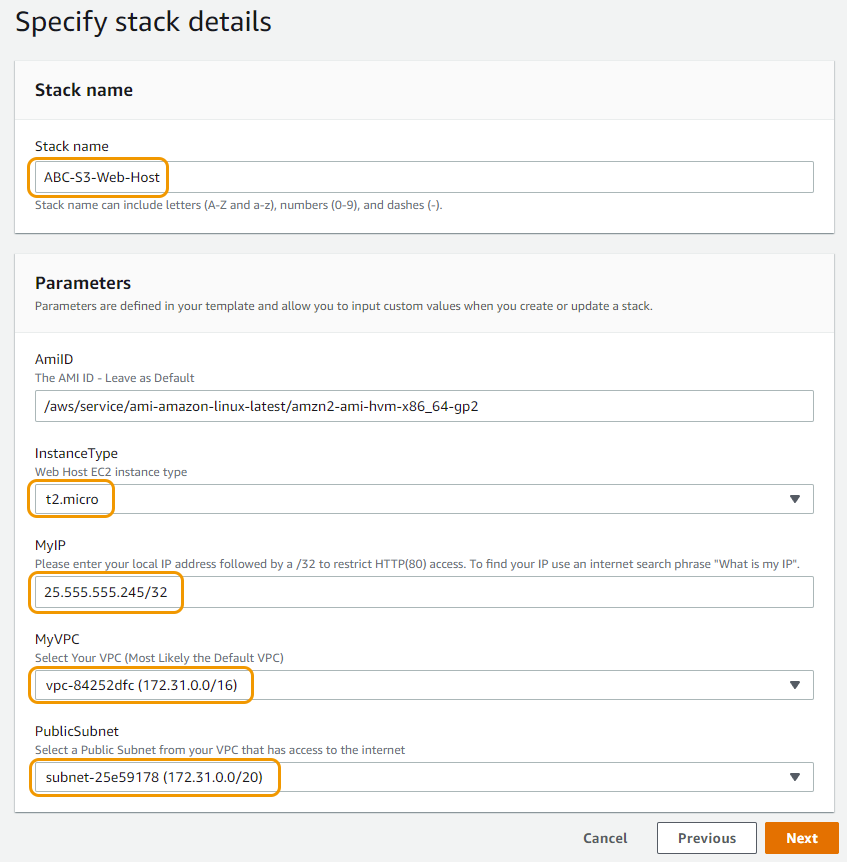
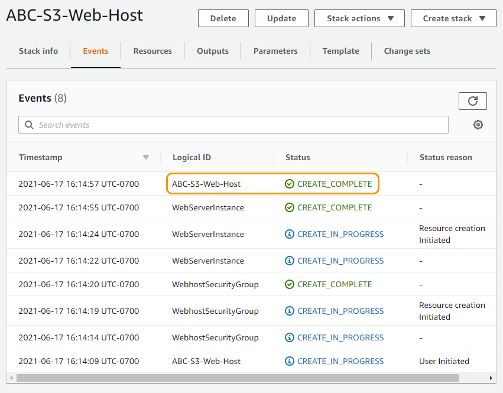
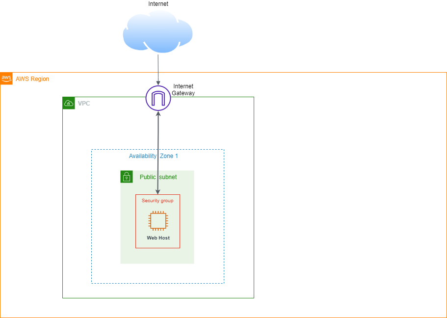
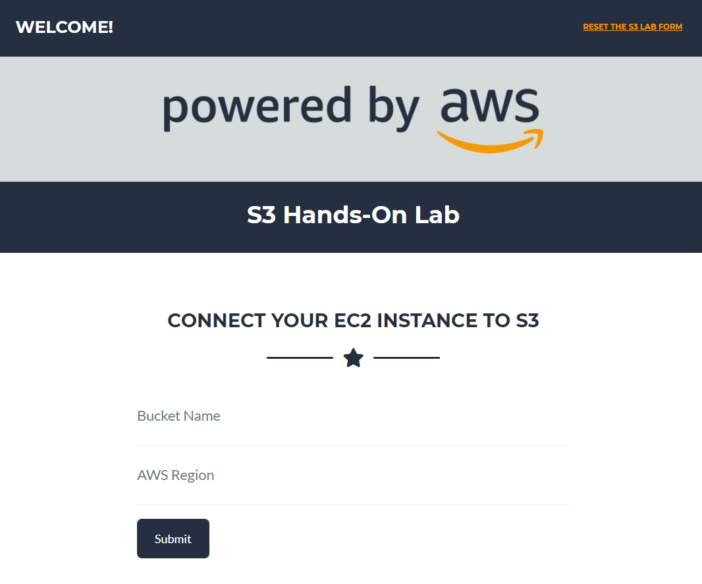

# Amazon S3 실습

## Amazon S3에 대하여

Amazon Simple Storage Service(S3)는 웹 상의 어디서나 언제든지 원하는 양의 데이터를 저장하고 검색할 수 있는 간편한 웹 서비스 인터페이스를 제공합니다.

이 실습은 AWS 콘솔을 통해 S3와 상호 작용하는 방법과 EC2 웹 호스팅을 통해 볼 수 있도록 개인 S3 버킷 내의 개체에 대한 액세스를 설정하는 방법을 시연하기 위해 설계되었습니다.

## 이 실습에서는 다음 과정을 안내합니다:

- S3 생성하기

- S3 버킷에 객체 추가하기

- S3 콘솔에서 객체 작업하기

- S3 버킷에 저장되어 있는 객체 접근하기

- 버킷 versioning 활성화하기

- 수명 주기 설정하기

- 실습 자원 삭제하기

## 실습 텍스트 범례

- "회색 강조 표시가 있는 따옴표로 묶은 텍스트" - 콘솔에서 헤더, 제목 또는 이름을 참조합니다.

- 굵은 글씨 - 클릭하거나 선택해야 하는 버튼, 링크 또는 드롭다운을 나타냅니다.

- 인라인 코드 - 입력을 위해 복사해야 하는 텍스트입니다(더 긴 텍스트에는 복사 버튼이 있으며, 더 짧은 텍스트는 강조 표시됩니다).

- 괄호가 포함된 인라인 코드 - 괄호 안의 텍스트는 고유한 입력이 필요한 텍스트를 나타냅니다.

## 필수 구성 요소:

S3 버킷에 업로드한 이미지를 보고 나중에 실습에서 실행 중인 버전을 보려면 웹 호스팅 작업이 필요합니다. 이 웹 호스팅 기능을 사용하면 실제 환경에서 S3 버킷과 상호 작용할 수 있습니다. CloudFormation 을 사용하여 EC2에 웹 호스트를 구축하려면 아래 템플릿 링크 버튼을 클릭하십시오.

다운로드 및 CloudFormation 템플릿 시작하기

1. 이 [링크](https://static.us-east-1.prod.workshops.aws/public/a24595bd-ccdc-448e-8a16-71e415d3e56b/static/common/s3_general_lab/S3-General-ID-Lab.yaml) 에서 우클릭 하여 "S3-General-ID-Lab.yaml" CloudFormation 템플릿을 다운로드하고 로컬 하드 드라이브에 저장합니다.

2. AWS 콘솔에서 CloudFormation을 검색하거나 Services 메뉴에서 "Management & Governance" 아래에 있는 CloudFormation을 클릭합니다.

3. CloudFormation 콘솔창에서 Create stack 버튼을 클릭하고 With new resources (standard) 를 선택합니다.

4. "Template source"에서 Upload a template file 를 선택하고 Choose file 버튼을 클릭합니다. 첫 단계에서 다운로드 받은 "S3-General-ID-Lab.yaml" 파일을 선택합니다. 템플릿 파일이 선택되면 Next 버튼을 클릭합니다.

5. Specify stack details 페이지에서 아래의 내용을 입력합니다.

    a. "Stack name" 이름에 [Your Initials]-S3-Web-Host를 입력합니다.

    b. "InstanceType" 에서 t2.micro(free tier) 혹은 m5.large를 선택합니다.

    c. "KeyPair"에서 여러분이 가지고 있는 키페어를 선택합니다. 만약 선택할 수 있는 키페어 리스트가 보이지 않는다면 해당 계정의 해당 리전에 키페어가 있지 않은 것입니다. 따라서 해당 리전에 키 페어 생성  작업이 필요합니다.

    d. "MyVPC"에서 인스턴스를 배포할 VPC를 선택합니다. 대부분의 계정에는 디폴트 VPC가 좋은 옵션일 것이고 처음 계정을 생성한 경우에는 디폴트 VPC 밖에 없을 겁니다.

    e. "PublicSubnet"에서 VPC 내에 인터넷 접속이 가능한 서브넷을 선택합니다. 퍼블릭 서브넷은 해당 라우팅 테이블 내에 인터넷 게이트웨이에 대한 경로가 있는 서브넷을 의미합니다. 기본적으로 디폴트 VPC 내에 있는 모든 서브넷은 퍼블릭합니다.

6. 세부 내용을 입력하는 작업이 다 끝나면 Configure stack options을 리뷰하기 위해, Next 버튼을 누르고, 셋팅 정보를 확인하기 위해 Next 버튼을 다시 누릅니다. 작성한 정보를 리뷰한 후, Create stack 을 클릭하여 웹 서버 배포를 시작합니다.

7. "Logical ID"가 "[Your Initials]-S3-Web-Host"인 항목에서 상태가 "CREATE_COMPLETE"로 보이기 전까지 기다립니다. 스택의 업데이트된 상태를 보려면 새로 고침 버튼을 클릭해야 합니다.

8. 이제 CloudFormation 스크립트가 아래 아키텍처를 만들었습니다.

## 인스턴스 설치 성공 여부 확인

1. Services 메뉴에서 EC2 를 선택하거나, 검색 창에서 EC2를 타이핑하여 EC2 서비스 페이지로 이동합니다.

2. 왼쪽 메뉴에서 Instances 를 선택합니다. "Instances" 페이지에서 "[Your Initials]-S3-Web-Host" 이름을 가진 인스턴스를 선택하고 "Public IPv4 DNS" 주소를 복사합니다. 해당 주소를 웹 브라우저에 붙여넣기 합니다.

"Public IPv4 DNS" 아래에 주소 링크를 붙여 넣었을 때, 웹 사이트가 보이지 않을 수 있습니다. 본 실습에서의 웹 서버는 SSL 인증서가 설치되어 있지 않기 때문에 해당 주소 앞에 http:// 대신 https:// 가 붙어 있으면 해당 에러가 발생할 수 있습니다.

.png)

3. 본 실습에서 사용할 "S3 Hands-On Lab" 페이지를 확인할 수 있습니다.

페이지가 로드되지 않으면 인스턴스 "Status check" 가 "2/2 checks passed"로 표시될 때까지 기다렸다가 다시 시도하는 것이 좋습니다.
이제 S3 버킷 생성하기 실습을 진행할 수 있습니다.

[Previous](../60-s3.md) | [Next](./s3/1-s3.md)