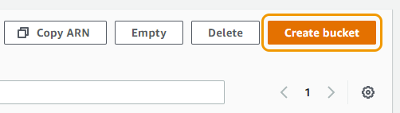
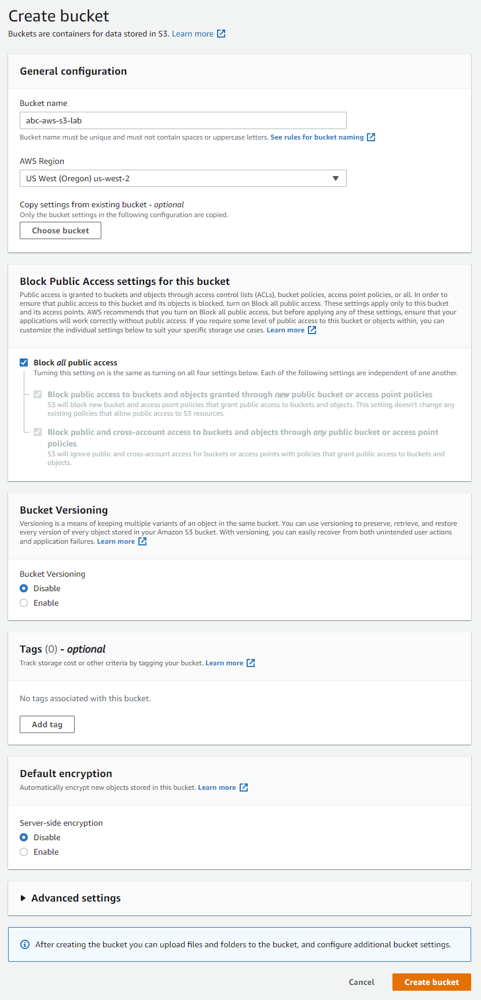
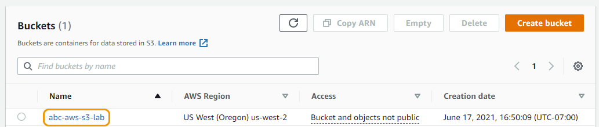
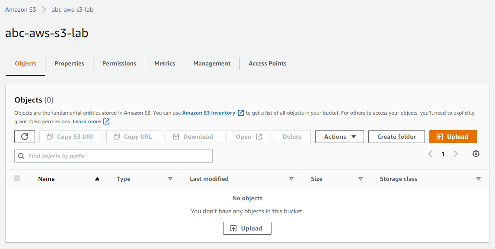

# S3 버킷 생성하기

## Amazon S3에 있는 모든 객체는 버킷에 저장됩니다. Amazon S3에 데이터를 저장하기 이전 버킷을 생성하는 작업이 필요합니다.

버킷을 생성하는 자체는 과금이 되지 않습니다. 버킷에 객체를 저장하고 버킷 안팎으로 객체를 전송하는 경우에만 요금이 부과됩니다.

1. 검색 창에서 S3를 찾거나 좌측 상단 Services 메뉴에서 "Storage" 아래에 S3를 선택하거나 여기 를 클릭합니다.

2. Create Bucket 버튼을 클릭합니다. 버킷 생성 작업을 위한 "Create bucket" 페이지로 이동됩니다.

3. "Bucket name" 필드에 이름을 입력합니다. 버킷 이름은 Amazon S3에 존재하는 모든 버킷 이름 으로부터 고유해야 합니다. 버킷 이름을 고유하게 만드는 한 가지 방법은 버킷 이름에 이니셜과 조직의 이름을 접두사로 붙이는 것입니다. 예: [your initials]-[your org]-s3-lab
버킷 이름은 다음 요구 사항을 준수해야 합니다:

- 소문자, 숫자, 마침표(.) 및 대시(-)만 포함할 수 있습니다(대문자 없음!).

- 숫자 또는 문자로 시작해야 합니다.

- 3자에서 255자 사이여야 합니다.

- IP 주소 형색은 불가능 합니다(예: 265.255.5.4).

4. Region 드롭다운 목록에서 CloudFormation을 사용하여 웹 호스팅을 수행한 리전과 동일한 값을 선택합니다.

5. 다음 항목은 "Block Public Access settings for this bucket" 입니다. 본 실습에서는 프라이빗 버킷으로 작업을 수행할 예정이기 때문에 Block all public access 체크된 상태로 둡니다. 사용자와 애플리케이션이 고유한 DNS 주소를 통해, 버킷 내의 객체에 접근할 수 있도록 버킷을 설정할 수 있습니다. 하지만 본 실습에서는 해당 작업을 하지 않습니다. 다음 챕터에서 버킷을 퍼블릭하게 두지 않고 객체에 접근할 수 있도록 설정할 것입니다.

6. 나머지 설정은 일단 기본값으로 둡니다. 다른 실습에서 버킷의 버전 관리를 사용하도록 설정할 예정입니다.. 이제 Create bucket 버튼을 클릭합니다.

7. 이제 S3 버킷 리스트가 있는 페이지로 돌아와 방금 생성한 버킷을 클릭합니다.

8. 버킷의 개요 페이지가 표시됩니다. 해당 버킷은 "Objects (0)" 값을 가집니다.

다음 단계인 S3 버킷에 객체 추가하기로 이동할 준비가 되었습니다.

[Previous](../s3.md) | [Next](./2-s3.md)