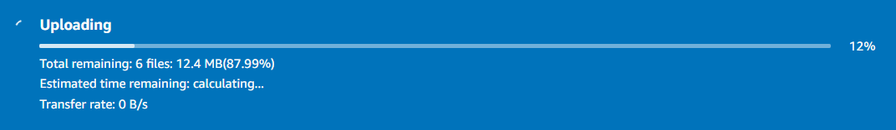

# S3 버킷에 객체 추가하기

## 버킷을 생성하였기에 객체를 추가할 준비가 되었습니다.

객체는 텍스트 파일, 사진, 비디오 등 모든 종류의 파일이 될 수 있습니다. Amazon S3에 파일을 추가할 때, 파일에 메타데이터를 포함하고 파일에 대한 액세스를 제어하는 권한을 설정할 수 있습니다.

1. 본 실습에서는 버킷에 7 장의 사진을 업로드할 것입니다. 압축 파일을 다운로드 받고 로컬 하드 드라이브에 저장합니다: photos.zip 

2. 압출 파일을 보면 "photo1.jpg"부터 "photo7.jpg"까지 7개의 파일과 "V2" 폴더 아래에 "photo1.jpg" 이름을 가진 파일을 확인할 수 있습니다.

3. 생성한 버킷 페이지에서 "Objects" 탭에 있는 Upload 버튼을 클릭합니다.

4. 업로드할 파일을 선택하기 위해 Add Files 버튼을 클릭합니다. "photo1.jpg"부터 "photo7.jpg"까지 업로드합니다. 단, "V2" 폴더에 있는 "photo1.jpg" 파일은 업로드하지 않습니다. 해당 파일은 추후 실습에서 사용할 예정입니다.

5. 이미지들을 선택한 후, "Upload" 작업을 수행하면 선택한 파일 리스트들이 화면과 같이 보입니다.

페이지 하단에서 "Permissions & Properties" 옆에 있는 화살표를 클릭하여 파일을 업로드하기 위한 추가 옵션을 살펴볼 수 있습니다.

6. 업로드 옵션을 사용하여 스토리지 클래스, 암호화, 태그, 메타데이터 등을 설정할 수 있습니다. 사용 사례에 따라 다른 스토리지 클래스를 선택할 수도 있지만, 본 실습에서는 스탠다드 스토리지 클래스를 사용할 것입니다. 다른 모든 설정은 기본값으로 둡니다.
페이지 아래에 있는 Upload 버튼을 클릭합니다.

업로드되는 이미지는 페이지 상단에 표시됩니다:

업로드가 완료되면 "Upload succeeded"이 표시됩니다:

7. 이제 Close를 클릭하여 버킷 개요 페이지로 돌아갑니다. 이제 S3 객체가 된 7장의 사진을 버킷에서 모두 볼 수 있습니다.

지금까지 빌드한 아키텍처는 아래와 같습니다:

다음 단계인 S3 콘솔에서 객체 작업하기로 이동할 준비가 되었습니다.

[Previous](./1-s3.md) | [Next](./3-s3.md)