# S3 버킷에 저장되어 있는 객체 접근하기

## EC2 인스턴스에 IAM Role 생성하기
실습 도입부에 생성한 EC2 인스턴스는 객체를 볼 수 있도록 설정된 서버입니다. 본 실습에서는 해당 서버에 3가지 내용을 서버에 제공하는 작업을 수행합니다:

- S3 버킷에 접근할 수 있는 권한: 실습에서 생성한 S3 버킷의 경우 프라이빗으로 접근할 수 있기 때문에 IAM 서비스 에서 IAM Role을 생성하는 작업을 통해, 권한을 만듭니다.

- 버킷 이름.

- 버킷을 호스팅한 리전.

1. "Services" 아래에서 "IAM"을 찾거나 링크 를 클릭합니다.

2. 좌측 메뉴에서 Roles 를 선택합니다.

3. Create role 버튼을 클릭합니다.

4. "Select type of trusted entity" 아래에서 AWS service 가 선택되었는지 확인한 후, "Choose a use case"에서 EC2를 선택합니다. Next: Permissions 버튼을 클릭합니다.

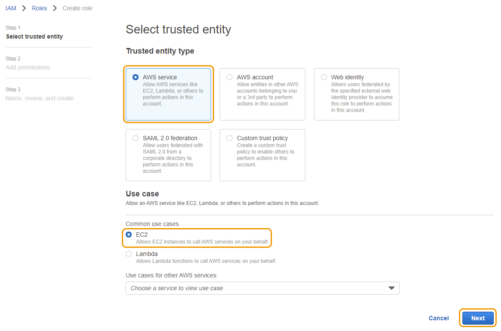

5. 다음으로 Role에 대한 permission policy를 만들 것입니다. Permission policy는 역할이 수행할 수 있는 작업과 역할이 사용할 수 있는 리소스를 정의합니다. Create Policy 버튼을 클릭합니다(이 작업은 웹 브라우저에서 다른 탭으로 이동하게 됩니다).

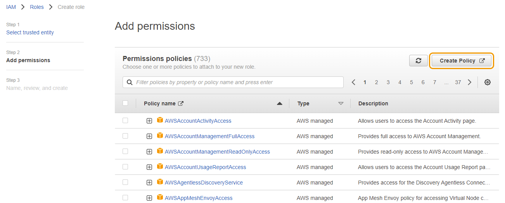

6. "Create Policy" 페이지에서 "Visual editor" 탭에서:

    a. Choose a service 선택 후, S3를 입력하고 선택합니다.

    b. "Actions"에서 "Filter actions" 검색 창에 GetObject을 입력합니다. "GetObject" 값에만 체크 표시를 합니다. GetObject는 EC2 인스턴스가 버킷에 있는 객체만 읽을 수 있도록 제한합니다.

    c. "Resources"에서 Specify object resource ARN for the GetObject action 를 클릭합니다. Specific 이 선택되고, Add ARN 이 클릭되어야 합니다(ARN은 "Amazon Resource Name"을 의미합니다).

    d. "Bucket name *" 필드에 [your-bucket-name] 값을 입력합니다.

    e. "Object name *" 필드에는 "Any"를 체크 합니다. 그 후, Add 버튼을 클릭합니다.

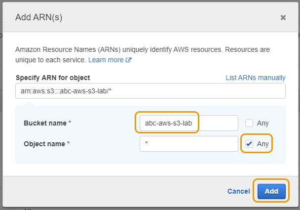

    f. 버킷 이름이 "abc-aws-s3-lab"이 아닌 여러분이 생성한 버킷 이름으로 되어 있는 것을 제외하고는 아래의 화면과 값이 같을 겁니다. Next: Tags 를 클릭합니다.

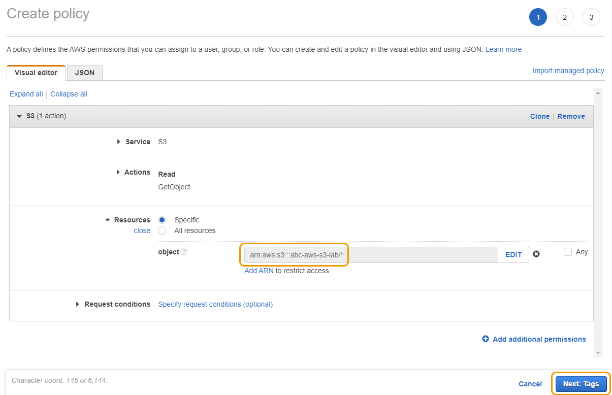

    g. 본 실습에서는 태그를 추가하지 않기에 Next: Review를 클릭합니다.

7. [your initials]-EC2-S3-Access로 정책 이름을 입력한 후, Create policy 를 입력합니다.

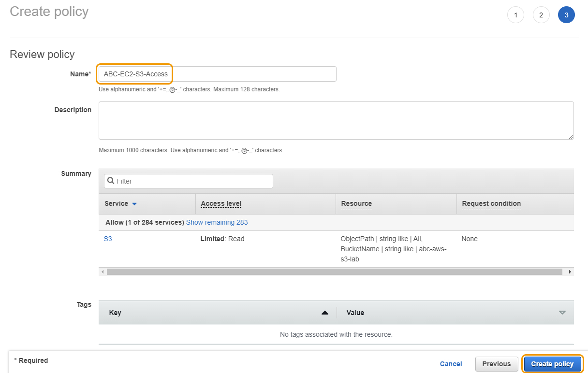

8. 이제 IAM Role 생성을 마무리하기 위해 이전 브라우저 탭으로 이동 합니다. 오른쪽에 있는 refresh button 를 클릭하여 방금 생성한 policy를 업로드시킵니다. "Filter policies" 검색 창에 S3를 입력합니다. 방금 전에 생성한 이름이 [your initials]-EC2-S3-Access 인 policy를 선택하고 Next: Tags 버튼을 클릭합니다.

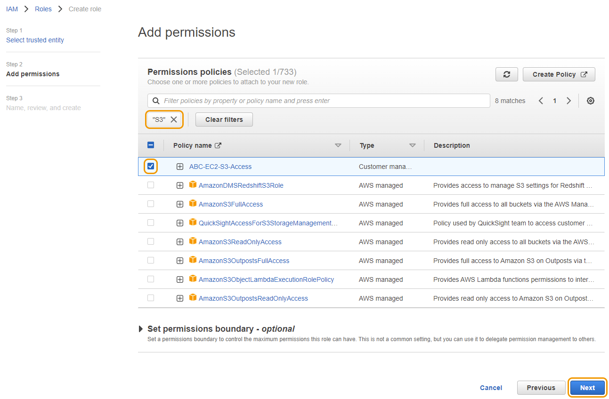

9. 태깅 작업은 수행하지 않기 때문에 Next: Review 를 클릭합니다.

10. [your initials]-EC2-S3-Access-Role로 IAM Role 이름을 입력하고 Create role 를 클릭합니다.

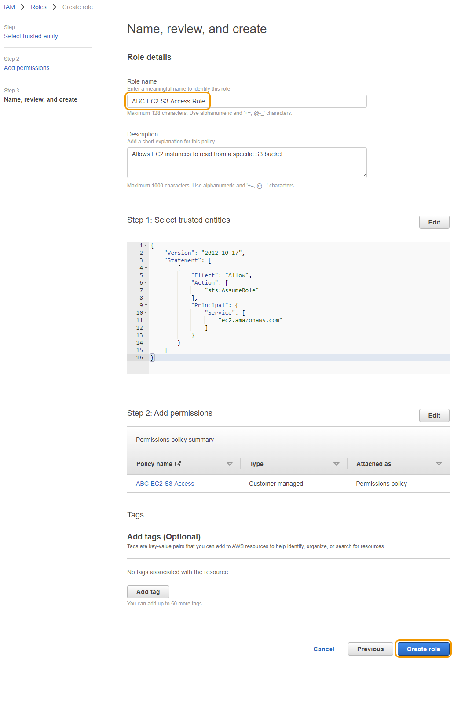

## EC2 인스턴스에 IAM Role 붙이기
S3 버킷에 있는 객체들을 EC2 인스턴스가 읽을 수 있도록 만들어주는 IAM Role을 생성했습니다. 해당 Role을 EC2 인스턴스에 붙이는 작업을 수행합니다.

1. "Services"에서 EC2를 클릭합니다.

2. 좌측 메뉴에서 Instances 를 클릭합니다.

3. "[your initials] - Web Server" 이름을 가진 인스턴스를 찾습니다.

4. 인스턴스를 선택하고, Actions > Security > Modify IAM Role 를 클릭합니다.

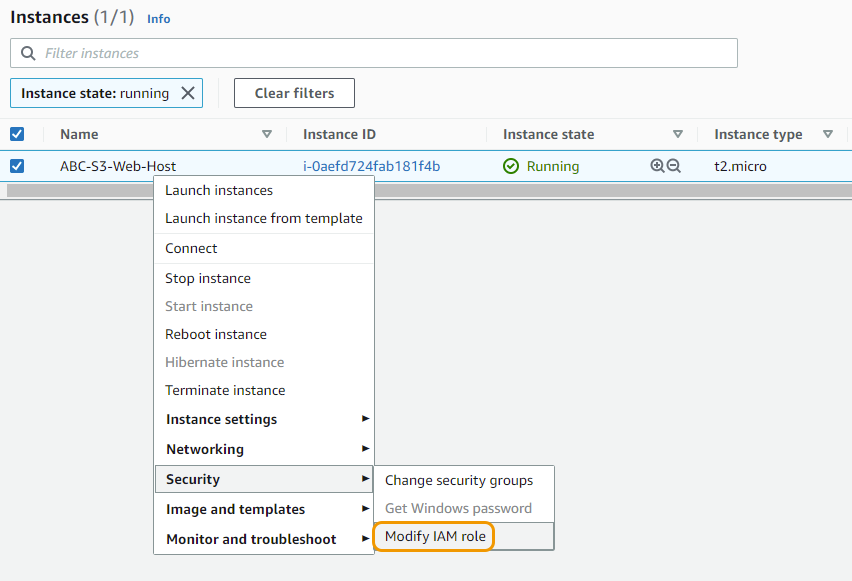

5. "IAM role" 드롭 박스에서 [your initials]-EC2-S3-Access-Role 이름을 가진 Role을 선택한 후, Save 버튼을 클릭합니다.

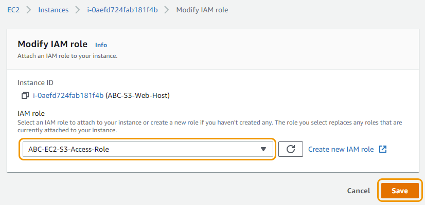

6. 이제 해당 인스턴스는 프라이빗 S3 버킷에 있는 파일을 읽을 수 있습니다.

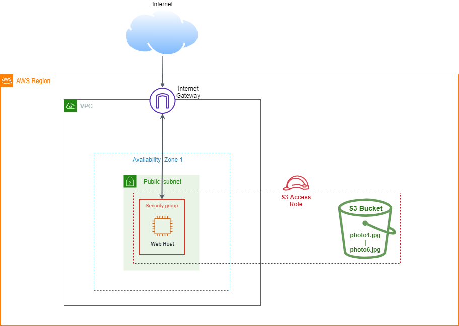

## 웹 브라우저에서 객체 보기
EC2 "Instances" 페이지로 이동한 후, "[Your Initials]-S3-Web-Host" 인스턴스를 선택하고 "Public IPv4 DNS" 주소를 복사해서 웹 브라우저 새로운 탭에 붙여 넣습니다.

"Public IPv4 DNS" 아래에 주소 링크를 붙여 넣었을 때, 웹 사이트가 보이지 않을 수 있습니다. 본 실습에서의 웹 서버는 SSL 인증서가 설치되어 있지 않기 때문에 해당 주소 앞에 http:// 대신 https:// 가 붙어 있으면 해당 에러가 발생할 수 있습니다.

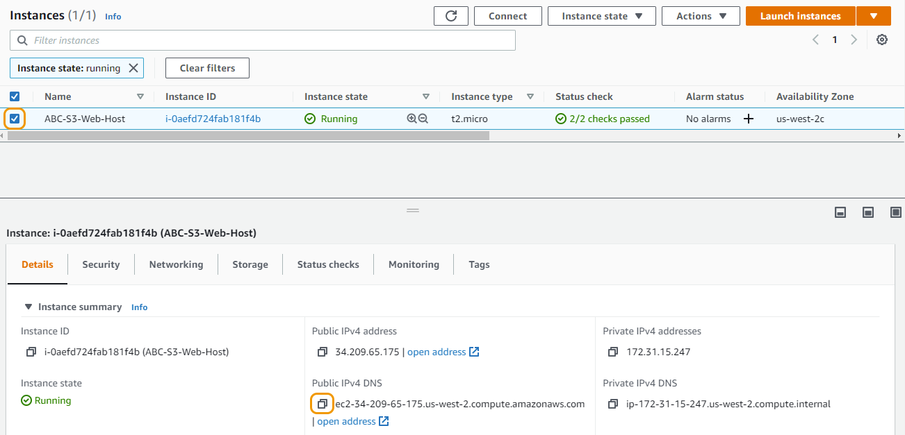

1. 실습에서 생성한 버킷 정보를 입력할 수 있는 "S3 Hands-On Lab" 페이지를 볼 수 있습니다.

2. S3 페이지에서 버킷 이름 및 리전을 확인할 수 있습니다. 리전은 us-west-2 같은 포맷으로 입력되어야 합니다.

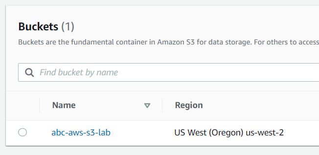

3. "Bucket Name"과 "AWS Region"를 입력하고 Submit을 클릭합니다.

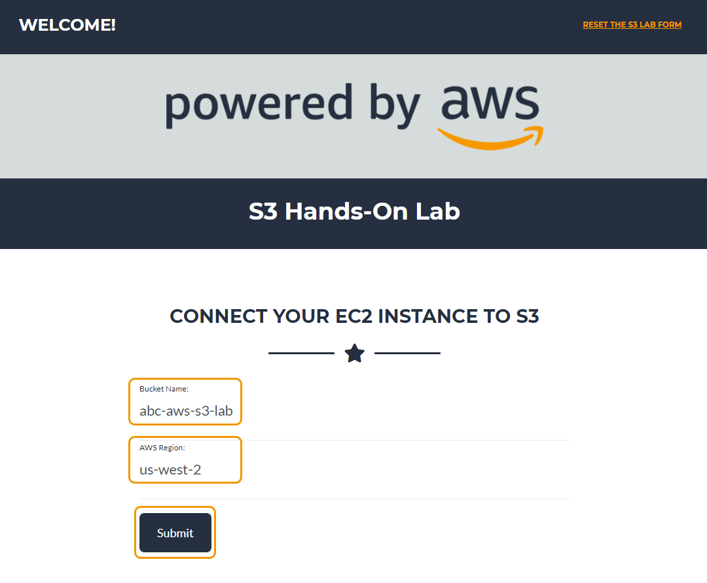

4. Submit 버튼을 클릭하면 이전에 업로드한 이미지가 작은 갤러리 형태로 표시됩니다(빨간색 X로 표시된 이미지는 versioning 실습에서 업데이트할 예정입니다)

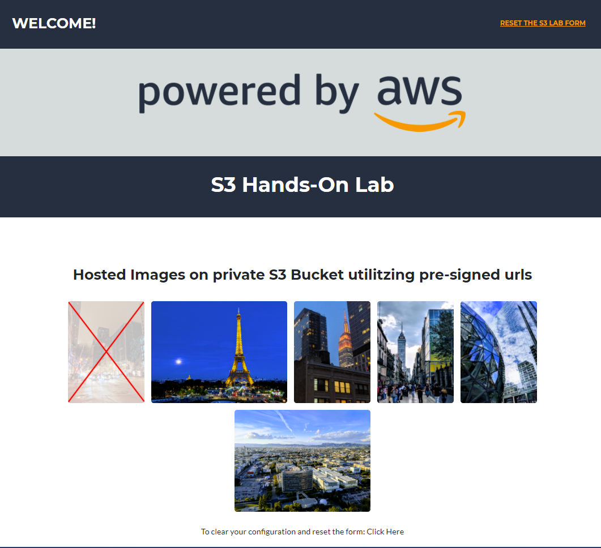

뒷 단에서 작용되는 원리: 웹 브라우저에 프라이빗 S3 버킷에 저장된 이미지를 읽습니다. 해당 부분은 각 객체에 presigned URL를 만들어 수행합니다. 객체 소유자는 자신의 보안 자격 증명을 사용하여 해당 객체에 presigned URL을 만들어 시간 제한적인 사용 권한을 부여하여 다른 사용자에게 객체를 공유합니다. 이 경우, S3에 전달된 보안 자격 증명은 EC2 인스턴스에 생성한 IAM Role입니다. 브라우저에서 이미지 중 하나를 열면 매우 긴 presigned URL가 표시됩니다.

지금까지 진행한 부분을 아키텍처로 표현하면 아래와 같습니다:

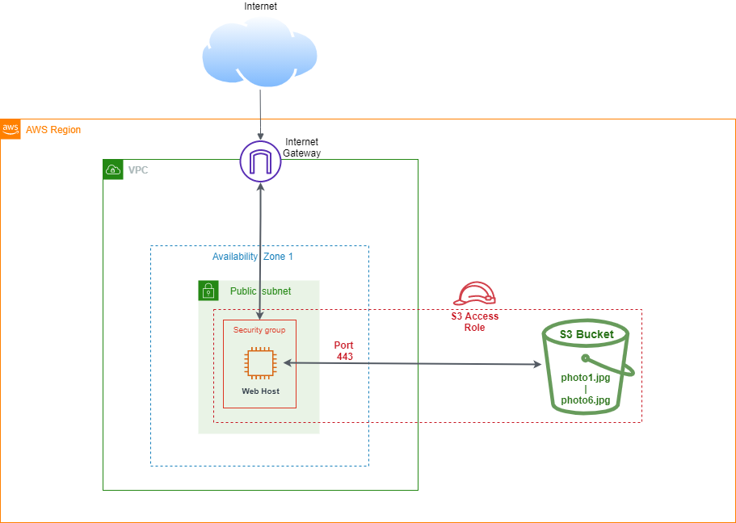

다음 단계인 버킷 versioning 활성화하기로 이동할 준비가 되었습니다.

[Previous](./3-s3.md) | [Next](./5-s3.md)