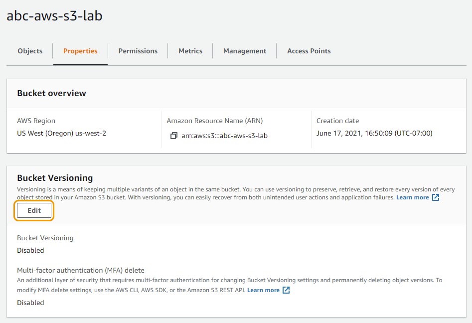
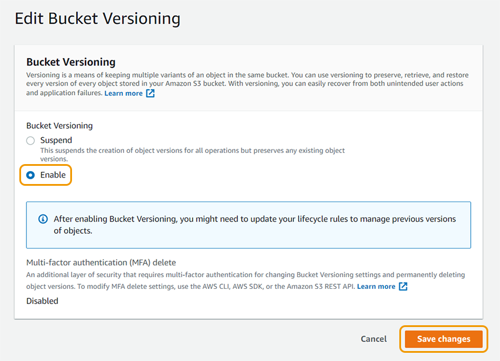
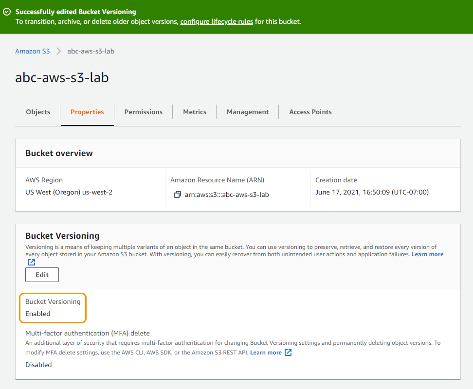
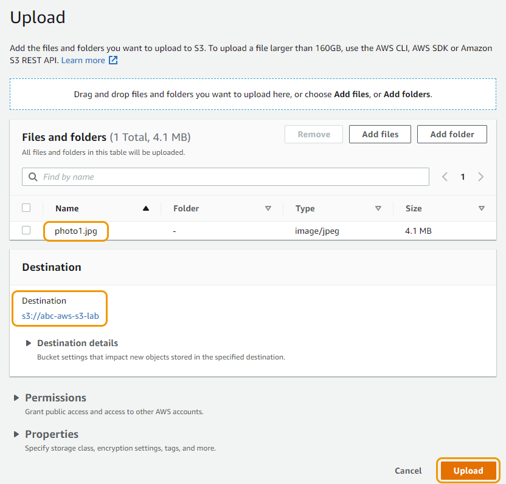
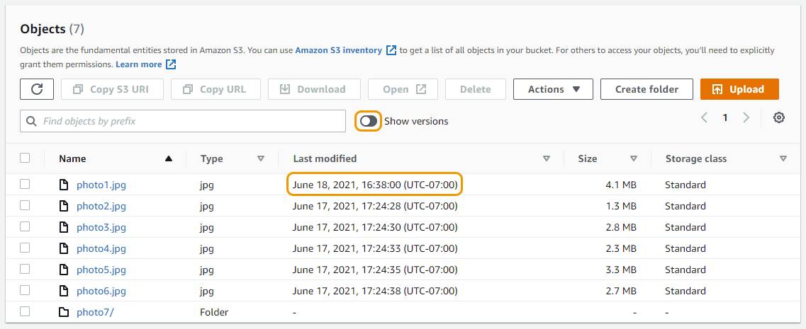
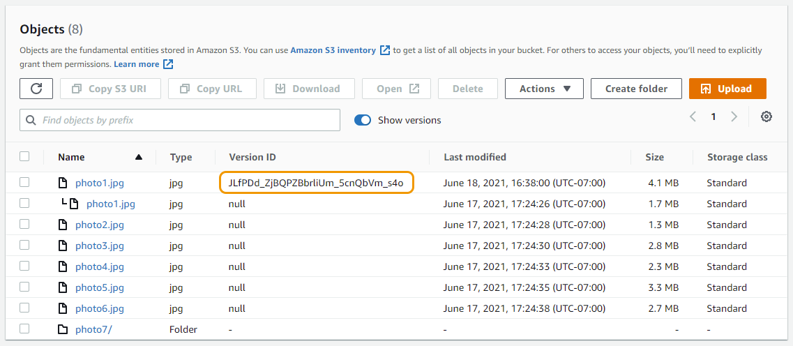

# 버킷 versioning 활성화하기

Versioning은 특정 객체에 여러 버전을 유지하는 수단입니다. 버전 관리를 사용하여 Amazon S3 버킷에 저장된 모든 객체의 버전을 보존, 검색 및 복원할 수 있습니다. 버전 관리를 사용하면 의도하지 않은 사용자 작업과 응용 프로그램 오류 모두 쉽게 복구할 수 있습니다.

버킷 수준에서 버전 관리를 사용하도록 설정하고 일시 중단할 수 있습니다. 버킷에서 버전을 사용하도록 설정한 후에는 버킷이 버전 설정 해제 상태로 돌아갈 수 없습니다. 대신 버전 관리 일시 중지 설정은 가능합니다.

1. [S3 콘솔](https://s3.console.aws.amazon.com/s3/) 에서 좌측에 있는 Buckets 를 클릭합니다. 이전 실습에서 생성한 버킷을 클릭하고 Properties 탭을 선택합니다. "Bucket Versioning" 아래에 Edit 버튼을 클릭합니다.

2. Enable 라디오 버튼을 선택하고 Save Changes를 클릭합니다.

이제 버킷 버전 관리 기능이 "Enabled" 되었습니다.

3. "Objects" 탭으로 돌아가서 Upload 를 선택합니다.

4. 이전 실습에서 이미지를 다운 받은 폴더로 가서 "V2" 폴더에 있는 "photo1.jpg" 파일을 이전 실습에서처럼 S3 버킷에 업로드 합니다. 이전에 photo1.jpg을 저장한 같은 위치에 파일을 저장해야 합니다.

5. 언뜻 보기에 photo1.jpg의 "Last modified" 날짜 외에는 변한 것이 없어보입니다(다른 이미지보다 최신 날짜 및 시간으로 표시되어 있는 것을 확인할 수 있습니다).
버킷 컨텐츠 위에 "Show Versions" 라는 토글 버튼을 활성화하면 각 객체의 버전을 확인할 수 있습니다.

6. 이제 여러분들은 "Version ID" 컬럼을 확인할 수 있으며 "photo1.jpg"의 경우, 두 개의 다른 버전이 있는 것을 확인할 수 있습니다. 새로운 버전은 유니크한 "Version ID"를 가지고 있으며 그외 다른 객체의 Version ID는 모두 "null"인 것을 확인할 수 있습니다. 이제 파일에 접근할 때, 새로운 버전의 "photo1.jpg"가 보일 것입니다.

7. "S3 Hands-On Lab" 웹 페이지를 리프레시 하면 새로운 버전의 "photo1.jpg"가 보이면서 빨간색 X 표시가 사라졌음을 확인할 수 있습니다. 구 버전의 객체는 버킷에 남아 있으며 필요에 따라 다운로드 및 복원 가능합니다.

Versioning을 활성화하면 객체의 버전은 기본적으로 무제한으로 허용됩니다. 객체 버전을 관리하는 방법 중 하나는 라이프사이클 정책을 설정하는 것입니다. 이 정책은 다음 섹션에서 수행할 것입니다.

다음 단계인 수명 주기 설정하기로 이동할 준비가 되었습니다.

[Previous](./4-s3.md) | [Next](./6-s3.md)