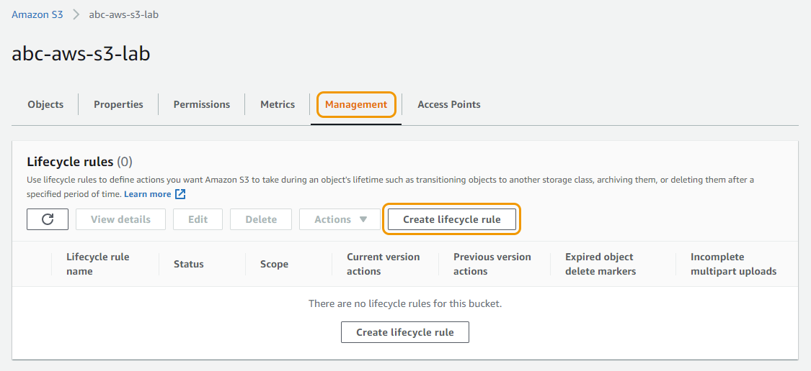
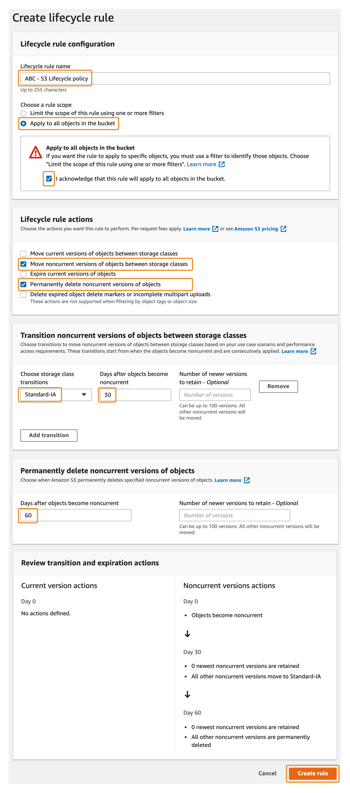
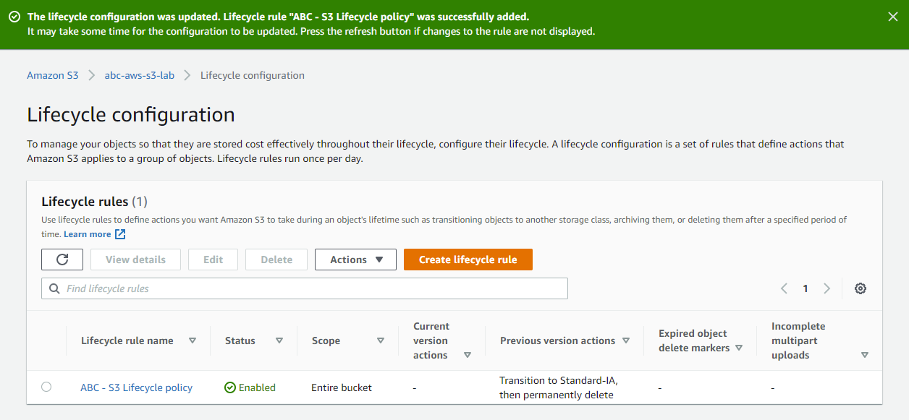

# 수명 주기 설정하기
수명 주기 정책을 사용하여 객체의 수명 동안 수행할 작업을 정의할 수 있습니다(예: 객체를 다른 스토리지 클래스로 전환, 객체 아카이빙 또는 지정된 기간 후 객체 삭제).

버전 설정을 활성화한 버킷에는 현재 버전 하나와 0 개 또는 그 이상의 구 버전의 객체가 존재할 수 있습니다. 수명 주기 정책을 사용하여 현재 버전 및 구 버전 관련된 작업을 정의할 수 있습니다.

30일 후에 객체 현재 버전이 아닌 이전 버전을 S3 IA(Increquent Access) 계층으로 이동한 다음 30일 후에 삭제하는 라이프사이클 정책을 설정할 예정입니다.

1. 버킷 페이지에서 Management 탭을 클릭합니다.

2. "Lifecycle rules" 아래에 Create lifecycle rule 버튼을 클릭합니다.

3. [your initials] - S3 Lifecycle policy라고 이름을 작성한 다음, 해당 규칙을 적용할 범위를 This rule applies to all objects in the bucket 로 설정하고 경고 사항에 대해 인지했다는 것을 체크 합니다. Prefix 혹은 객체 태그에 따라 조금더 정밀한 규칙을 셋팅할 수 있지만 본 실습에서는 버킷에 있는 모든 객체에 대해 적용하는 방식으로 진행합니다.

4. "Lifecycle rule actions" 아래에 Transition previous versions of objects between storage classes 와 Permanently delete previous versions of objects 를 체크합니다. "previous" 버전 관련 규칙을 설정하면 새로운 버전의 객체에 의해 이전 버전으로 대체될 때 이런 작업이 수행된다는 것을 의미합니다.

5. "Transition noncurrent versions of objects between storage classes" 아래에서 "Storage class transitions"에 Standard-IA 를 선택합니다. "Day after objects become noncurrent"에는 30을 입력합니다.

이 규칙은 객체가 구 버전으로 변경된 후, 30일이 지나면 S3-Standard에서 S3-IA로 변경된다는 것을 의미합니다. 이런 규칙은 처음 업로드 후, 30일 동안은 자주 액세스하지만 그 이후에는 가끔씩만 액세스하는 경우에 비용 절감 측면에서 효과적입니다.

6. "Permanently delete previous versions of objects"에서 60을 입력합니다. 이는 구 버전이 된 이후, 60일이 지나면 객체를 삭제한다는 의미입니다(30일 이후에는 S3-IA로 이동).

7. 아래에 있는 Timeline summary를 보면 현재 설정한 규칙을 시각적으로 확인할 수 있습니다. 검토가 끝나면 Create rule 버튼을 클릭합니다.

8. 이제 객체가 구 버전이 된 이후, 30일이 지나면 S3-IA로 그리고 또 30일이 지나면 삭제되는 수명 주기 정책을 설정했습니다.

마지막 단계인 실습 자원 삭제하기로 이동할 준비가 되었습니다.

[Previous](./5-s3.md) | [Next](./7-s3.md)