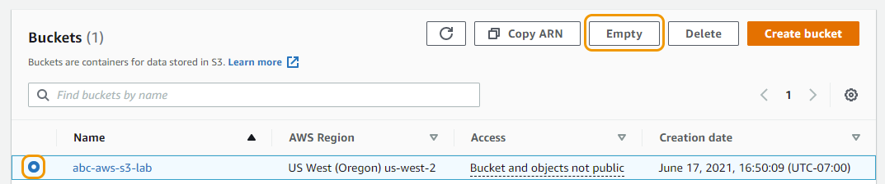

# 실습 자원 삭제하기

## 객체(여러 버전 포함) 및 버킷 삭제

개체 및 버킷은 API 및 콘솔을 통해 프로그래밍 방식으로 삭제할 수 있습니다. 본 실습에서 업로드한 객체와 생성한 버킷이 더 이상 필요하지 않은 경우, 비용이 발생하지 않도록 삭제해야 합니다.

버킷 페이지로 가서 모든 파일을 하나씩 삭제할 수 있지만 본 가이드에서는 한 번에 삭제할 수 있는 방법을 설명합니다.

## Empty bucket 기능을 활용하여 모든 객체 삭제하기
버킷에 있는 모든 객체를 삭제하고 싶을 경우, S3 콘솔에서 Empty 옵션을 사용할 수 있습니다.

1. S3 콘솔에서 본 실습에서 생성한 버킷의 라디오 버튼 을 선택한 후, Empty 버튼을 클릭합니다.

2. "Empty bucket" 페이지로 이동한 후, permanently delete 를 입력합니다. 그 후, Empty 버튼을 클릭하여 모든 객체를 영구적으로 삭제합니다.

3. "Empty bucket:status" 페이지로 이동된 후, 모든 버킷의 객체가 삭제되었다는 메세지를 확인할 수 있습니다. Exit 을 클릭한 후, S3 콘솔로 다시 돌아갑니다.

## 버킷 삭제하기

1. S3 콘솔에서 실습 때 생성한 [your-bucket-name] 를 선택합니다.

2. 현재 버킷이 비워진 상태라는 것을 확인할 수 있습니다. "Show Versions" 토글 버튼을 활성화시켜 구 버전도 잘 삭제되었는지 확인합니다.

3. "Buckets" 페이지로 다시 돌아간 후, 버킷 왼쪽에 있는 라디오 버튼을 클릭하고 Delete 버튼을 클릭합니다.

4. "Delete bucket" 페이지에서 [your-bucket-name] 값을 입력한 후, Delete bucket 버튼을 클릭합니다.

5. 삭제가 되면 "Successfully deleted bucket [your-bucket-name]" 메세지와 함께 S3 버킷 페이지로 다시 이동됩니다.

버킷을 삭제하기 전 명심해야할 두 가지:

1. 버킷 삭제는 취소할 수 없습니다.

2. 버킷 이름은 유일합니다. 따라서 당신이 해당 버킷을 삭제하면 다른 AWS 사용자가 그 이름을 사용할 수 있습니다.

## CloudFormation Stack 삭제하기

1. CloudFormation 콘솔 창을 엽니다.

2. [Your Initials]-S3-Web-Host 이라는 이름을 가진 스택을 선택하고 Delete 버튼을 클릭합니다.

3. 팝업 창에서 Delete stack 을 선택합니다.

4. 몇 분 후, 스택이 삭제되고, 리프레시 버튼을 누르면 업데이트된 상태를 확인할 수 있습니다. 스택은 삭제된 후, 리스트에서 볼 수 없습니다.

축하합니다! S3 실습을 완료했습니다!

S3의 추가 기능을 살펴봅니다!

- S3d에 웹 호스팅  기능이 있다는 사실을 알고 있나요?

- S3 Bucket policy 를 통해, 세분화된 액세스 제어가 가능합니다.

- 다른 버킷에 객체의 자동, 비동기식 복사본 을 설정할 수 있습니다.

- S3의 각기 다른 스토리지 클래스 를 확인합니다.

[Previous](./6-s3.md) | [Next](../../../README.md)