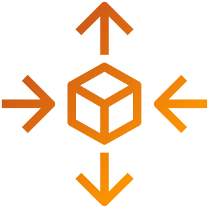

# 오토스케일링

AWS Auto Scaling 기능은 애플리케이션을 모니터링하고 용량을 자동으로 조정하여 최저 비용으로 안정적이고 예측 가능한 성능을 유지합니다. AWS Auto Scaling을 사용하면 여러 서비스에 걸쳐 여러 리소스에 대한 애플리케이션 스케일링을 몇 분 만에 쉽게 설정할 수 있습니다. 이 서비스는 Amazon EC2 인스턴스 및 Spot Fleets, Amazon ECS 작업, Amazon DynamoDB 테이블 및 인덱스, Amazon Aurora Replica를 포함한 리소스에 대한 확장 계획을 구축할 수 있는 간단하고 강력한 사용자 인터페이스를 제공합니다.

AWS Auto Scaling을 사용하면 성능, 비용 또는 균형을 최적화할 수 있는 권장 사항을 통해 간편하게 확장할 수 있습니다. Amazon EC2 Auto Scaling을 사용하여 Amazon EC2 인스턴스를 동적으로 확장하는 경우 이제 이 Auto Scaling을 AWS Auto Scaling과 결합하여 다른 AWS 서비스에 대한 추가 리소스를 확장할 수 있습니다. AWS Auto Scaling 기능을 사용하면 애플리케이션에 항상 적절한 시점에 적절한 리소스가 제공됩니다.

자 그럼 시작해볼까요?: EC2 Auto Scaling

[Previous](../ec2-windows/ec2-windows/99-ec2.md) | [Next](ec2-auto-scaling/ec2-auto-scaling.md)
