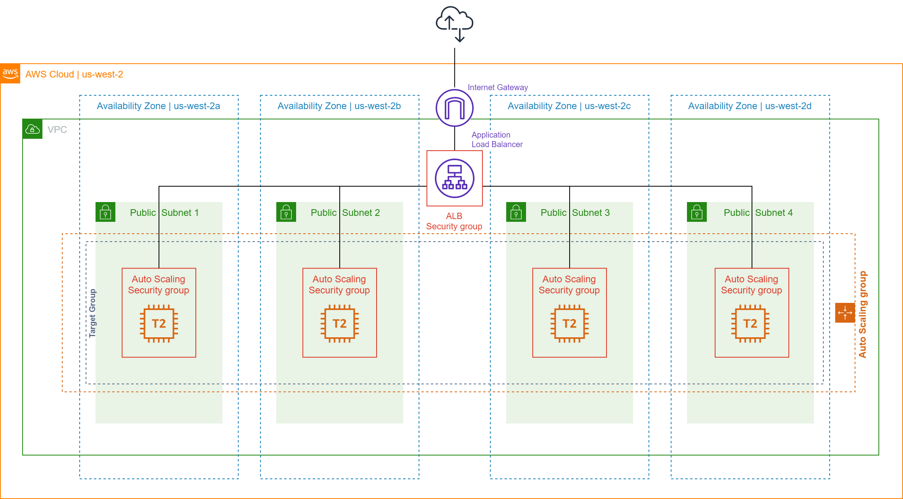
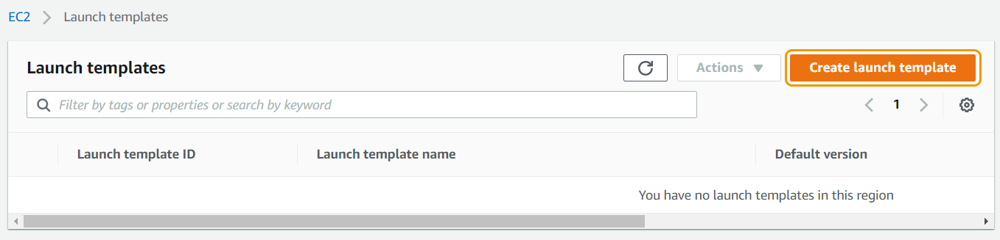
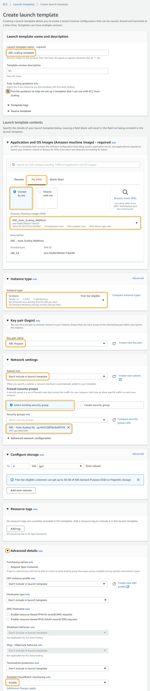

# 시작 템플릿 생성하기

## 오토 스케일링 실습 아키텍쳐

아래 그림은 실습을 완료하시게 되면 확인할 수 있는 최종 아키텍쳐입니다. 본격적으로 진행해봅시다!

## EC2 오토 스케일링을 구성하는 3가지 주요 구성 요소

1. Launch Template(시작 템플릿): 시작 템플릿은 시작 요청을 템플릿화하는 방법을 허용하는 EC2 Auto Scaling의 기능입니다. 이를 통해 인스턴스를 시작할 때마다 지정할 필요가 없도록 시작 매개변수를 저장할 수 있습니다. 예를 들어 시작 템플릿에는 일반적으로 인스턴스를 시작하는 데 사용하는 특정 Amazon 머신 이미지, 인스턴스 유형, 스토리지 및 네트워킹 설정이 포함될 수 있습니다. 각 시작 템플릿에 대해 하나 이상의 번호가 지정된 시작 템플릿 버전을 생성할 수 있습니다. 각 버전에는 다른 시작 매개변수가 있을 수 있습니다.
2. Auto Scaling Groups(오토 스케일링 그룹): Auto Scaling을 위해 EC2 인스턴스는 그룹으로 구성되어 확장 및 관리 목적으로 논리적 단위로 취급될 수 있습니다. 그룹을 생성할 때 최소, 최대 및 원하는 EC2 인스턴스 수를 지정할 수 있습니다.
3. Scaling Policies(조정 정책): 조정 정책은 Auto Scaling에서 조정 시기와 방법을 알려줍니다. 조정은 일정에 따라 요청 시 수동으로 수행하거나 Auto Scaling을 사용하여 특정 수의 인스턴스를 유지할 수 있습니다.

Auto Scaling은 시간별, 일별 또는 주별 사용량 변동을 경험할 수 있는 예측할 수 없는 수요 패턴이 있는 애플리케이션에 적합합니다. 이를 통해 비용을 관리하고 필요하지 않은 시간에 용량의 과잉 프로비저닝을 제거할 수 있습니다. Auto Scaling은 또한 비정상 인스턴스를 찾아 해당 인스턴스를 종료하고 확장 계획에 따라 새 인스턴스를 시작할 수 있습니다.

Auto Scaling이 이러한 그룹을 생성할 때 정의한 지표에 응답함에 따라 EC2 인스턴스의 수를 축소 또는 축소할 수 있습니다.

* 그룹이 설정한 크기 아래로 떨어지지 않도록 각 Auto Scaling 그룹의 최소 인스턴스 수를 지정할 수 있습니다. (인스턴스가 비정상인 경우에도)
* 그룹이 설정한 크기를 초과하지 않도록 각 Auto Scaling 그룹의 최대 인스턴스 수를 지정할 수 있습니다.
* 원하는 용량을 지정하여 Auto Scaling 그룹이 항상 보유해야 하는 정상 인스턴스 수를 지정할 수 있습니다. (자세한 정보는 여기서 확인하실 수 있습니다)
* Auto Scaling이 이전 지점에서 언급한 원하는 목표 용량을 수정하도록 조정 정책을 지정할 수 있습니다. 애플리케이션에 대한 수요가 증가하거나 감소하면 인스턴스를 시작하거나 종료합니다.

## 시작 템플릿 생성하기

오토 스케일링 그룹을 설정할 때 시작 템플릿을 설정하셔야 합니다. 첫번째 단계로 EC2 오토 스케일링 그룹에 필요한 시작 템플릿을 생성하도록 하겠습니다.

1. "Services" 탭에서 EC2 를 선택합니다.
2. 왼쪽 메뉴 탭에서 "Instances" 아래 위치한 Launch Templates 버튼을 클릭합니다.
3. Create launch template 버튼을 클릭합니다.

1.  "Create launch template" 페이지로 이동하시게 되고 아래와 같이 "Launch template name과 description" 을 작성합니다.

    a. Launch template name: \[이니셜]-scaling-template

    b. Template version description: 선택 사항

    c. Auto scaling guidance: 오토 스케일링 설정을 위한 체크 박스 선택 을 해주세요
2.  "Launch Template Contents" 에서 오토 스케일링 그룹 설정에 필요한 인스턴스 파라미터를 설정할 수 있습니다:

    a. Amazon machine image (AMI): 해당 버튼을 클릭하시면 드랍 다운 형태로 AMI를 찾을 수 있고 이전에 생성한 custom AMI \[이니셜] - Auto Scaling Webhost 를 선택합니다. "My AMIs" 아래에서 확인하실 수 있습니다.

    b. Instance type: t2.micro

    c. Key pair (Login): 첫번째 실습에서 생성한 Key Pair를 선택 합니다. 높은 확률로 Key Pair 이름은 \[이니셜]-KeyPair 일것입니다.

    d. Networking Settings:

    * Network Platform: Virtual Private Cloud (VPC)
    * Security groups: \[이니셜]-EC2-Web-Host - Auto Scaling SG 이라는 이름의 첫번째 실습에서 생성된 security group을 선택합니다.

    e. Storage (volumes): 기본값으로 둡니다.

    f. Resource tags: None

    g. Network interfaces: 자동 크기 조정된 인스턴스에 추가 네트워크 인터페이스를 추가하지 않습니다.

    h. Advanced Details: 중요: "Advanced details" 탭을 확장하고 "Detailed Cloudwatch monitoring" 에서 Enable 버튼을 클릭합니다. 나머지는 기본 값으로 둡니다.

여기에서 CloudWatch 세부 모니터링을 활성화합니다. 기본적으로 인스턴스에는 5분 간격으로 인스턴스에 대한 기본 모니터링이 있습니다. 세부 모니터링을 활성화하면 CloudWatch가 1분 간격으로 Auto Scaling 그룹의 인스턴스를 모니터링합니다. 이렇게 하면 Auto Scaling 그룹이 그룹의 변경 사항에 더 빠르게 대응할 수 있습니다.

1. 설정값을 알맞게 작성한 것을 확인하시고 Create launch template 버튼을 클릭한 다음 View launch templates 버튼을 클릭합니다. 시작 템플릿 생성하기를 완료하였습니다. 다음 실습으로 넘어가도록 하겠습니다: 오토 스케일링 그룹 설정하기

[Previous](2-ec2-as.md) | [Next](3-ec2-as.md)
