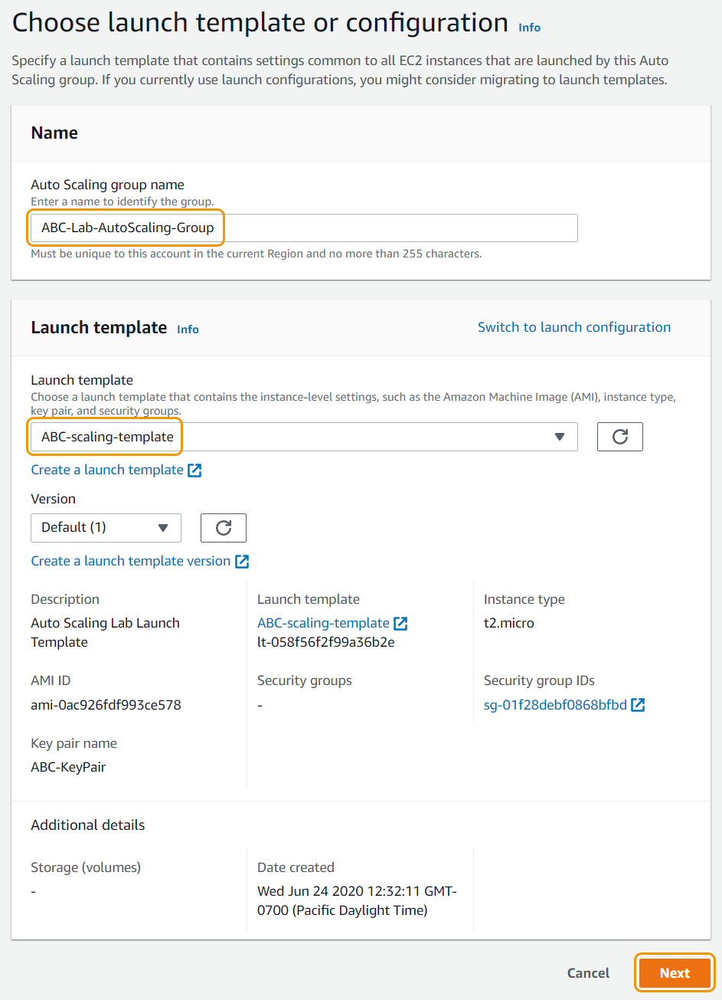
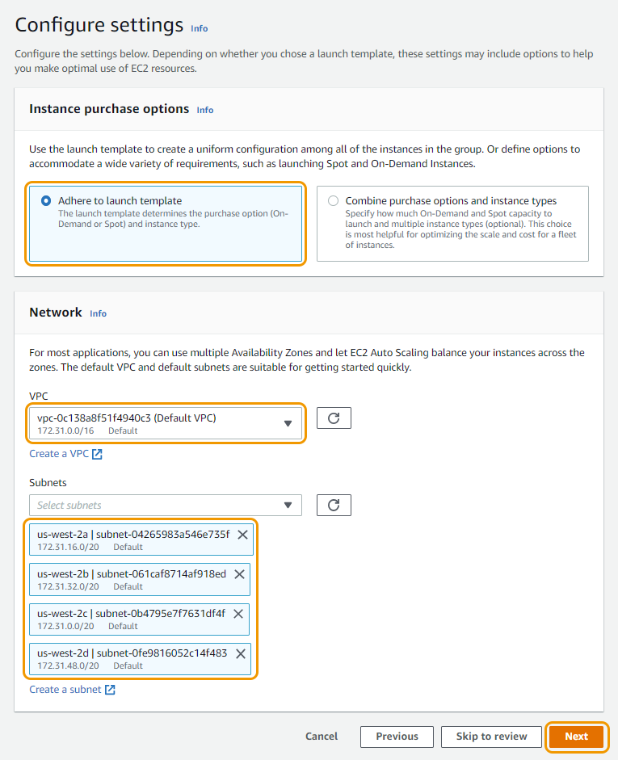
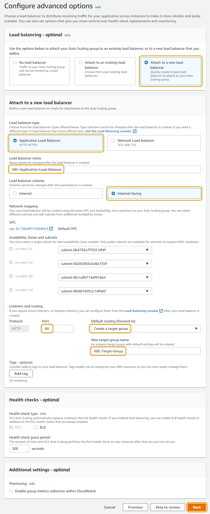
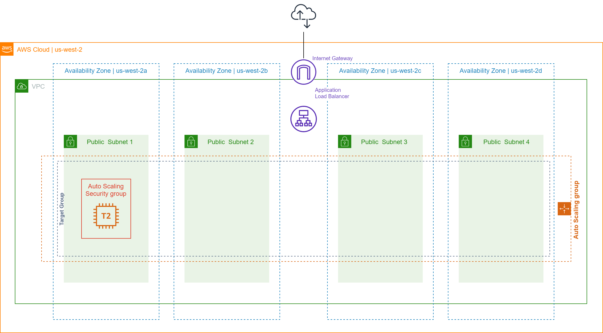

# 오토 스케일링 그룹 설정하기

## 오토 스케일링 그룹 생성하기

지금까지 생성된 인스턴스의 매개변수를 정의하는 시작 템플릿을 생성했습니다. 이제 생성되어야 할 EC2 인스턴스 수와 생성될 위치를 정의할 수 있도록 Auto Scaling 그룹을 생성하겠습니다.

1. EC2 콘솔 페이지로 다시 이동해주세요.
2. 왼쪽 메뉴에서 "Auto Scaling" 을 찾고 Auto Scaling Groups 버튼을 클릭합니다.
3. Create an Auto Scaling group 버튼을 클릭합니다.
4. 오토 스케일링 그룹 이름을 지정합니다: \[이니셜]-Lab-AutoScaling-Group
5. Launch Template 드랍 다운에서 이전에 생성한 \[이니셜]-scaling-template 이름의 Launch Template을 선택하고 Next 버튼을 클릭합니다.

1.  설정 페이지를 아래와 같이 설정을 하고 Next 버튼을 클릭합니다.

    a. Purchase options and instance types: Adhere to launch template 버튼 선택

    b. Network:

    * VPC: VPC 선택 하기 (대부분 기본 VPC 입니다)
    * Subnets: 호스트를 추가될 때 Auto Scaling 그룹이 사용할 서브넷을 선택 합니다. (기본 VPC를 사용하는 경우 아래와 같이 서브넷이 4개일 가능성이 큽니다.)

Auto Scaling Group의 모범 사례는 프라이빗 서브넷만 선택하는 것입니다. 인스턴스는 로드 밸런서 뒤에 위치하며 공용 IP 주소가 필요하지 않습니다. 이 실습에서는 프라이빗 또는 퍼블릭 서브넷이 사용될 수 있습니다.

1.  로드 밸런서와 헬스 체크 상태 지정하기:

    a. Load balancing: Attach to a new load balancer 버튼 클릭

    b. Load balancer type: Application Load Balancer 버튼 클릭

    c. Load balancer name: \[이니셜]-Application-Load-Balancer

    d. Load balancer scheme: Internet-facing 버튼 클릭

    e. Networking mapping: 이전 단계에서 선택한 모든 가용 영역과 서브넷이 표시되어야 합니다. (AZ당 서브넷이 여러 개인 경우 이 중에서 선택할 수 있습니다.)

    f. Listeners and routing: Port는 80으로 그대로 둡니다. "Default routing (forward to)" 드랍 다운에서 Create a target group 버튼을 선택합니다.

    g. New target group name: \[이니셜]-Target-Group

    * 대상 그룹은 로드 밸런서가 트래픽을 분산할 인스턴스를 찾는 위치입니다. 이 그룹에 인스턴스를 자동으로 등록하도록 Auto Scaling 그룹을 설정하고 있으며 로드 밸런서에도 연결됩니다.

    h. Health checks & Additional settings: 기본값으로 두고 Next 버튼을 클릭합니다.

1.  아래에서 그룹 크기 및 조정 정책을 구성하고 Next 버튼을 클릭합니다.

    a. Group Size: 아래 설정은 조정 정책이 트리거되지 않는 한 그룹 크기를 하나의 EC2 인스턴스로 유지합니다.

    * Desired capacity: 1
    * Minimum capacity: 1
    * Maximum Capacity: 5

    b. Scaling policies: Target tracking scaling policy 선택하기

    * Metric type: Average CPU utilization
    * Target Value: 25

빠른 실습 진행을 위해서 목표 CPU 사용률을 낮게 설정하겠습니다.

1. Notifications 추가하기:

이메일 주소와 같이 선택한 엔드포인트로 알림을 보내도록 Auto Scaling 그룹을 구성할 수 있습니다. 인스턴스 시작 성공, 인스턴스 시작 실패, 인스턴스 종료, 인스턴스 종료 실패 등 지정된 이벤트가 발생할 때마다 알림을 받을 수 있습니다.

지금은 이 단계를 건너뛰고 Next 버튼을 클릭합니다.

1.  Add Tags: 단일 태그를 추가하고 Next 버튼을 선택합니다.

    a. Add Tage 버튼을 선택하고 다음을 구성합니다:

    * Key: Name
    * Value: \[이니셜] - Auto Scaling Group
2.  설정을 검토한 다음 Create Auto Scaling group 버튼을 클릭합니다. 지금까지 Auto Scaling 그룹, 대상 그룹 및 로드 밸런서를 생성했습니다.

    a. 곧 EC2 콘솔에서 "\[이니셜] - Auto Scaling Group"이라는 이름의 Auto Scaling 그룹이 생성한 새 인스턴스를 볼 수 있습니다. (인스턴스를 보려면 화면을 새로 고침하셔야 합니다.)

    b. 왼쪽 메뉴의 "Load Balancing"에서 Load Balancers를 선택하면 로드 밸런서 프로비저닝이 표시됩니다.

다음 단계에서는 추가 보안 그룹을 만들고 ALB와 웹 호스트 간에 트래픽이 흐를 수 있도록 보안 설정을 업데이트하겠습니다.

다음 실습으로 이동하시겠습니다: 보안 그룹 구성하기

[Previous](2-ec2-as.md) | [Next](4-ec2-as.md)
