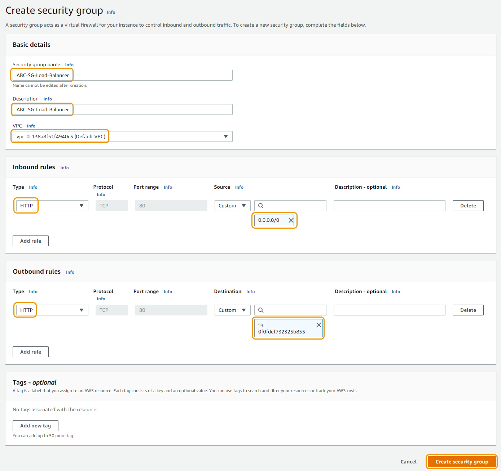
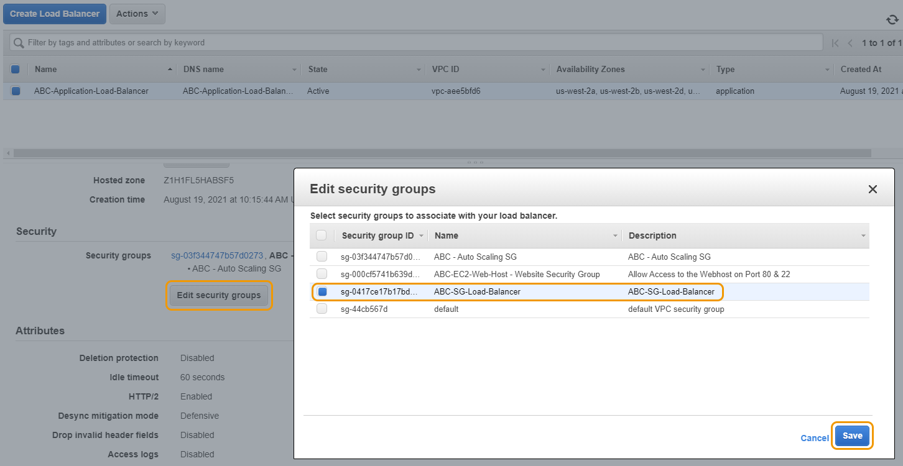
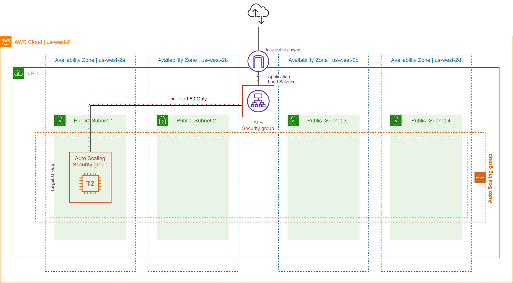
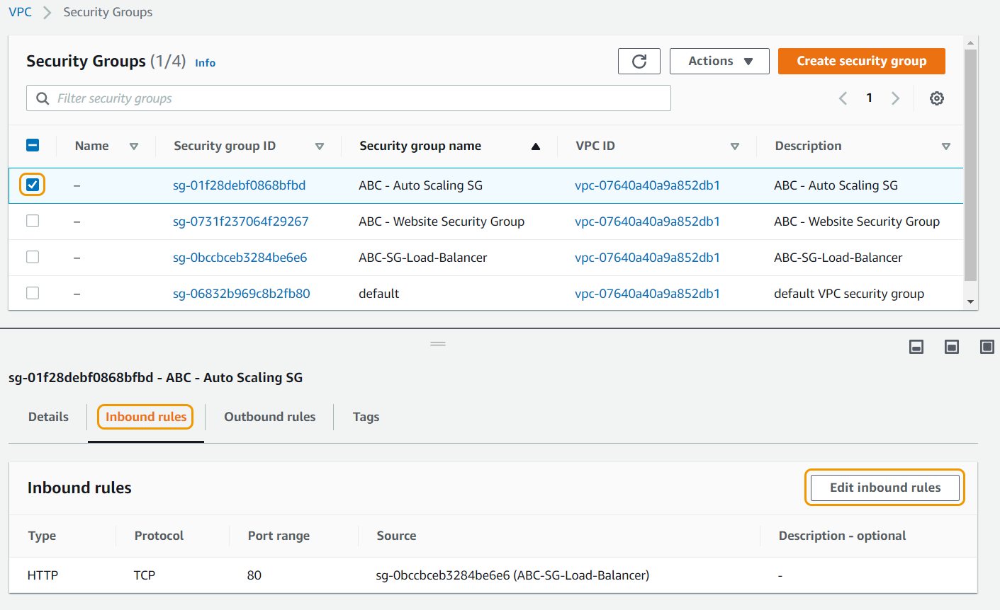
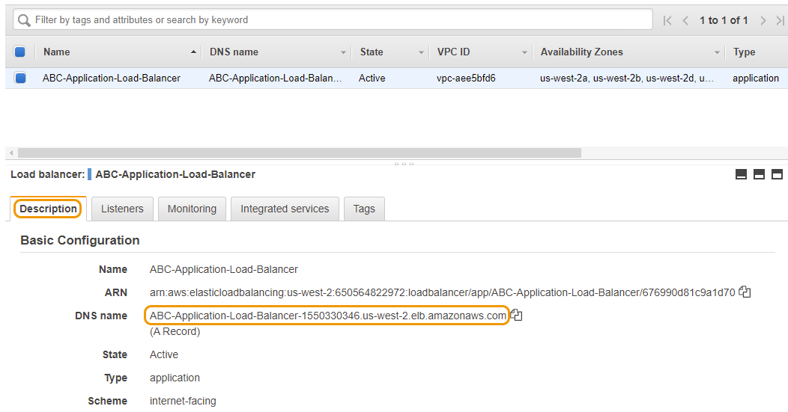
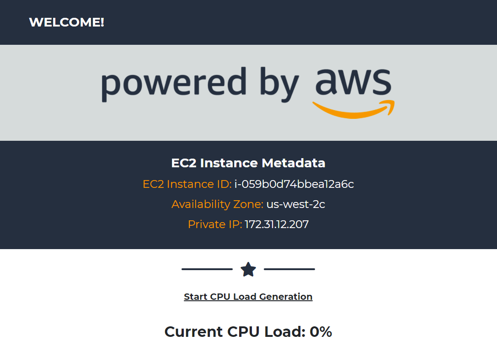

# 보안 그룹 구성하기

## 로드 밸런서 보안 그룹 생성하기

로드 밸런서가 프로비저닝될 때 VPC의 기본 보안 그룹으로 설정되어 있습니다. 공용 DNS를 통해 로드 밸런서에 대한 액세스를 허용하려면 인터넷에서 포트 80의 인바운드 트래픽을 허용하는 보안 그룹을 생성하고 연결해야 합니다.

또한 로드 밸런서에서 나가는 트래픽이 Auto Scaling 보안 그룹 내의 호스트로만 전송되도록 허용하는 아웃바운드 규칙도 생성합니다.

콘솔에서 "Services" 탭을 클릭하고 EC2 를 선택합니다. EC2 콘솔 창에서 왼쪽 메뉴에 위치한 "Network & Security" 탭에서 Security Groups 버튼을 클릭합니다. \[이니셜]-EC2-Web-Host - Website Security Group 이름으로 된 다른 보안그룹을 확인하실 수 있습니다. Create security group 버튼을 클릭합니다.

1.  기본 설정:

    a. Security group name: \[이니셜]-SG-Load-Balancer

    b. Description: \[이니셜]-SG-Load-Balancer

    c. VPC: 기본 VPC 또는 직접 만든 VPC를 선택 (기본 VPC를 사용하셔도 무관합니다.)
2.  Inbound rules:

    a. Add rule 버튼을 클릭합니다.

    b. Type: HTTP

    c. Source: Custom: 0.0.0.0/0 (이를 통해 모든 소스의 웹 트래픽이 웹 호스트의 페이지를 요청할 수 있습니다.)
3.  Outbound rules:

    a. "All traffic" 규칙을 찾아 Delete를 클릭하여 규칙을 제거합니다. (모든 아웃바운드 규칙을 제거합니다.)

    b. Add rule 버튼을 클릭합니다.

    c. Type: HTTP

    d. "Destination" 아래 Custom 버튼을 선택하고 "Destination"에 \[이니셜]-Auto Scaling SG 을 설정합니다. 힌트: sg 타이핑하여 sg로 시작되는 Security Group 리스트를 불러올 수 있습니다.

    f. 보안 그룹 구성은 아래 이미지와 유사해야 합니다. 완료 시 Create security group 버튼을 클릭합니다.

1.  새 로드 밸런서 보안 그룹을 로드 밸런서에 연결합니다:

    a. EC2 콘솔 창에서 "Load Balancing" 로 이동한 뒤 Load Balancers 버튼을 클릭합니다. 이전에 생성한 로드 밸런서를 클릭합니다. 생성된 로드 밸런서의 state가 "Active" 인지 확인합니다.

    b. "Description" 탭에서 쭉 내려간 다음 "Security" 섹션에서 Edit security groups 버튼을 클릭합니다.

    c. \[이니셜]-SG-Load-Balancer라는 새 로드 밸런서 sg의 왼쪽에 있는 상자를 선택합니다.

    d. 다른 보안 그룹도 un-select한 다음 Save 버튼을 클릭합니다.

## Task 4: Auto Scaling 보안 그룹에 인바운드 규칙 추가하기

1.  새 로드 밸런서 보안 그룹에서 Auto Scaling 보안 그룹으로의 트래픽만 허용하도록 규칙을 설정해야 합니다. 웹호스트가 인터넷에서 직접 액세스하는 것을 방지하는 보호 계층 중 하나입니다.

    a. EC2 콘솔 창에서 왼쪽 메뉴 "Network & Security" 아래에 Security Groups 버튼을 클릭합니다.

    b. 오토 스케일링 Security Group 선택하기: \[이니셜] - Auto Scaling SG

    c. Inbound Rules 탭에서 Edit inbound rules 버튼을 클릭하고 Add rule 버튼을 클릭합니다.

    d. "Type" 드랍 다운에서 HTTP 를 선택합니다. "Source" 필드에서 Custom 을 선택하고 \[이니셜]-SG-Load-Balancer 을 선택합니다. 힌트: sg 타이핑하여 sg로 시작되는 Security Group 리스트를 불러올 수 있습니다.

규칙이 아래 이미지와 유사하게 표시됩니다.

1. 로드 밸런서가 작동하는지 테스트합니다. 현재 Auto Scaling 그룹에서 하나의 인스턴스(또는 대상)만 실행 중이지만 웹사이트에 액세스할 수 있어야 합니다.

왼쪽 메뉴에서 Load Balancers를 선택하여 로드 밸런서 페이지로 돌아갑니다. "Description" 탭에서 DNS 이름을 복사하고 웹 브라우저에 붙여넣기합니다. 이제 Auto Scaling 그룹에서 로드되는 웹사이트가 표시되어야 합니다. 이 페이지를 열어 두십시오. 다음 단계에서 필요합니다.

다음 실습으로 이동하시면 됩니다: 오토스케일링 그룹 테스트하기

[Previous](3-ec2-as.md) | [Next](5-ec2-as.md)
