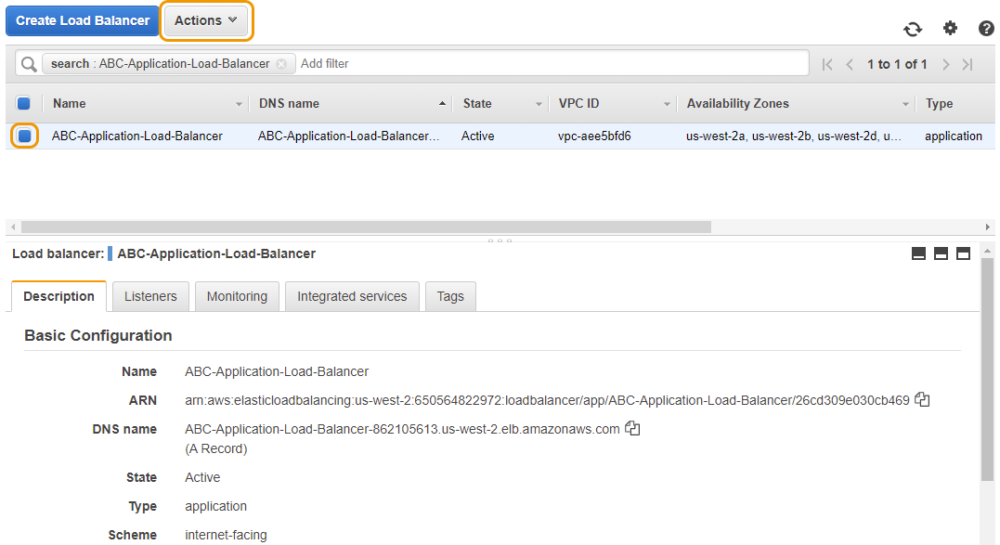
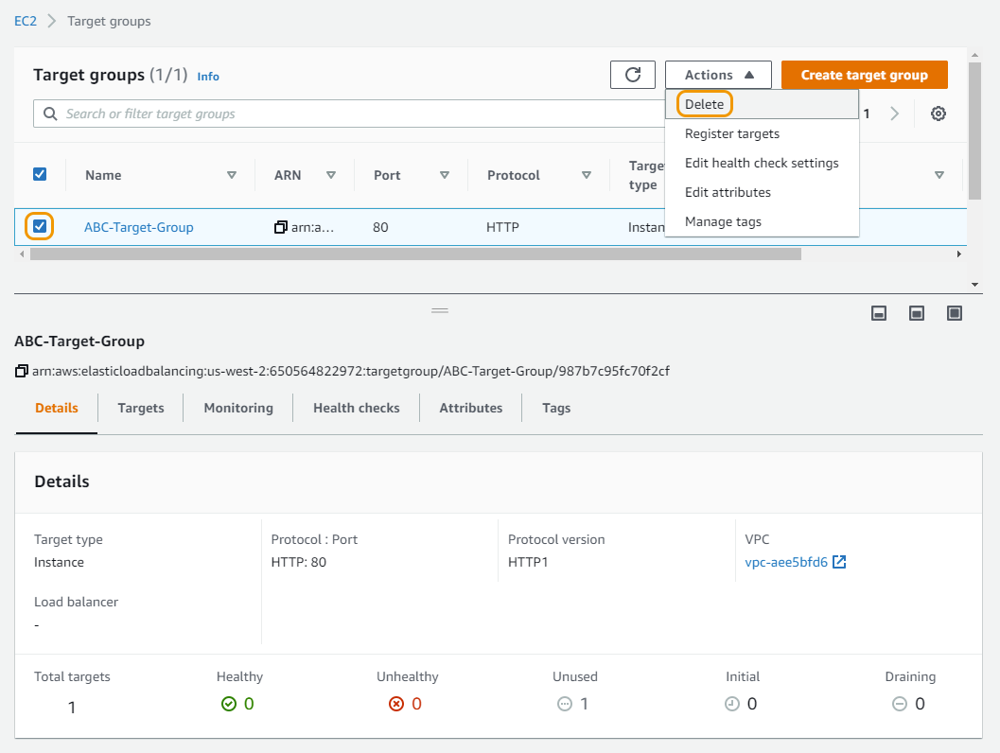
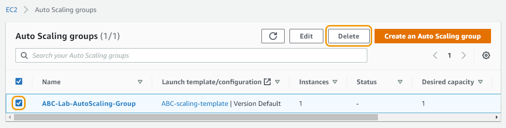
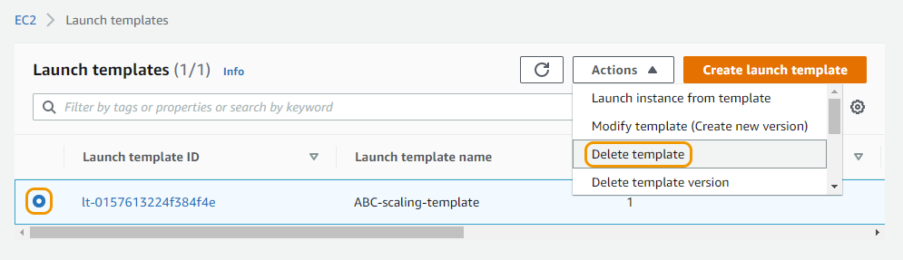
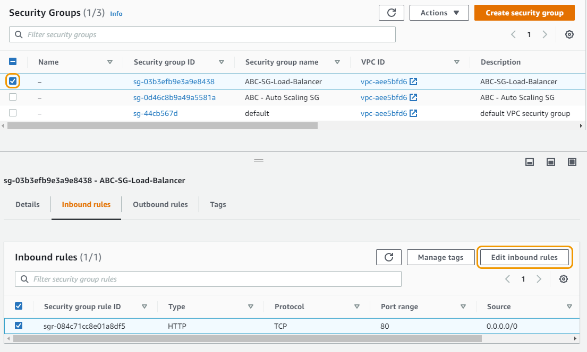
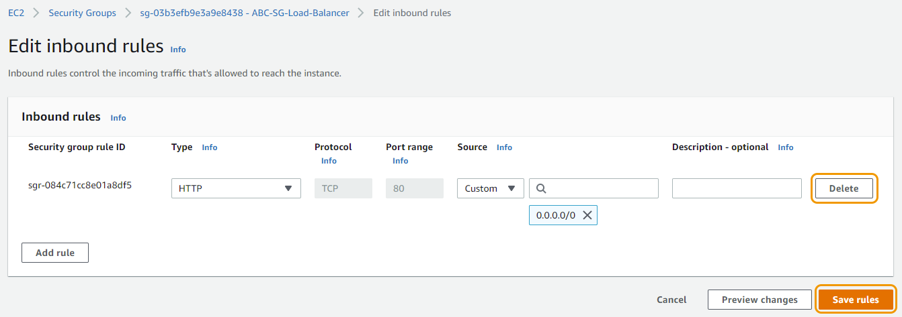
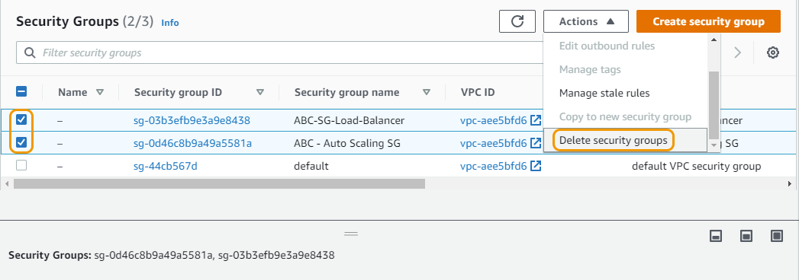
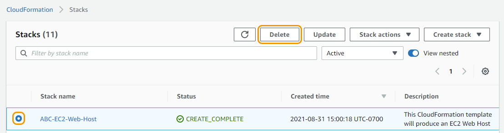
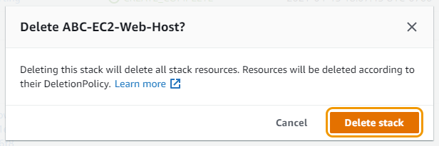

# 실습 자원 삭제하기

실습에서 만든 리소스를 아래 순서대로 삭제하셔야 합니다

## 로드 밸런서 삭제하기

1. 콘솔에서 "EC2" 로 이동합니다. "Load balancing" 아래의 왼쪽 메뉴에서 Load Balancer를 선택합니다.
2. \[이니셜]-Application-Load-Balancer 라는 로드 밸런서를 선택합니다.
3. 페이지 상단의 Actions 드롭다운을 클릭하고 Delete를 선택합니다. 다음 팝업 창에서 Yes, Delete 버튼을 클릭합니다.

1. 삭제에 성공하면 로드 밸런서가 즉시 제거됩니다.

## Target Group (대상 그룹) 삭제하기

1. 콘솔에서 "EC2" 로 이동합니다. "Load balancing" 아래의 왼쪽 메뉴에서 Target Groups를 선택합니다.
2. \[이니셜]-Target-Group이라는 대상 그룹을 선택합니다.
3. 페이지 상단의 Actions 드롭다운을 클릭하고 Delete를 선택합니다. 다음 팝업 창에서 Yes, Delete 버튼을 클릭합니다.

1. 대상 그룹이 제거되었습니다.

## 오토 스케일링 그룹 삭제하기

1. 콘솔에서 "EC2" 로 이동합니다. "Auto Scaling" 아래의 왼쪽 메뉴에서 Auto Scaling Groups를 선택합니다.
2. \[이니셜]-Lab-AutoScaling-Group이라는 Auto Scaling 그룹을 선택합니다.
3. 페이지 상단의 Delete 버튼을 클릭합니다. 다음 팝업 창에서 텍스트 필드에 delete 를 입력하고 Delete 버튼을 선택합니다.

이제 Auto Scaling 그룹의 모든 인스턴스가 종료되며 완료하는 데 몇 분 정도 걸릴 수 있습니다.

## Launch Template (시작 템플릿) 삭제하기

1. 콘솔에서 "EC2" 로 이동합니다. "Instances" 아래의 왼쪽 메뉴에서 Launch Templates를 선택합니다.
2. \[이니셜]-scaling-template이라는 시작 템플릿을 선택합니다.
3. 페이지 상단의 Action 드롭다운을 클릭하고 delete template를 선택합니다. 다음 팝업 창에서 텍스트 필드에 delete를 입력하고 Delete 버튼을 선택합니다.

Launch template이 제거되었습니다.

## Security Groups (보안 그룹) 제거하기

1. 콘솔에서 "EC2" 로 이동합니다. "Network & Security" 아래의 왼쪽 메뉴에서 Security Groups를 선택합니다.
2. \[이니셜]-SG-Load-Balancer 라는 보안 그룹을 선택하고 Edit inbound rules 버튼을 클릭합니다.

1. "Edit inbound rules" 페이지에서 Delete 버튼을 클릭하여 하나의 규칙을 삭제한 다음 Save Rules 버튼을 선택합니다.

1. 이제 Outbound Rule 탭을 선택하고 Edit Outbound Rule 버튼을 선택합니다.
2. "Edit Outbound Rule" 페이지에서 Delete 버튼을 클릭하여 하나의 규칙을 삭제한 다음 Save Rules 버튼을 선택합니다.
3. 이제 보안 그룹 이름 \[이니셜] - Auto Scaling SG 만 선택하고 2, 3단계를 반복합니다. (이 보안 그룹에 대한 아웃바운드 규칙을 제거할 필요가 없습니다.)
4. \[이니셜]-SG-Load-Balancer 및 \[이니셜] - Auto Scaling SG라는 두 개의 보안 그룹을 선택합니다.
5. 페이지 상단의 Action 드롭다운을 클릭하고 Delete Security Group를 선택합니다. (Action 메뉴에서 아래로 스크롤해야 할 수도 있습니다.) 다음 팝업 창에서 텍스트 필드에 Delete 를 입력하고 Delete 버튼을 선택합니다.

1. 이제 보안 그룹을 삭제되어져야 합니다. 보안 그룹을 제거할 수 없는 경우 모든 규칙을 성공적으로 제거하지 않았을 수 있습니다.

## CloudFormation Stack 제거하기

1. 콘솔에서 서비스 또는 검색을 사용하여 CloudFormation을 엽니다.
2. \[이니셜]-EC2-Web-Host라는 스택을 선택한 다음 Delete 버튼을 클릭합니다.

1. 팝업에서 Delete Stack를 선택합니다.

스택을 삭제하는 데 몇 분 정도 걸립니다. 업데이트된 상태를 보려면 새로 고침 버튼을 선택하세요. 스택이 삭제되면 스택이 더 이상 표시되지 않습니다. 축하합니다! Auto Scaling 실습을 완료했습니다!

[Previous](5-ec2-as.md) | [Next](../../../../20-vpc/)
