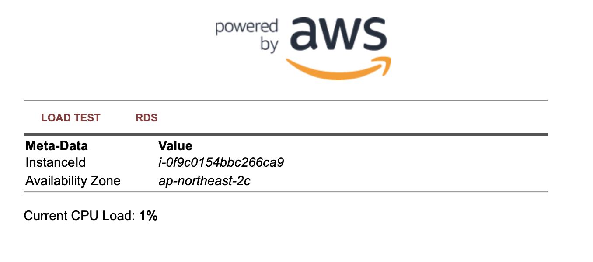

# 웹 서버 인스턴스 생성하기

## 웹 서버 인스턴스 생성하기

Amazon Linux 2 인스턴스를 시작하고, Apache/PHP를 부트스트랩하고, 우리의 인스턴스에 대한 정보를 표시할 기본 웹 페이지를 생성합니다.

1. 맨 왼쪽 메뉴 상단에서 EC2 Dashboard를 클릭합니다. 그리고 Launch 인스턴스를 클릭합니다.


1. Quick Start 섹션에서 Free tier only을 클릭한 다음 64비트(x86) 아키텍처에 대한 첫 번째 Amazon Linux 2 AMI를 선택하고 Select을 클릭합니다.


1. 2단계의 Instance Type 선택에서 t2.micro 인스턴스 크기를 선택하고, Next: Configure Instance Details를 클릭합니다.


Free Tier Eligible 라벨이 붙어 있지 않으면 요금이 부과될 수 있습니다.

1. 3단계의 인스턴스 세부 정보 구성 페이지에서 페이지 하단에 있는 Advanced Details 섹션을 확장한 다음 아래 스크립트를 사용자 데이터 필드에 복사/붙여넣습니다. 이 셸 스크립트는 Apache & PHP를 설치하고 웹 서비스를 시작하며 간단한 웹 페이지를 배포합니다. 그 다음 Next: Add Storage 버튼을 클릭합니다.


```
#!/bin/sh

# Install a LAMP stack
amazon-linux-extras install -y lamp-mariadb10.2-php7.2 php7.2
yum -y install httpd php-mbstring

# Start the web server
chkconfig httpd on
systemctl start httpd

# Install the web pages for our lab
if [ ! -f /var/www/html/immersion-day-app-php7.tar.gz ]; then
   cd /var/www/html
   wget https://aws-joozero.s3.ap-northeast-2.amazonaws.com/immersion-day-app-php7.tar.gz  
   tar xvfz immersion-day-app-php7.tar.gz
fi

# Install the AWS SDK for PHP
if [ ! -f /var/www/html/aws.zip ]; then
   cd /var/www/html
   mkdir vendor
   cd vendor
   wget https://docs.aws.amazon.com/aws-sdk-php/v3/download/aws.zip
   unzip aws.zip
fi

# Update existing packages
yum -y update
```


\*\*Use subnet setting (Enable)\*\*에서 Auto-assign Public IP이 설정되어 있는지 확인합니다.

1. 이 페이지에서는 스토리지 및 디스크 드라이브를 수정하거나 인스턴스에 추가할 수 있습니다. 이 실습에서는 스토리지 기본값을 적용하고 Next: Add Tags 버튼을 클릭합니다.


1. 인스턴스를 식별하기 위해 다양한 정보를 추가할 수 있습니다. 태그 정보를 통해 사용자는 인스턴스의 단계, 목적 및 비용을 쉽게 확인할 수 있습니다. 태그 추가를 클릭하고 아래와 같이 키를 입력합니다. 완료한 후 Next: Configure Security Group을 클릭합니다.

| KEY   | VALUE                     |
| ----- | ------------------------- |
| Key   | Name                      |
| Value | Web server for custom AMI |

1. 새 Security Group을 생성하거나 이미 존재하는 Security Group을 선택할 수 있습니다. Security Group은 허용할 프로토콜 및 주소를 방화벽 정책으로 지정합니다. Create a new security group을 선택합니다. Security Group 이름 및 Description에 Immersion Day - Web Server를 입력하고 Add Rule 버튼을 선택하고 Type(유형)에서 HTTP를 지정하여 웹 서비스에 TCP/80을 허용합니다. Source(소스)에 My IP를 선택하거나 0.0.0.0/0을 입력하여 모든 네트워크에서 액세스할 수 있도록 합니다. 오른쪽 아래에 있는 Review and Launch를 클릭합니다.


1. 구성 및 선택 사항을 검토한 후 Launch 버튼을 누릅니다.
2. 드롭다운에서 이 실습의 시작 부분에서 생성한 키페어를 선택하고 I acknowledge 확인란을 체크합니다. 그런 다음 Launch Instance 버튼을 클릭합니다. 이제 인스턴스가 시작됩니다. 잠시 시간이 걸릴 수 있습니다.


1. EC2 인스턴스 목록을 보려면 화면 오른쪽 아래에 있는 View Instance 버튼을 클릭합니다. 인스턴스가 시작되면 웹 서버와 인스턴스가 있는 가용 영역, 공개적으로 라우팅할 수 있는 DNS 이름이 표시됩니다. 이 EC2 인스턴스에 대한 세부 정보를 보려면 웹 서버 옆에 있는 확인란을 클릭하십시오.


## 웹 서버 살펴보기

1. 인스턴스가 상태 검사를 통과하여 로드가 완료될 때까지 기다립니다.


1. 새 브라우저 탭을 열고 EC2 인스턴스의 Public DNS name을 브라우저에 입력하여 웹 서버를 찾습니다. EC2 인스턴스의 공용 DNS 이름은 위에서 강조 표시된 Public IPv4 DNS 이름 줄을 검토하여 콘솔에서 찾을 수 있습니다. 다음과 같은 웹 페이지를 확인할 수 있습니다.



잘하셨습니다! 몇 분 만에 서버를 배포하고 웹 사이트를 시작했습니다!

[Previous](1-ec2.md) | [Next](3-ec2-1.md)
