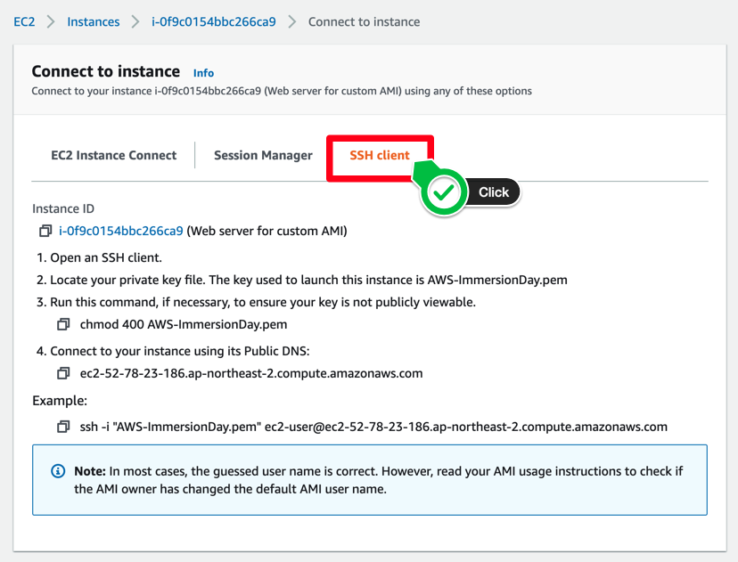
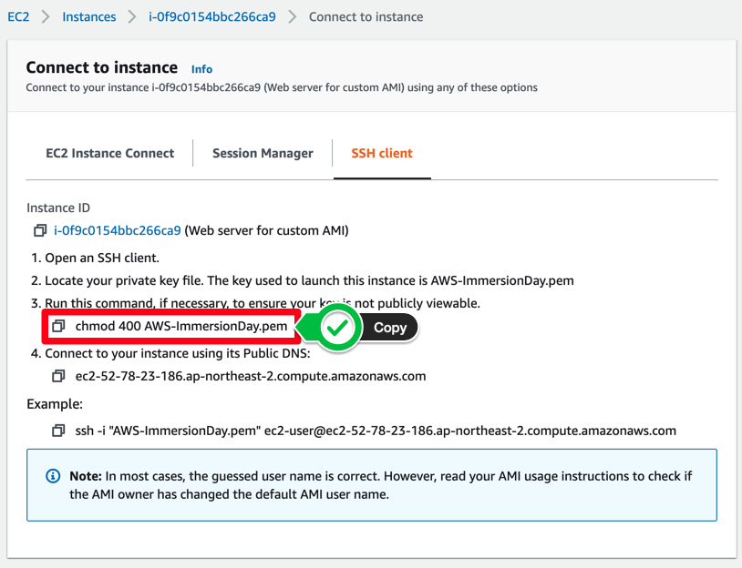
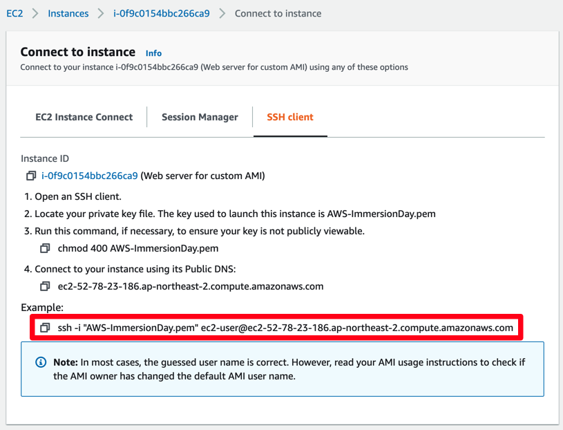
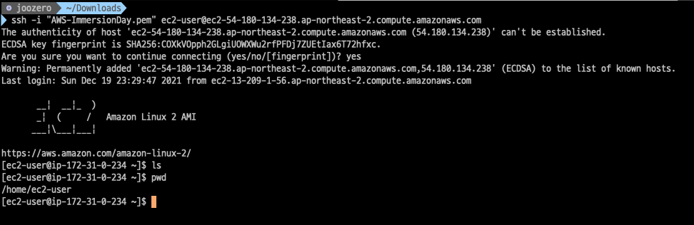

# 리눅스 인스턴스에 접근하기

## 리눅스 인스턴스에 접근하기

Linux 인스턴스에 연결하기 위해 SSH 클라이언트를 사용합니다. Windows 사용자의 경우, PuTTy를 사용하여 Linux 인스턴스에 연결 섹션을 참고합니다. Mac 사용자의 경우 터미널을 사용합니다.

1. EC2 인스턴스 콘솔에서 연결할 인스턴스를 선택한 다음 Connect 버튼을 클릭합니다.

.png)

1. Connect to instance 페이지에서 SSH client 탭을 누릅니다. 아래 적혀있는 가이드를 따라합니다.

1. Private key가 있는 로컬 디렉토리 위치로 이동하고 다음 명령을 입력합니다. 키를 만들 때 지정한 이름으로 \[Your Name] 을 바꿉니다.

> chmod 400 \[Your Name]-ImmersionDay.pem

1. 그 다음, SSH 클라이언트에서 리눅스 인스턴스에 접근하기 위해 아래의 명령어를 수행합니다.

> ssh -i "\[Your Name]-ImmersionDay.pem" ec2-user@

1. 연결을 계속 진행할 것인지 묻는 질문에 yes라고 대답한 후, 아래와 같은 결과를 확인할 수 있습니다.

[Previous](3-ec2-1.md) | [Next](4-ec2.md)
