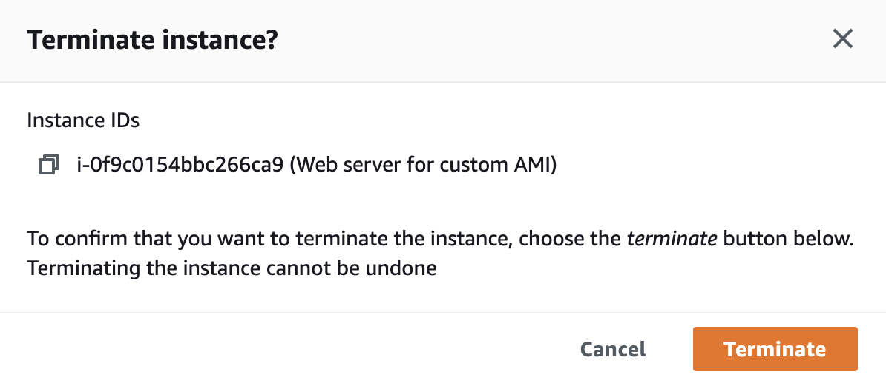

# 실습 자원 삭제하기

## 자원 정리

생성한 EC2 인스턴스를 삭제하려면 이 실습에서 생성한 인스턴스를 선택합니다. 인스턴스 상태 메뉴에서 Terminate instance를 선택합니다.

해당 인스턴스를 종료할지 묻는 팝업 창이 나타납니다. Terminate를 누릅니다.

### (옵션) 도전 과제

AWS CLI를 사용하여 동일한 EC2 인스턴스를 배포합니다.

[AWS Cloud9](https://aws.amazon.com/cloud9/?nc1=h\_ls) 을 사용해서 도전해보세요. AWS Cloud9에는 이미 AWS CLI가 설치되어 있습니다.

## 참고 자료

* [AWS CLI Documentation](https://docs.aws.amazon.com/cli/latest/userguide/cli-services-ec2-instances.html)
* [AWS CLI Configuration](https://docs.aws.amazon.com/cli/latest/userguide/cli-chap-configure.html#cli-quick-configuration)

[Previous](4-ec2.md) | [Next](../../ec2-windows/)
